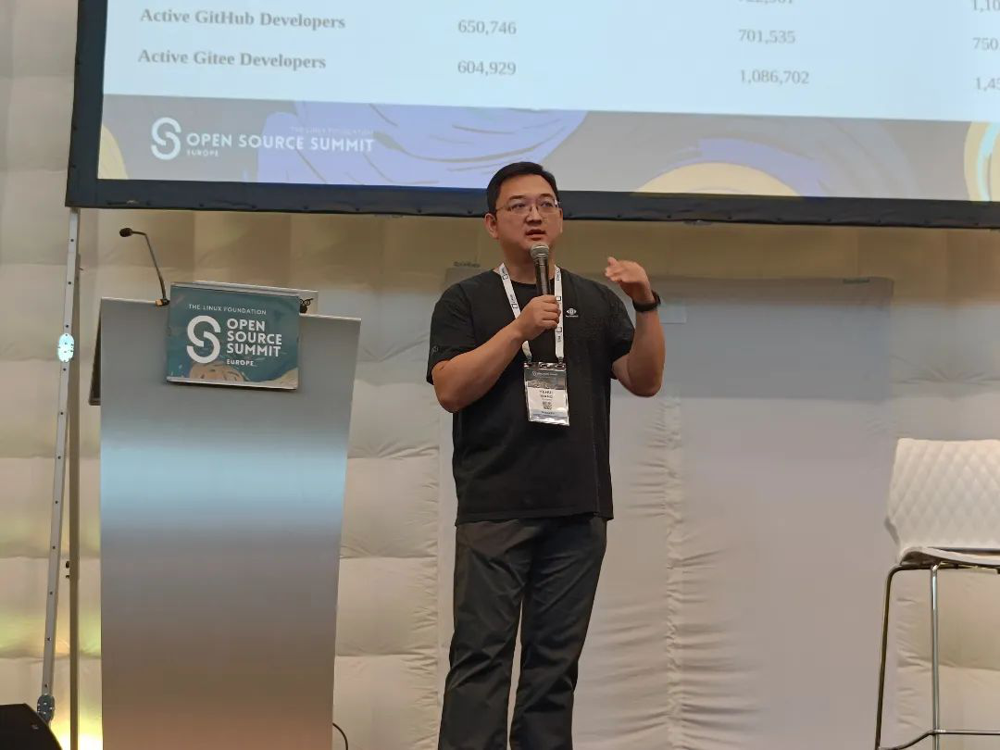
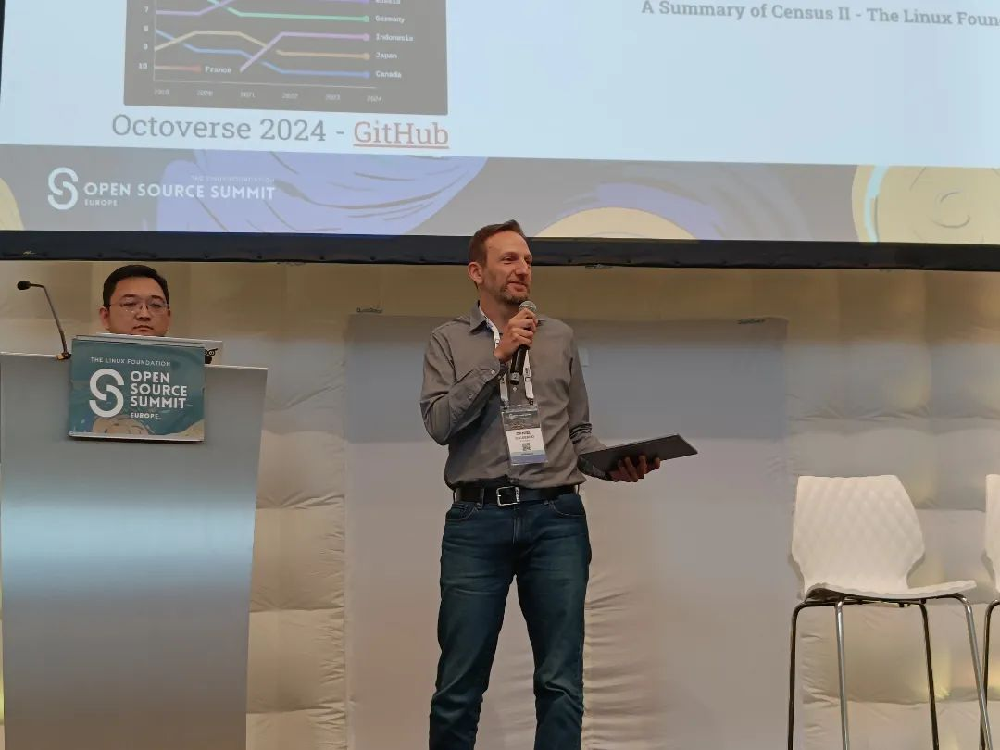
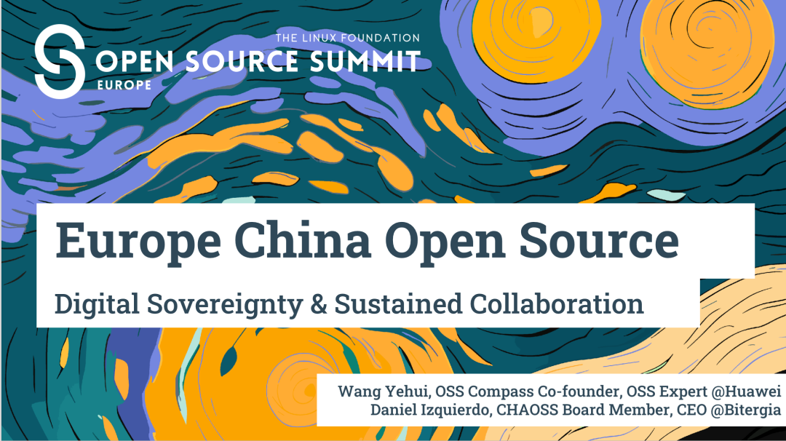
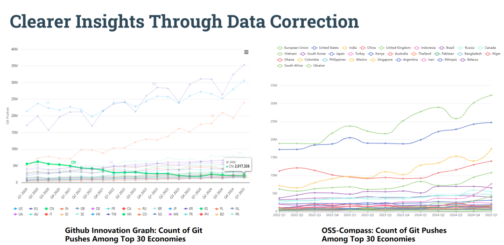
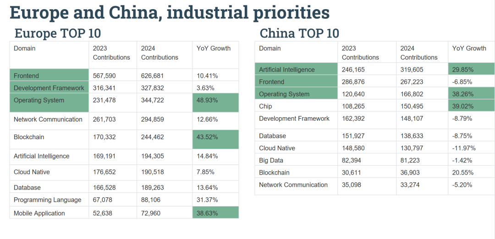

From August 25-27, 2025, Open Source Summit Europe 2025 was successfully held in Amsterdam, with OSS-Compass invited to participate. On August 27, OSS-Compass Technical Committee Co-Chair Yehui Wang and Bitergia CEO Daniel Izquierdo Cortázar delivered a keynote presentation: Europe-China Open Source: Digital Sovereignty & Sustained Collaboration.

<!--truncate-->

In their presentation, Yehui Wang and Daniel Izquierdo Cortázar discussed the development of European and Chinese open source ecosystems under geopolitical changes, covering the following aspects:

They pointed out that open source has become a critical strategy. Although the density of European and American developers is well-known, their connections with the Chinese ecosystem remain underexplored. They presented the open source contribution trends of the global TOP 30 countries and regions from 2020-2025, analyzed the data distortion issues in GitHub geographical data caused by VPNs and other methods of changing or hiding IP addresses, and identified current challenges: insufficient data sources, incomplete data systems, data distortion, and difficulties in data acquisition. In response, OSS-Compass has improved data accuracy through cross-platform statistics (including GitHub and introducing Gitee data sources), timezone validation, and other methods, demonstrating the data differences after these modifications.

In 2024, OSS-Compass provided core data support for the "China Open Source Development In-Depth Report (2024)" edited by the OpenAtom Foundation. The presentation detailed comparisons between Europe and China in terms of basic indicators such as population, GDP, ICT workforce, as well as core data including open source contributions (Europe: 92.53 million commits, China: 50.34 million), active projects (Europe: 5.6 million, China: 3.03 million), and showed changes in contributions across various technical fields and global open source import-export contribution distribution. The data reveals that Europe has become a leading force in global open source collaboration, while Chinese open source projects and developers also possess tremendous potential. Finally, based on data analysis showing Europe's leadership in mature fields such as operating systems, frontend, and mobile applications, and China's prominence in AI, semiconductors, and operating systems, they proposed that the two are forming a complementary ecosystem market cooperation path.

The thriving development of the OSS-Compass community is inseparable from the continuous contributions and efforts of community developers. Looking toward the future, OSS-Compass will be innovation-oriented, continuously iterating technical capabilities and service systems to provide more users with powerful tools and solutions that better meet open source ecosystem needs. We also sincerely invite all partners who are concerned about China's open source ecosystem and aspire to participate in ecosystem research and collaboration to join us. We look forward to working with you to explore the development path of China's open source ecosystem and jointly promote the prosperity and evolution of the ecosystem.
