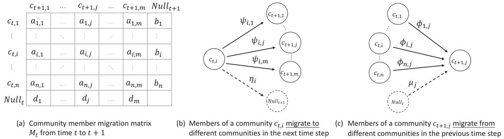
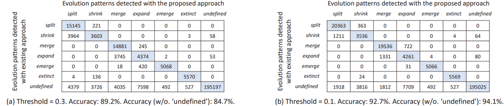
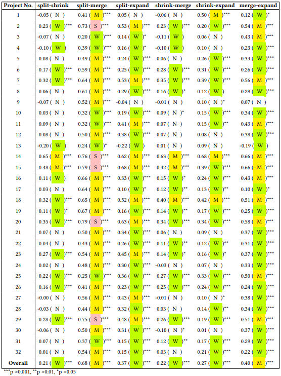
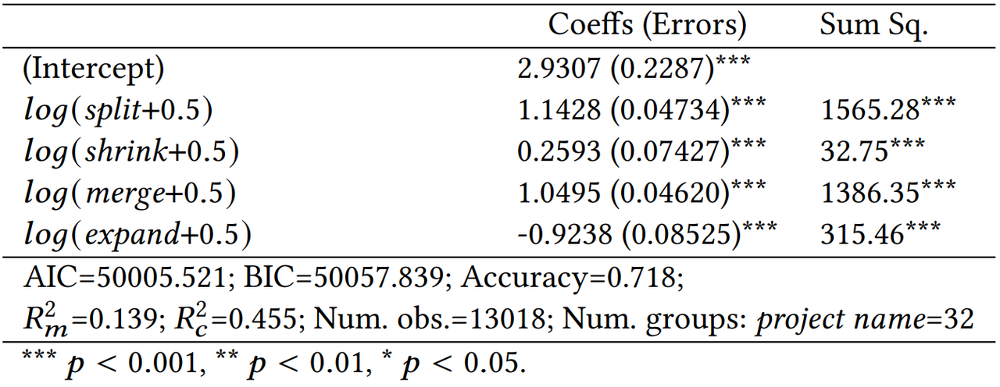

Jierui Zhang，Ying Li，Liang Wang，Xianping Tao

Department of Computer Science and Technology, Nanjing University, State Key Laboratory for Novel Software Technology OSS Compass

### Abstract

In this study, we study the community evolution behavior in developer social networks around open source software projects, in response to the limitation of traditional community evolution analysis techniques being biased towards qualitative rather than quantitative analysis. We propose a set of community split, shrink, merge, and expand indices based on information entropy to measure the evolutionary behavior of open source developer social networks. Empirical studies demonstrate that these indices effectively characterize the evolution of open source communities, by achieving a 94.1% accuracy in drawing conclusions consistent with existing qualitative work through simple rules. Furthermore, additional research indicates a significant correlation between the proposed community evolution indices and the productivity of open source projects, represented by the number of commits. The information entropy-based measurement indices presented in this study provide quantitative support for understanding and analyzing the evolutionary behavior of open source communities.

<!--truncate-->

### 1. Introduction

Open source software development is a socialized software production approach, and a deep understanding of the developer social networks (DSNs) in open source projects and their evolutionary processes is crucial for understanding the phenomenon of collective intelligence in the open source world. Existing methods for studying the evolution of open source communities and networks can be categorized into two types: network-level and community-level statistical models. The first type quantifies a series of snapshots of the social network using statistical metrics. These works typically utilize metrics such as network diameter, shortest paths between nodes, modularity, hierarchical structure, and centrality to measure the properties of the social network as a whole. While most of these metrics provide an overall assessment of the nature of the social network, a natural phenomenon in social networks is the spontaneous formation of complex community structures among interacting individuals. Therefore, understanding the community patterns within DSNs can provide a deeper understanding of open source software development. As Conway's Law suggests, the architecture of a system reflects the organization of its implementers. Although some measurement methods have addressed the measurement of groups or communities within social networks, the ability of these network-level statistical data to reveal the structure and evolution of communities within DSNs is relatively weak. The second type of method uses a community perspective to reveal the evolutionary patterns of social networks within DSNs. Existing methods propose using patterns such as community split, shrink, merge, and expand, etc, to describe community evolution behavior, which provides rich semantic information but still has limitations: first, it is difficult to describe the evolution of a community using a single pattern; second, existing methods are difficult to support quantitative analysis; third, these patterns are limited to describing the evolution of individual communities and are difficult to extend these concepts to the entire DSN network level. Therefore, there is a need for a comprehensive, quantitative representation and measurement method for community evolution behavior to form a complete, in-depth, and scientific understanding of this widespread phenomenon.

### 2. Quantitative Measurement Method for Community Evolution Based on Information Entropy

Building upon existing qualitative community evolution representation methods based on patterns, the method proposed in this study provides a more comprehensive and quantitative analysis, which can help open source volunteers and maintainers understand the current status of open source communities, compare the evolution trends of different projects' communities, quantitatively track the evolution of project communities over time, and conduct quantitative analysis.

  

Fig1 Method Overview

  

The indicator calculation process proposed in this work includes three steps. Firstly, as shown in Figure 1 (a), we integrated OSS Compass, GHTorrent database, and GitHub GraphQL API3 to retrieve the corresponding public data for Issue and Pull Request. Record the participants of Issues to extract joint discussion relationships. These records are used to construct DSN and perform community evolution analysis in subsequent steps. Next, as shown in Figure 1 (b), we use the data obtained from window segmentation and construct a DSN snapshot from the fragments using a weighted undirected graph. Then, the improved Clauset Newman Moore (CNM) algorithm was applied to perform community detection. Finally, as shown in Figure 1 (c), we propose a set of indicators based on information entropy to measure community evolution behavior, including measures of community fragmentation, contraction, merging, and expansion behavior. On the basis of a single community, this research method can also summarize these indicator values to quantify the community evolution behavior at the DSN network level.

Building a DSN snapshot is a necessary prerequisite for measuring the evolutionary behavior of the community included in it. We segment the raw data use a sliding window of 12 weeks, starting at time $$t$$, with a step of 1 week. We then use a weighted undirected graph $$G_t=\langle V,E,U,W \rangle$$ to model the DSN structure composed of issue and PR participants within this window (we ignore the time index $$t$$ in the following text). The vertex $$v_j \in V$$ represents a user present in the DSN, and the edge $$e_{i,j}\in E$$ represents social interaction between users $$v_i$$ and $$v_j$$. The edge weight $$w_{i,j}\in W$$ quantifies the intensity of social interaction between users using edge $$e_{i,j}$$ following equation (1). The node weight $$u_i \in U$$ is the level user activity obtained by quantifying the vertex $$v_i$$ according to equation (2). Specifically, given the count $$cnt_{i,j}$$ of a conversation between a pair of users $$v_i$$ and $$v_j$$ (jointly participating in an issue or PR) within a time window $$t$$, the weight $$w_{i,j}$$ of the corresponding edge is calculated as follows:

$$w_{i,j} = \ln(cnt_{i,j} + 1)$$ (1)

Based on the edge weights above, we further quantify the user's activity in the DSN by calculating its weight for each user using equation (2):

$$u_i=\ln(\sum_{j=1}^{|V|}w_{i,j}+1)$$ (2)

Next, for each DSN snapshot, we use community detection algorithms to mine the communities formed within it. In this work, community refers to a group of users closely interact with each other in the DSN snapshot. Given the $$t^{th}$$ snapshot $$G_t$$ of DSN. We use an improved Clauset Newman Moore (CNM) algorithm to detect potential communities in the snapshot. For $$G_t$$, the result of community detection is a set of non-overlapping communities, each includes a subset of users with strong joint discussion relationship in the DSN. By applying community detection to all snapshots arranged in time, we obtained a series of communities that evolves over time. Based on the detected communities, we can construct the migration matrices of community members reflected in two DSN snapshots at adjacent times, namely $$t$$and $$t+1$$, as shown in Figure 2 (a).

  

Fig 2 Transfer Matrix and Migration of Community Members Between Continuous Time Slices

  

Based on the above community member migration matrix, we can apply it to a community $$c_{t,i}$$ at time t, as well as a community $$c_{t+1,j}$$ at time $$t+1$$ to calculate the weight distribution as shown in Figures 2 (b) and (c), respectively; Furthermore, by using information entropy, we measure the evolutionary behavior patterns of a single community, including its split, shrink, merge, and expand, within a continuous time frame. Compared with the existing research, which mostly assigns a single pattern to a pair of matching communities, our method can comprehensively and quantitatively describe all the behavior patterns and their degrees for each community in the evolution process. We take the $$i^{th}$$ community, i.e. $$c_{t,i}$$, in the DSN snapshot to explain how to calculate the split and shrink indicies. Assuming that there are $$m$$ communities in the DSN at time $$t+1$$, we can calculate the distribution of active users remaining in the project at time $$t+1$$ for community$$c_{t,i}$$, who migrate to the $$m$$ communities in the next time step as follows (as shown in Figure 2(b)):

$$\hat{\psi_{i,j}} = \frac{\psi_{i,j}}{\sum_{j=1}^m \psi_{i,j}}$$ (3)

And calculate the information entropy corresponding to the distribution using equation (4):

$$\mathcal{H}_{c_{t,i}} = - \sum_{j=1}^m \hat{\psi_{i,j}}\log_2(\hat{\psi_{i,j}})$$ (4)

Intuitively, the above information entropy measures the degree of separation of members in $$c_{t,i}$$ in migrating to different communities at the next time step. Based on the above information entropy, we can calculate the split and shrink index of $$c_{t,i}$$ as it evolves to the next moment following equations (5) and (6), respectively:

Split index $$\mathcal{I}_{c_{t,i}}^\psi = (1-\eta_i)\mathcal{H}_{c_{t,i}}$$ (5)

Shrink index $$\mathcal{I}_{c_{t,i}}^\eta = \eta_i(\mathcal{H}^*_{t\rightarrow t+1} - \mathcal{I}_{c_{t,i}}^\psi + \sigma_{\eta_i})$$ (6)

Similar to the process of calculating community split and shrink indices mentioned above, based on the member migration distribution shown in Figure 2 (c), we focus on a community $$c_{t+1,j}$$ at time t+1, and measure its merge index as shown in equation (7) and expand index following equation (8) from the distribution of its members migrate from communities in the previous time step $$t$$:

Merge index $$\mathcal{I}_{c_{t+1,j}}^\phi = (1-\mu_j)\mathcal{H}_{c_{t+1,j}}$$ (7)

Expand index $$\mathcal{I}_{c_{t+1,j}}^\mu = \mu_j(\mathcal{H}^*_{t\leftarrow t+1} - \mathcal{I}_{c_{t+1,j}}^\phi + \sigma_{\mu_i})$$ (8)

Taking the community split and shrink indicies as an example, the above indices have the following properties to make them effective in quantifying community evolution behaviors:

1. Given $$0<\eta_i<1$$, and assuming $$\psi's$$ show a uniform distribution, the split and shrink indices of the community are monotonically increasing functions of the number of communities $$m$$ in the next time step;
2. Assuming $$\eta_i > 0$$, $$m>1$$, the split and shrink indices are monotonically decreasing and monotonically increasing functions of $$\eta_i$$ , respectively, under any given $$\psi's$$;
3. When the migration distribution $$\psi's$$ suggests the members of a community migrages evently to communities detected in the next time step, the split index reaches its maximum value and the shrink index reaches its minimum value;
4. When the migration distribution $$\psi's$$ of retained personnel is extremely uneven (all migrating to a single community in the next time step), the split index reaches its minimum value and the shrink index reaches its maximum value.

Based on the above properties, we believe that the proposed community evolution index can accurately reflect our intuitive understanding of community evolution behaviors.

### 3. Empirical Research on Open Source Software Community

We conducted empirical research on a dataset consisting of 32 open source repositories to evaluate the effectiveness and usefulness of the proposed community evolution indicators. This study aims to answer the following two research questions:

1. RQ1 effectiveness: Can these indicators quantify community evolution in DSN? We validate the effectiveness of the proposed indicators by analyzing the consistency between the community evolution behavior obtained from the indicators and the detection results of existing work, as well as the factor independence between the indicators.
2. RQ2 usefulness: Is the proposed indicator related to team productivity? We demonstrated the usefulness of the proposed indicators by using regression analysis to investigate their correlation with project team productivity.

#### 3.1 RQ1: Effectiveness

We evaluate the effectiveness of the proposed indicies by comparing the community evolution pattern detection results of the proposed method and existing methods. We use the process proposed in existing work to detect qualitative community evolution patterns in DSN, which serve as the ground-truth for the evaluation. More specifically, for continuous time steps $$t$$ and $$t+1$$, we first calculate the similarity between each pair of communities detected in the two DSN snapshots. The generation of DSN snapshots and community detection are consistent with the above statement for fair comparison.

  

Fig 3 Confusion matrices and results of comparion studies

  

Figure 3 (a) shows the confusion matrices of comparing the results of existing methods with the detection results of the proposed method in this study. The overall accuracy, including the undefined pattern, is 89.2%. The undefined pattern describes community evolution behaviors that are not covered by existing definitions. We also evaluate the accuracy by removing the undefined labels (i.e. removing the last column and row in the confusion matrix). When there are no undefined labels, the overall accuracy is 84.7%. From Figure 3 (a), we can observe that 52% of shrink cases are classified as split by our method, and 45.8% of expand cases were detected as merge. This is potentially because there is a similarity threshold of 0.3 in existing methods to determine communties that match in consequtive time steps, which may exclude pairs of communities that potentially match but less similar.

Since there is no evidence to suggest that the existing threshold of 0.3 is optimal, we repeated the test by setting a threshold of 0.1 to increase the chances of matching communities in consequtive time steps. As shown in Figure 3 (b), we can observe that the detection accuracy improved to 92.7% and 94.1% with and without undefined patterns, respectively. The above results indicate that the proposed indicators can accurately distinguish the evolution patterns of different open source communities, which is consistent with the results obtained by existing methods.

Next, we validate the proposed indices with respect to factor independence. Since the proposed indices do not always follow normal distributions, we measure their correlation by calculating the Spearman's correlation coefficient for each pair of indices in all the projects.

  

Table 1 Spearman's Correlation Coefficient

  

Table 1 lists the Spearman's correlation coefficients and their significance levels for all items. We also attach the results of mixing all project data to the last row of the table. It can be observed that out of the 32 projects involved in our study, 4 projects, namely projects 4, 10, 13, and 31, showed weak or no correlation for all indicator pairs, covering both active and inactive projects. In addition, from the experimental results, it can be seen that the split and merge indicators show moderate correlation with most items, and only show strong correlation in five projects. The overall correlation coefficient between splitting and merging is 0.68.

### 3.2 RQ2: Usefulness

In this experiment, we demonstrate the usefulness of community evolution indicies by studying the correlation between the proposed indicators and the productivity of open-source project teams. We refer to existing work and use the number of commits pushed to open source repositories to represent team productivity. We used a linear mixed effects model (LMM) for regression analysis to investigate the correlation between indicators and team productivity. For each snapshot extracted according to the previous text, we obtain a sample consisting of the following variables: the dependent variable is the number of commits in the snapshot; the independent variables are the community split, shrink, merge, and expand indices. We perform log-transformation on the above variables to stabilize variance and reduce heteroscedasticity. Finally, the project name is included in each sample as an indicator of random effects. The results are shown in Table 2.

  

Table 2 Correlation between Logarithmic Transformation of Community Evolution Indicators and Team Productivity

  

The results indicate that after log-transformation, all indicators show significant correlations with team productivity. Three indicators, including split, shrink, and merge, are positively correlated with team productivity. The accuracy of the regression model (i.e. the correlation coefficient between the actual and predicted values of the results) is 0.718, indicating that the aggregation index of community evolution is a useful predictor of team productivity.

### Conclusion

In this study, we analyzed the evolution of communities in open-source developer social networks and proposed a set of information entropy-based indices to measure such evolution behaviors. Empirical results suggest the indices are effective, and show significant correlations with team productivity in terms of count of commits. The indices enable us to gain a deeper understanding of the social behavior of open-source developers.

### Related Publication

Liang Wang, Ying Li, Jierui Zhang, and Xianping Tao. 2022. Quantifying community evolution in developer social networks. In Proceedings of the 30th ACM Joint European Software Engineering Conference and Symposium on the Foundations of Software Engineering (ESEC/FSE 2022). Association for Computing Machinery, New York, NY, USA, 157–169. https://doi.org/10.1145/3540250.3549106

### Thanks

We thank the OSS Compass community, especially Yehui Wang from Huawei Technology Co., Ltd., for providing support for this research work. This research work is supported by the NSFC (No. 62172203), the Huawei Technology Cooperation Project "Open Source Ecological Assessment Technology Cooperation Project", and the Collaborative Innovation Center of Novel Software Technology and Industrialization.
