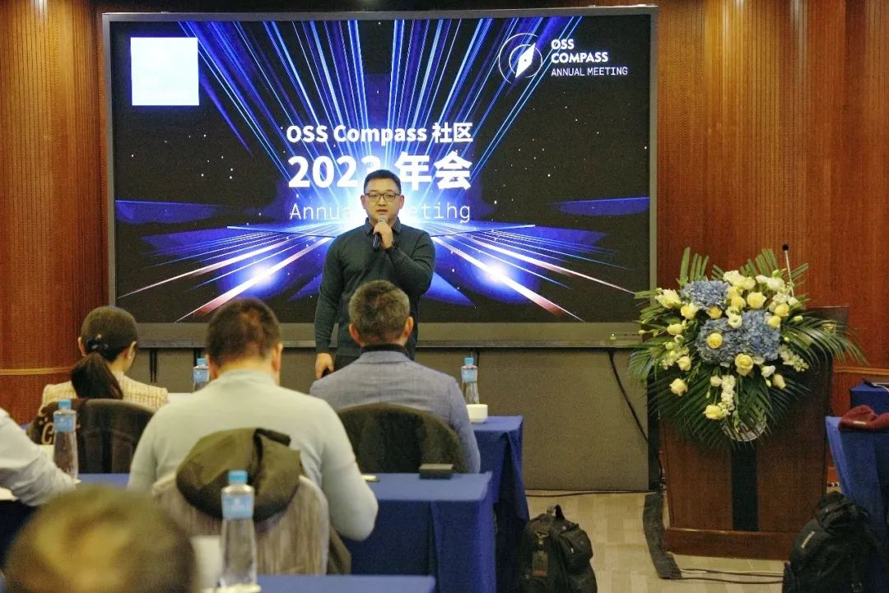
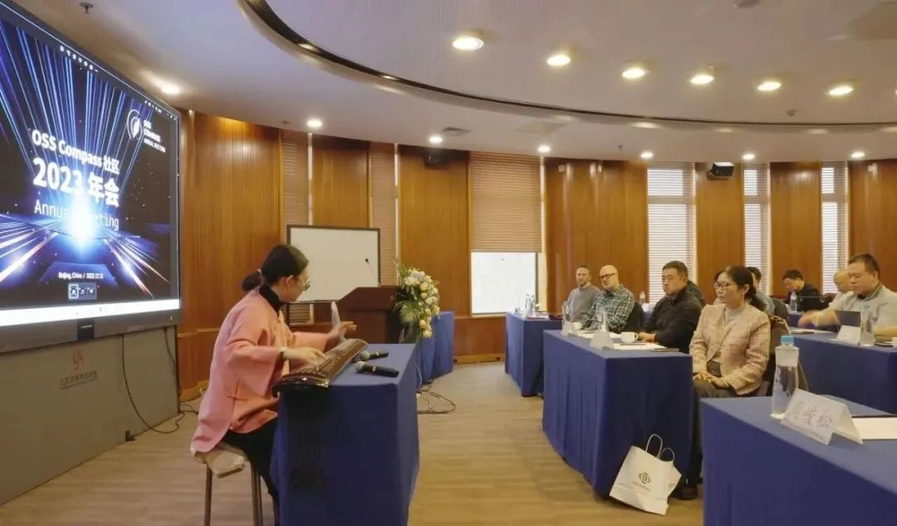
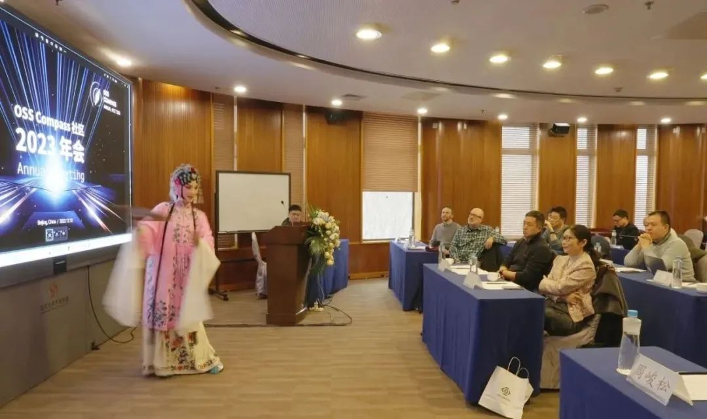
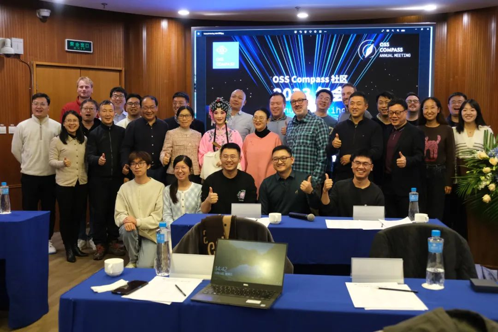

On the afternoon of December 13, 2023, amidst heavy snowfall in Beijing, OSS Compass Community 2023 Annual Meeting, co-organized by OSS Compass Community, Peking University, and Huawei Open Source, took place as scheduled. Despite the cold weather and slight traffic congestion, the enthusiasm of the experts remained unstoppable as they braved the snowy conditions, together igniting this feast of technology and art!

<!--truncate-->

<embed
  height={398}
  width={'100%'}
  src={'https://www.youtube.com/embed/5rnow-bXSHk'}
  sandbox={''}
></embed>

**01 Opening by Yehui Wang**

The meeting was hosted by Yehui Wang, co-Founder and TC co-Chair of OSS Compass. After introducing the agenda, open source experts from all walks of life took the stage, initiating a wave of discussions on open source evaluation and measurement.

**02 Century-old Motto of Peking University Coincides with Open Source Spirit**

Professor Minghui Zhou from Peking University's School of Computer Science gave the welcome speech, mentioning the motto of Peking University from Mr. LuXun and emphasizing Peking University as a pioneer in the reform movement and the motto's coincidence with the spirit of open source. Professor Zhou expressed a strong interest in open source measurement, considering OSS Compass as a thermometer for open source, aiding the development of open source communities. She highlighted the significance of experts gathering at Peking University to discuss and collaborate on open source measurement, injecting more vitality into Peking University's research in this field.

<embed
  height={398}
  width={'100%'}
  src={'https://www.youtube.com/embed/SMWf6MdfHCw'}
  sandbox={''}
></embed>

**03 The Voice of Huawei Open Source**

Xudong Ren, Chief Liaison Officer of Huawei Open Source, delivered a speech on Huawei open source initiatives. He mentioned Huawei's strong support for the development of open source projects, initiating various open source projects, such as openEuler and OpenHarmony, and donating them to domestic and international open source foundations. While affirming the value of OSS Compass, he expressed expectations for its continued development to assist open source communities in creating more outstanding projects.

<embed
  height={398}
  width={'100%'}
  src={'https://www.youtube.com/embed/_YEy1R3WxiE'}
  sandbox={''}
></embed>

**04 Expectations from CHAOSS**

Sean Goggins, co-Chair of the CHAOSS community and professor at the University of Missouri, expressed excitement about participating in the meeting. He looked forward to collaboration between CHAOSS, OSS Compass, and openEuler to create a white paper on open source evaluation and measurement, establishing factual standards for open source measurement.

<embed
  height={398}
  width={'100%'}
  src={'https://www.youtube.com/embed/_W9CqNhxysQ'}
  sandbox={''}
></embed>

**05 Insights from CHAOSS Technical Experts**

Daniel Izquierdo, Governing Board member of CHAOSS community and CEO of Bitergia, shared tools and technologies for open source ecosystem assessment, including GrimoireLab and Bitergia Analytics, revealing the technical mysteries behind open source.

<embed
  height={398}
  width={'100%'}
  src={'https://www.youtube.com/embed/QgOdMjkwX4Y'}
  sandbox={''}
></embed>

**06 Cultural and Artistic Feast**

During the tea break, there was a special session of traditional Chinese culture and art sharing arranged. Two teachers from Peking University presented the ancient qin music "He Ming Jiu Gao" and Kunqu opera "The Peony Pavilion: Dream Search", featuring the melodies "Lan Hua Mei" and "Te Te Ling". This allowed the guests from the tech industry to closely appreciate the charm of traditional Chinese culture and art.

**07 Engaging Topics Shared by Guests**

Following that, Associate Professor Liang Wang from Nanjing University, Zhenyu Zheng, Operation Director of openEuler community, Su Wang, Head of the Ecological Development Department of OpenI Community and Peng Cheng Laboratory Efficient Cloud Computing Operation, and Chaozheng Li, CEO of Beijing Pareto Forest, each presented topics including academic research based on OSS Compass, open source measurement practices, and AI open source project evaluations, covering a wide range of technical and theoretical aspects.

Liang Wang shared "Academic Research Based on OSS Compass", including two research topics: "Predicting the Activity of Open Source Projects" and "Recognizing the Emotional States of Question Askers in Technical Forum Discussions". The model and tools of "Predicting the Activity of Open Source Projects" have already been deployed on the OSS Compass official website, and the model of "Recognizing the Emotional States of Question Askers" will also be deployed on the OSS Compass official website in the future.

<embed
  height={398}
  width={'100%'}
  src={'https://www.youtube.com/embed/2NDlQq6O9HQ'}
  sandbox={''}
></embed>

Zhenyu Zheng shared "Open Source Measurement: openEuler Community Practices", introducing the challenges of measurement in the openEuler community and how these challenges were addressed through OSS Compass.

<embed
  height={398}
  width={'100%'}
  src={'https://www.youtube.com/embed/r5jX1vCR0HY'}
  sandbox={''}
></embed>

Su Wang shared "AI Open Source Project Evaluation and OpenI Community Practices". After a brief introduction to the OpenI Community and its project panorama, he presented the developer incentive plan, project evaluation OpenI Index, developer evaluation OpenI Points Challenge, and the future operational process of AI projects on the OpenI platform. He also mentioned that the future OpenI Index will reference OSS Compass's open source evaluation solution, providing better evaluation services for OpenI platform's AI open source projects.

<embed
  height={398}
  width={'100%'}
  src={'https://www.youtube.com/embed/tuGYw6kzzNM'}
  sandbox={''}
></embed>

Chaozheng Li shared "The Unique Competition Rules and Incubation Investment Logic of Open Source", pointing out the deep-rooted reasons for China's widespread failure in application and foundational software since 2011. He emphasized the misunderstanding of barrier models in open source competition and highlighted that open source is not charity but a business strategy. He also pointed out the three roles of open source: eliminating competition, upgrading business models, and establishing extensive cooperation systems.

<embed
  height={398}
  width={'100%'}
  src={'https://www.youtube.com/embed/mojdsQHpMmA'}
  sandbox={''}
></embed>

**08 Latest Developments of OSS Compass**

Yehui Wang introduced the latest developments of OSS Compass: three new contributor models added to the open source evaluation system; SaaS services added Project Deep Dive Insight Solution and Compass Collaboration; Gitee platform has integrated OSS Compass open source evaluation solutions and is in the process of fully replacing Gitee Index. These updates elevate OSS Compass to a new level, providing more solid theoretical and technical support for open source evaluation and measurement in the future.

<embed
  height={398}
  width={'100%'}
  src={'https://www.youtube.com/embed/CRr0lTbRhWA'}
  sandbox={''}
></embed>

  

Yehui Wang introduces OSS Compass's latest developments

  

**09 Discussion: Open Source Software vs. Commercial Software**

Biaowei Zhuang, the Deputy Secretary-General of the Tiangong Kaiwu Open Source Foundation, led a discussion on open source software versus commercial software. He deconstructed the differentiated competition between open source software and commercial software, revealing the unique charm of open source. Biaowei Zhuang mentioned that open source software narrows the knowledge gap brought by commercial software and promotes further prosperity in the ecosystem.

<embed
  height={398}
  width={'100%'}
  src={'https://www.youtube.com/embed/https://youtu.be/Bm4_qfMzZVk'}
  sandbox={''}
></embed>

**10 Gathering of Distinguished Guests**

The annual meeting also saw the attendance of numerous other guests from domestic and international organizations, including Junsong Zhou, Technical Director of Open source Technology Research Department, Software Institute, National Industrial Information Security Development Research Center, Professor Xianping Tao from Nanjing University, Professor Jingyue Li from the Norwegian University of Science and Technology, Chengshuang Li from China Electronics Technology Standardization Research Institute, Guofeng Zhang from Shanghai Open Source Information Technology Association, Xin Tan from Beihang University, Yuxia Zhang from Beijing Institute of Technology, Hong Shu, Founder and CTO of Open Source China, Hongwei Ma, Product Operations Manager of Baidu Open Source Office, Zhongyi Tan, Founder and Open Source Expert of StarTogether Community, Ning Jiang from ByteDance, Kun Gao from Huawei Open Source Management Center, Yuhua Gong from Huawei, Zhipeng Huang from Huawei, Qiuyue Qi from Xmirror Security, Wenxuan Long, Deputy General Manager of Checode, Zhao Li and Nan Wang from IDC International Data Corporation, Xiaoming Li from Kaiyuanshe, Miguel Ángel Fernández, Data Analysis Consultant from Bitergia, students from Peking University, etc. The event was lively and extraordinary!

This OSS Compass Community annual meeting marked the beginning of a celebration of both technology and art, and we look forward to more innovation and collaboration in the coming year! Thanks to everyone's participation, let's continue to delve into the field of open source evaluation and measurement, contributing to the prosperity and development of the open source industry!

