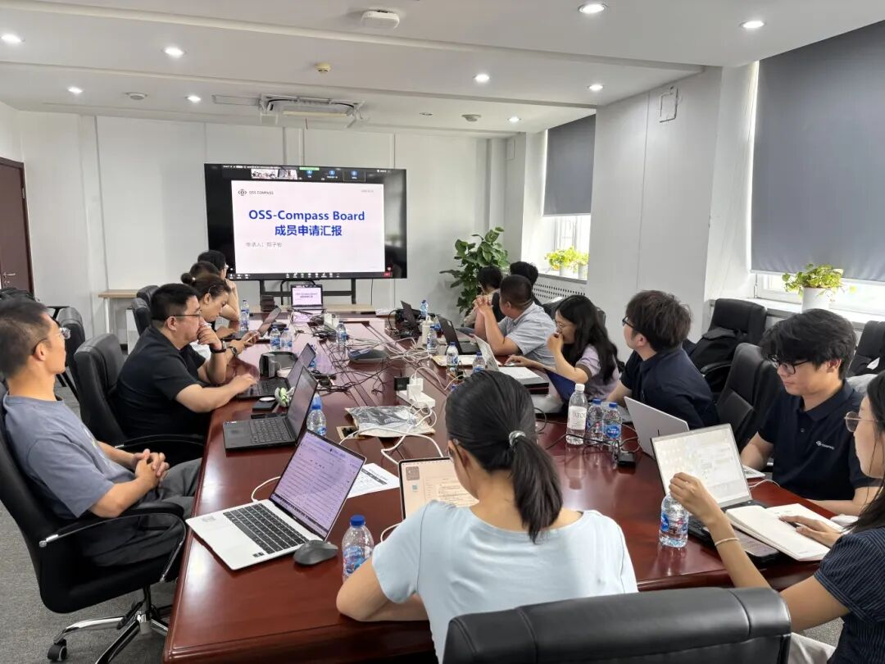

On the afternoon of June 2, 2026, the 2026 Board Meeting of the OSS-Compass Community was successfully held at the Institute of Software, Chinese Academy of Sciences. During the meeting, participants conducted in-depth discussions on core topics including joint talent cultivation, model iteration, developer experience optimization, and the development of a compliance framework for large language models, and finalized the community’s annual priorities and long-term development roadmap.

<!--truncate-->

A total of 16 Board members attended the meeting, namely: Zhou Minghui from Peking University; Tao Xianping and Wang Liang from Nanjing University; Ni Chao from Zhejiang University; Zheng Zibin from Sun Yat-sen University (represented by Wu Weibin); Xu Zhixin from the Software Division of the National Research Center of Industrial Information Security; Yang Liyun from the China Electronics Standardization Institute; Liang Guanyu from the Institute of Software, Chinese Academy of Sciences; Guo Xue from China Academy of Information and Communications Technology (CAICT); Daniel Izquierdo from OpenUK; Hongshu and Zhang Shengxiang from OSCHINA; Long Wenxuan from Qike Houde; Ma Hongwei from Baidu; Ma Quanyi and Wang Yehui from Huawei.

### I. Election of New Board Members

New Board member elections were held at the meeting. Five authoritative experts from leading industrial standard-setting institutions, top-tier universities and international open-source organizations were newly elected. The proposal was unanimously approved after deliberation and voting by all attendees, marking their official admission to the OSS-Compass Community Board of Directors to inject brand-new professional expertise into the community’s ecosystem development. (Listed in the order of speeches delivered)

#### 1. Yang Liyun, Director of the Open Source Research Office, Software Center, China Electronics Standardization Institute

With years of experience in standardization for cloud computing and open source, Director Yang Liyun has advanced the development of open-source standard systems, presided over the formulation and release of multiple national, industrial and association standards in the open-source domain, and taken part in core initiatives of numerous international open-source organizations and committees to drive the implementation of open-source governance standards. Moving forward, she will prioritize advancing the international standardization of OSS-Compass’s indicator framework. Drawing on her accumulated research outcomes and industrial partnership resources, she will deepen collaborative ties with global open-source bodies to facilitate the internationalization of the OSS-Compass system.

#### 2. Guo Xue, Director of the Open Source & Software Security Department, Institute of Cloud Computing and Digitalization, CAICT

Director Guo Xue has long been engaged in the open-source industry, focusing on core work including open-source policy research, industrial standard formulation and industrial ecosystem development, and led the standardization of multiple flagship open-source projects. Following her appointment to the OSS-Compass Community, she will participate extensively in refining the community’s project evaluation framework and core models. Leveraging her role as an industry bridge, she will promote the adoption of OSS-Compass deliverables across industrial and government sectors, supporting central and state-owned enterprises in open-source solution selection and local governments’ open-source ecosystem construction. In addition, she will mobilize resources from standardization bodies, industrial communities and agent-focused open-source communities to build a regular cooperation mechanism with OSS-Compass for improved open-source governance frameworks and core technological iteration.

#### 3. Associate Professor Ni Chao, School of Software Technology, Zhejiang University

Professor Ni Chao’s research team specializes in open-source ecosystem development, focusing on core technologies for intelligent software quality and efficiency assurance, alongside university-based open-source talent training and industry-university-research innovation. The team independently developed [the Taiyi Platform](https://www.taiyi.top), a hub linking universities, industrial enterprises and open-source communities to advance open-source education. To address the mismatch between university training curricula and corporate talent demands, the platform connects students with enterprises and open-source communities via disciplinary competitions, customized courses and thematic practical programs, improving students’ hands-on capabilities and enthusiasm for open-source contribution. According to Ni Chao, his team will partner with OSS-Compass to expand open-source competition programs going forward, cultivating high-caliber open-source professionals tailored to industrial demands and unlocking universities’ endogenous innovation potential in open-source R&D.

#### 4. Daniel Izquierdo, Researcher at OpenHQ & Board Member of CHAOSS under the Linux Foundation

Daniel Izquierdo is a seasoned veteran of the global open-source landscape with deep involvement in top international open-source organizations, concentrating on research into open-source development paradigms and global open-source ecosystem applications. During the meeting, he highlighted the pivotal value of cross-border open-source collaboration and underscored open-source technology’s foundational role in advancing digital transformation for governments, enterprises and public services. He expressed anticipation of establishing robust, long-term cooperation with OSS-Compass to advance sustainable and standardized global open-source development through cross-regional data sharing and joint evaluation model development.

#### 5. Zheng Zibin, Dean of the School of Software, Sun Yat-sen University

Dean Zheng Zibin’s core research centers on compliance evaluation for large language models. Upon joining the community, he will leverage the neutral positioning of open-source foundations and massive developer ecosystems to build an industry-university-research collaborative standard framework for trustworthy large model evaluation. Furthermore, he will accelerate the practical rollout of large model evaluation metrics, core algorithms and evaluation platforms via shared standard infrastructure, dedicated R&D staffing and ecosystem exchange events.

### II. Progress Report from the Evaluation Model Working Group

Wang Yehui, OSS-Compass Board Member and Co-Chair of the Technical Committee, delivered an update on the Evaluation Model Working Group’s latest progress. Against the backdrop of widespread AI adoption and persistent challenges around open-source community identity management, he analyzed sweeping shifts and emerging risks facing open-source community development and software engineering. He noted that AI-powered development is rewriting industry rules, driving mandatory upgrades to conventional open-source governance policies, infrastructure architectures, evaluation frameworks and engineering systems. Based on prevailing industry conditions, the working group laid out its future priorities: tackling prominent pain points in AI-era open-source governance by refining governance rules and infrastructure optimized for intelligent scenarios, upgrading open-source evaluation and engineering frameworks, and exploring innovative industry-university-research partnerships plus the development of intelligent evaluation tools to fully accommodate the new AI-driven open-source development ecosystem.

### III. Progress Report from the AI Working Group

Qi Guoqiang, Lead of the OSS-Compass AI Working Group, reported on the R&D and deployment progress of the developer experience evaluation platform, elaborating on its technical architecture, core evaluation models, task orchestration mechanism and future upgrade roadmap. Built around the full lifecycle of developer engagement within open-source communities, the platform defines six core participation journeys paired with granular assessment tasks to comprehensively gauge developers’ project experience and coding productivity. Adopting a lightweight and modular design, the platform splits complex evaluation assignments into discrete modules, generates customized evaluation plans via intelligent orchestration, and automatically outputs professional assessment reports upon task completion. To date, the platform has pinpointed numerous critical bottlenecks hindering open-source contributors, supports dynamic issue tracking and real-time data updates, and enables online developer feedback to substantially boost practical usability. Moving forward, the working group will continuously integrate cutting-edge AI technologies to upgrade the platform’s intelligence and assessment granularity.

### IV. Establishment of the Open-Source Large Model Compliance Working Group

The meeting formally inaugurated the Open-Source Large Model Compliance Working Group. Yan Xuanchen, Senior Engineer at Huawei, led the presentation of the working group’s core planning and development goals, dissecting prevailing industry challenges across four core compliance dimensions: copyright, privacy, cybersecurity and value compliance. He pointed out major gaps in China’s existing compliance evaluation system for open-source large models, including insufficient transparency around test dataset origins, poor regional adaptability, lack of compliance-focused fine-tuning for models, and oversimplified scoring criteria, all of which hamper standardized industrial growth.

To resolve these pain points, the working group outlined key objectives:

- Develop an open, neutral, reusable and actionable set of compliance standards for open-source large models
- Drive the engineering implementation of compliance algorithms in partnership with universities, tech firms and open-source communities
- Roll out the compliance evaluation platform in phased iterations alongside international standard-setting initiatives

The ultimate goal is to build a widely recognized, industry-wide compliance evaluation system that lifts the overall compliance and trustworthiness of open-source large models in copyright protection, privacy preservation and information security.

The successful wrap-up of OSS-Compass Community’s 2026 Board Meeting has not only brought top-tier cross-sector talents from academia, research institutes and industry onboard but also clarified the blueprint for technological innovation and compliant growth of open-source communities amid the AI revolution.

Going forward, OSS-Compass will keep aggregating premium resources from universities, research institutions, leading enterprises and international open-source organizations. Upholding the open, neutral and collaborative spirit of open source, the community will keep refining its open-source evaluation system, innovate technology-enabled empowerment approaches and consolidate industrial compliance benchmarks to fuel the standardized, intelligent and international development of China’s open-source ecosystem.

