<!--truncate-->

# Significant Community Milestones in 2023

**1. Community Users:** As of December, the total number of active users
on the official website exceeded 15,000, covering over 90 countries and
regions. The top 3 countries are China, the United States, and Japan.
And over 30% of users are from overseas.

**2. International Cooperation:** Established a partnership with CHAOSS,
with CHAOSS set to complete the deployment of OSS Compass's SaaS
service in 2024.

**3. Industry Collaboration:** Fully replaced Gitee Index with OSS
Compass, connecting with over 30 million open source projects; domestic
enterprises\' OSPOs utilizing OSS Compass for community governance and
operation; supported iResearch in releasing the "2023 China
Foundational Software Open Source Industry Research White Paper";
supported COPU in releasing the "2023 China Open Source Development
Blue Book".

**4. Government Collaboration:** Provided data support for "open source
community development improvement action" of the National Industrial
Information Security Development Research Center.

**5. Academic Collaboration:** Six academic achievements from Peking
University and Nanjing University were implemented in the community;
supported academic research of Nanjing University, with one paper
published at CCF-A conference and another submitted to CCF-A journal.

# Part 1: Community Value

## User Growth

From January to December of 2023: Total users on OSS Compass's official
website exceeded 15,000, with over 10,000 new users and an average of
over 1,000 monthly active users.

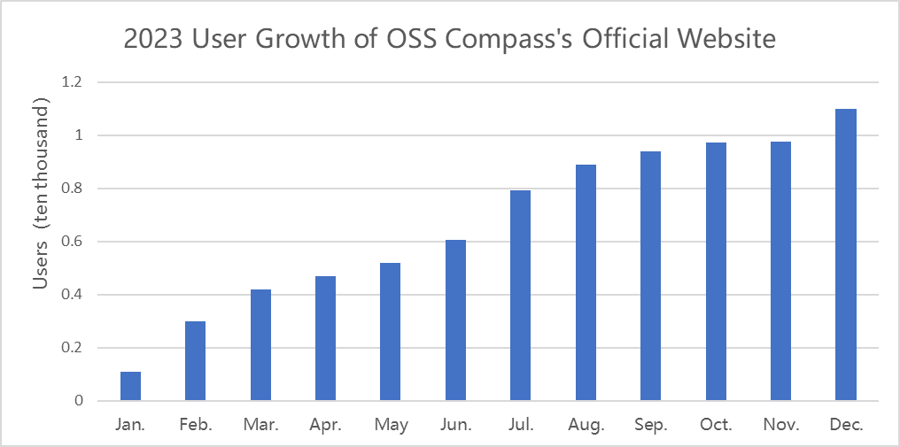

Top three countries by user distribution are China, the United States,
and Japan. The

majority of users are from mainland China, with over 30% from overseas.

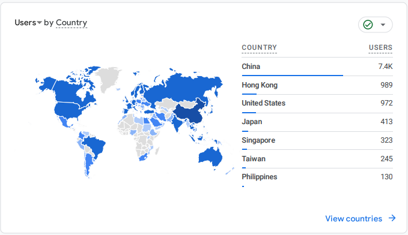

## International Cooperation

1\. Strategic cooperation with the Linux Foundation's CHAOSS community
established, jointly initiating the development of ISO international
standards for open source community evaluation in 2024.

2\. Partnership established with CHAOSS, validating CHAOSS's open
source evaluation model through OSS Compass's SaaS service "Compass
Laboratory".

3\. CHAOSS set to complete the deployment of OSS Compass's open source
ecosystem evaluation solution SaaS service in 2024.

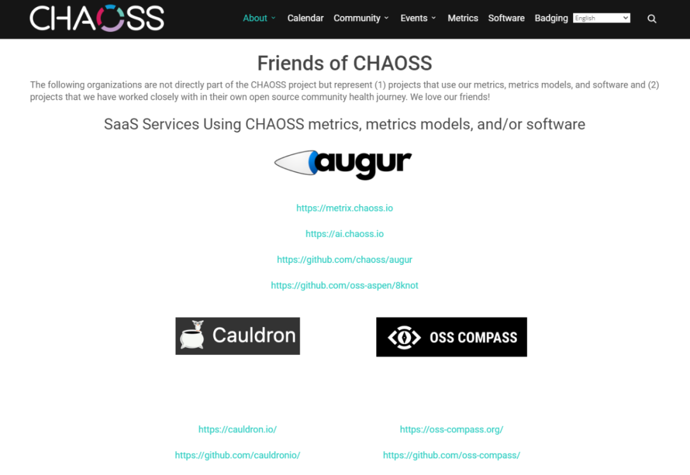

## Industry Collaboration

1.  From November to December, the largest domestic code hosting
    platform, Gitee, integrated OSS Compass's open source ecosystem
    evaluation solution, enabling the display of OSS Compass evaluation
    index for over 30 million open source projects.

> 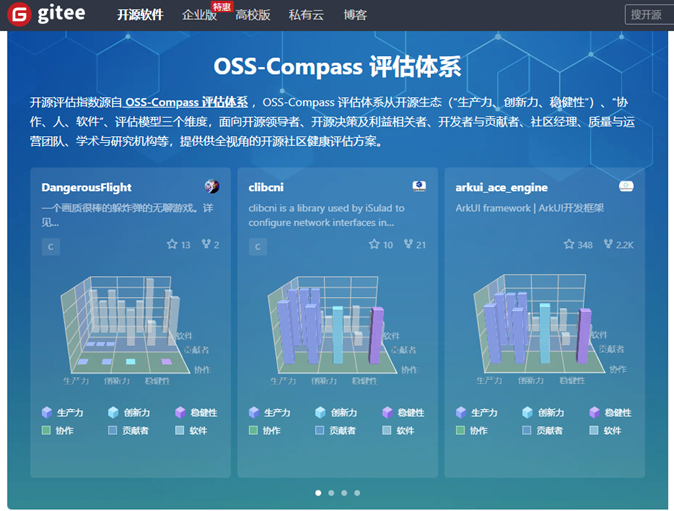

2\. From September to December, some domestic technology companies\'
OSPOs voluntarily used OSS Compass's open source ecosystem evaluation
solution for governance and operation of related open source
communities.

3\. In June, OSS Compass provided data support for the "2023 China Open
Source Development Blue Book", the compiling of which was led by the
China OSS Promotion Union (COPU).

## Consulting Agency Cooperation

In September, OSS Compass provided data support for the "2023 China
Foundational Software Open Source Industry Research White Paper"
released by iResearch. Related article links:

[OSS Compass supports the release of the "2023 China Foundational
Software Open Source Industry Research White
Paper"](https://mp.weixin.qq.com/s?__biz=MzkxMDQzNjc2MQ==&mid=2247484400&idx=2&sn=6b5b1183b20cfac38d80d0355659a1a1&scene=21#wechat_redirect)

[Huawei Full Connection Conference 2023 \| Open Source Ecosystem
Construction Is Becoming Key to the Development of the Intelligent
World](https://mp.weixin.qq.com/s?__biz=Mzg3OTQzMDcwMA==&mid=2247508742&idx=1&sn=ea51001c54f78987195daea8b50f3b4a&scene=21#wechat_redirect)

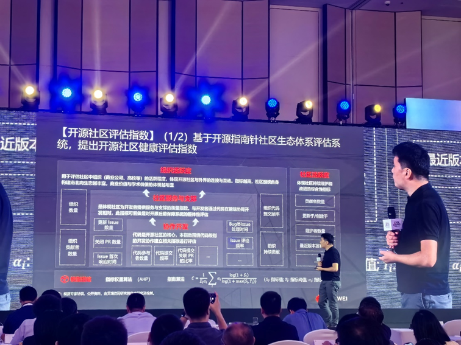

## Government Organization Collaboration

In October, the National Industrial Information Security Development
Research Center, in conjunction with Nanjing University, Huawei,
OSChina, Baidu, and other organizations, launched the "Open Source
Community Development Improvement Action" during the "2023 Shenzhen •
China 1024 Programmer Festival", aiming to promote the healthy
development of open source communities. OSS Compass provided data
support for this action.

## Academic Collaboration

**1. Six academic achievements from Peking University and Nanjing
University landed in OSS Compass**

In 2023, OSS Compass actively collaborated with Peking University and
Nanjing University on academic reasearches. Currently, six academic
achievements from both universities have been deployed in OSS Compass's
SaaS service "Compass Collaboration".

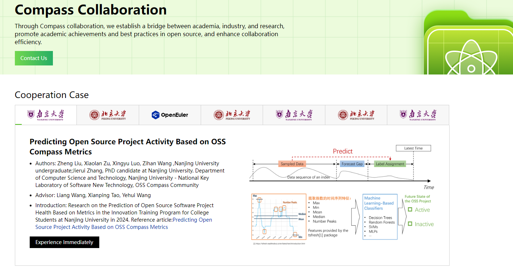

https://oss-compass.org/collaboration

**2. OSS Compass supported Nanjing University in publishing CCF-A
conference papers and journal papers**

OSS Compass supported the academic research of Professor Liang Wang's
team at Nanjing University on entropy-based metrics for measuring open
source projects\' forks, providing data support for the paper presented
at the CCF-A conference in September 2023.

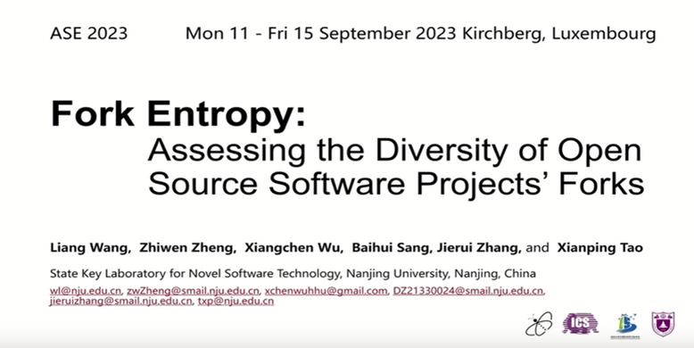

Additionally, Professor Liang Wang's team submitted a paper based on
the above research to a CCF-A journal: "Entropy-Based Indices to
Quantify Community Evolution in Developer Social Networks," which is
currently under review.

## Other Collaborations

Currently, various domestic and foreign organizations related to open
source in government, industry, academia, and research institutions are
actively seeking cooperation with OSS Compass. Specific forms of
cooperation are being discussed, including project cooperation and
commercial cooperation simultaneously.

# Part 2: Technical Progress

## Datasets

As of December, OSS Compass's dataset has included over 100,000 open
source projects, with over 1,000 actively submitted to OSS Compass.
There are over 300 technical subcategories for these projects.

## Open Source Ecosystem Evaluation System

**1. Open Source Ecosystem Evaluation System Restructured with the
contributor persona models added:**

In December, OSS Compass announced a brand-new open source ecosystem
evaluation system on its official website documentation page. This new
architecture builds over a dozen evaluation models in a
three-dimensional space interwoven with "Productivity, Robustness,
Niche Creation" and "Software, Collaboration, People". The previous
SaaS platform had only four evaluation models: "Collaborative
Development Index", "Community Service and Support", "Community
Activity" and "Organization Activity". Now, three contributor persona
models have been added, including "Contributor Domain Persona",
"Contributor Milestone Persona" and "Contributor Role Persona".

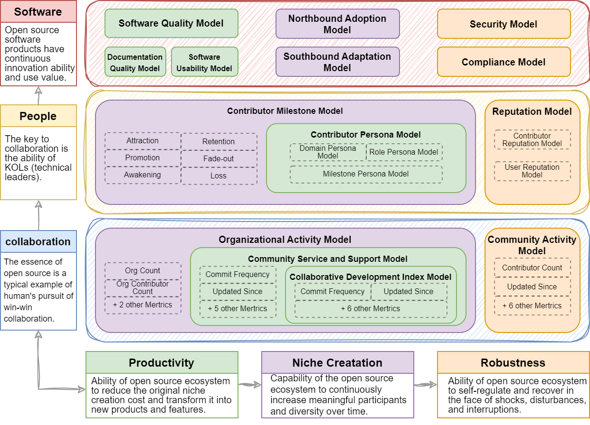

**2. Existing Evaluation Models Optimized:**

In the second and third quarters, optimization was performed on over 30
evaluation metrics, and all metrics of the "Collaborative Development
Index", "Community Service and Support", "Community Activity" and
"Organization Activity" models were atomized, totaling 45 metrics,
including five types of code, issues, PRs, repositories, and
contributors.

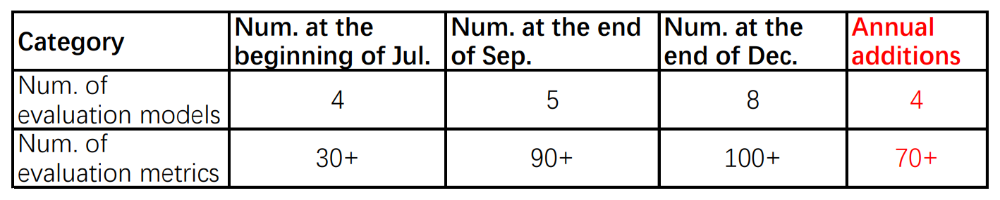

## SaaS Services

Since its official release on February 21, 2023, OSS Compass has
continuously accelerated iterations and optimizations at the technical
level to provide better metric models and SaaS services. As of December,
2023, the following significant progress has been made in SaaS services:

---

July

[Compass Badge for Project
Reports](https://oss-compass.org/blog/2023/07/22/compass-badge/compass-badge)

[Y-axis Scaling for Project Reports
Charts](https://oss-compass.org/blog/2023/07/28/y-axis-scaling/y-axis-scaling)

August

[Switching between One-point System to Percentage System for Project Reports
Charts](https://oss-compass.org/blog/2023/08/05/scoring-system-switch/scoring-system-switch)

[Compass Lab](https://oss-compass.org/blog/2023/09/01/explore-compass-lab/explore-compass-lab)

September

[Redirection from Project Reports to Repositories with
One-click](https://oss-compass.org/blog/2023/09/15/visit-project-categories/visit-project-categories)

October

[Report Charts Embeddable in Open Source Project
Webpages](https://oss-compass.org/blog/2023/10/13/report-charts-embems/report-charts-embems)

December

[Contributor Persona Models](https://oss-compass.org/blog/2023/12/29/contributor-persona-update/)

[Project Deep Dive Insight
Solution](https://oss-compass.org/blog/2023/12/29/contributor-persona-update/)

[Three-dimensional Evaluation System
Graph](https://oss-compass.org/blog/2024/01/05/compass-collaboration-update/)

[Compass Collaboration](https://oss-compass.org/blog/2024/01/05/compass-collaboration-update/)

---

# Part 3: Community Governance

## Community Meetings

1\. [The 2023 fourth-quarter community Board
meeting](https://oss-compass.org/blog/2023/12/20/explore-community-values/)
held on December 13, with two updates of meeting minutes (in Chinese and
English) to the repository; [the first Board meeting of
2023](https://oss-compass.org/blog/2023/09/01/first-board-meeting/first-board-meeting)
held on August 23, with two updates of meeting minutes (in Chinese and
English) to the repository.

Board Meeting Minutes:
[Chinese](https://github.com/oss-compass/community-zh/blob/main/meeting%20minutes/2023_meeting_minutes/2023_board-meeting-minutes_Zh-CN.md),
[English](https://github.com/oss-compass/community/blob/main/meeting%20minutes/2023_meeting_minutes/2023_board-meeting-minutes_EN.md)

2\. Total 36 technical community meetings held, with community meeting
minutes updated in both Chinese and English of 72 times.

Community Meeting Minutes:
[Chinese](https://github.com/oss-compass/community-zh/blob/main/meeting%20minutes/2023_meeting_minutes/2023_community-meeting-minutes_Zh-CN.md),
[English](https://github.com/oss-compass/community/blob/main/meeting%20minutes/2023_meeting_minutes/2023_community-meeting-minutes_EN.md)

Board members took a group photo at Peking University campus After the
2023 fourth-quarter Board meeting.

## Website Maintenance

Throughout the year, the OSS Compass website underwent multiple rounds
of updates, including adding Gitee or Github repository identifiers to
all project avatars, adding technical category labels to repositories,
optimizing the content displayed on the homepage, adjusting the website
menu bar, adding dynamic pages, and optimizing documentation page
content, etc.

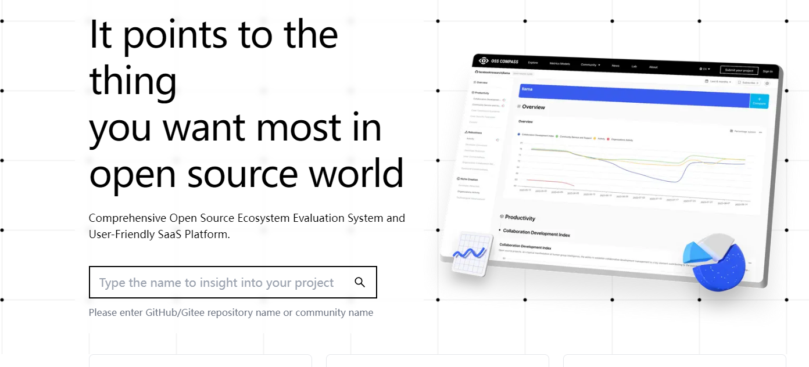

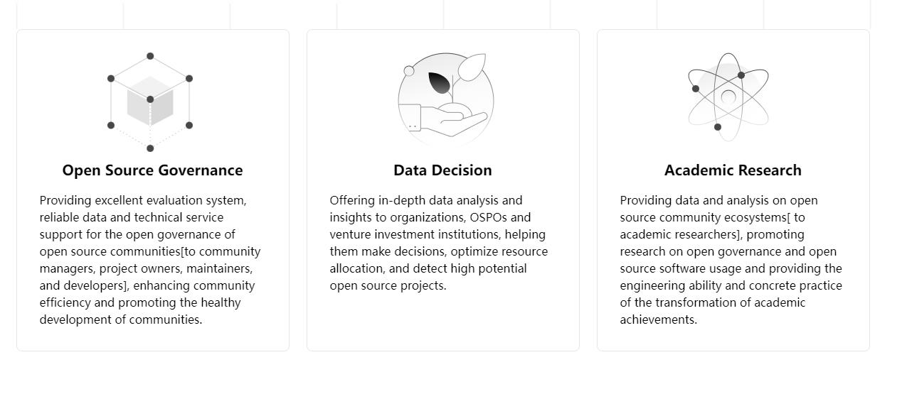

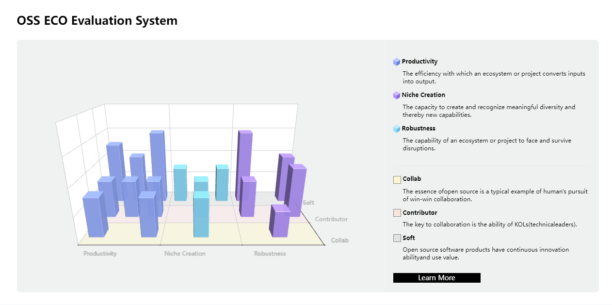

# Part 4: Community Operations

## Community Events

December 13: [2023 OSS Compass Community Annual
Meeting](https://oss-compass.org/blog/2023/12/20/annual-meeting2023/)

December 1: [Participated in the 2023 CCF China Software
Conference](https://mp.weixin.qq.com/s/h6A4w-oR9k6IR_xk7Ei-4g)

November 22: [Participated in the Hefei Open Source Ecosystem
Development Exchange
Meeting](https://gxq.hefei.gov.cn/xwdt/yqyw/18646651.html)

November 21: [Participated in the CHAOSScast interview
program](https://mp.weixin.qq.com/s/tP4vDQ78Ibu74gJk4L12mQ)

November 4: [Be Invited to participate in the 7th Xiuhu Conference of
CCF](https://oss-compass.org/blog/2023/11/07/xiuhu-conference/)

October 24: [Participated in the "2023 Shenzhen • China 1024 Programmer
Festival"](https://mp.weixin.qq.com/s/dMwf7OQlMZcOkSAfX_O6Vw)

September 21: [Participated in OSS EU
2023](https://oss-compass.org/blog/2023/09/28/foresee-pytorch/foresee-pytorch)

August 23: Organized Compass Lab release live streaming event, [first
half](https://mp.weixin.qq.com/s/Xe76rke1efTXGg969mspUg) and [second
half](https://mp.weixin.qq.com/s/NOdQBcdjOA1DQwEdPmiVQw)

May 28: [Participated in GOTC and planned Open Source Ecosystem Health
Evaluation Forum](https://mp.weixin.qq.com/s/Y_FcT5LRe8a5ASb_szzR0g)

April 19: [Participated in the Open Source Rainforest Forum of China
International Software Development
Conference](https://mp.weixin.qq.com/s/3JVzMidbLAfhJNgh-0t4jA)

February 21: [OSS Compass launch
event](https://oss-compass.org/blog/2023/06/09/thrives-since-launch/thrives-since-launch)

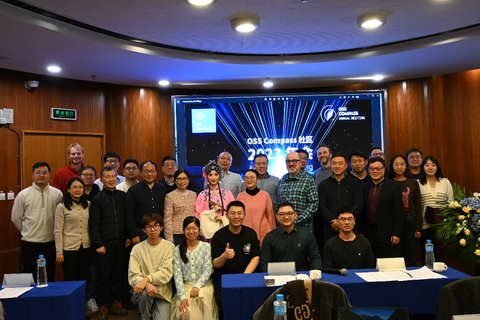

2023 OSS Compass Community Annual Meeting

## Marketing and Communication

1\. Sent 44 articles via WeChat official account platform, with 31
original articles, accumulating over 330 followers and over 10,000
reads.

2\. Updated Twitter 11 times, accumulating over 400 reads.

3\. Updated WeChat video account 17 times, accumulating nearly 3,000
views.

## WeChat Groups/Slack Channels

1\. Official WeChat group has over 280 members, with over 100 new
additions.

2\. Slack channel has over 45 users, with over 10 new additions.

# Part 5: 2024 Community Planning

## Technological Evolution and Business Planning

**1. Continue Optimizing the Open Source Ecosystem Evaluation System and
its SaaS Services**

\(1\) Complete the development and launch of models such as contributor
journey, reputation, security, compliance, software quality, etc.;

\(2\) Continue integrating other high-quality open source academic
research results and community best practices, expanding the services of
Compass Collaboration;

\(3\) Optimize the current open source evaluation SaaS services based on
user feedback.

**2. Launch Global Insights and Provide Specific Open Source Ecosystem
Evaluation Solutions to Different Groups**

\(1\) Provide comprehensive evaluation systems, reliable data, and
technical service support for open source community managers, project
owners, maintainers, and developers to improve community efficiency and
promote healthy community development.

\(2\) Provide in-depth data analysis and project insights for
organizations, OSPOs, and venture capital institutions to assist in
decision-making, resource allocation optimization, and the discovery of
high-potential open source projects.

\(3\) Provide open source community ecosystem data and analysis for
academic researchers to promote research on open source governance and
software usage, while also providing engineering capabilities and
specific practices for academic results transformation.

**3. Collaborate with Venture Capital Institutions to Promote OSS
Compass**

Through collaboration with venture capital institutions, explain OSS
Compass data, further compile case studies, and promote user cases of
OSS Compass to attract more users.

**4. Work Closely with CHAOSS to Establish ISO International Standards
for Open Source Ecosystem Evaluation**

Collaborate with CHAOSS to jointly initiate the development of ISO
international standards for open source community evaluation, expected
to complete the first draft in 2024.

**5. Establish Cooperation with OpenSSF**

Work together with CHAOSS to promote OSS Compass as the officially
recognized open source evaluation platform of OpenSSF.

# Part 6: Conclusion

2023 was a year when the OSS Compass community was born and embarked on
a new stage. Over the past 12 months, we have witnessed rapid growth in
the community, deep cooperation both domestically and internationally,
technological advancements, and significant achievements in community
governance and operations.

In 2024, we will continue to improve and optimize, striving to provide
more innovative and valuable features for the vast open source
communities. We will actively collaborate with various parties to
promote the healthy development of the global open source community
ecosystem. We appreciate the support and participation of community
members and look forward to continuing our journey together in 2024!
