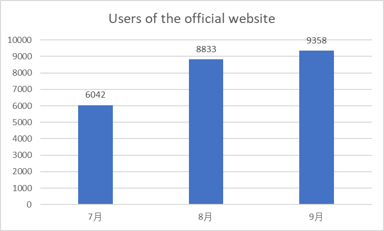
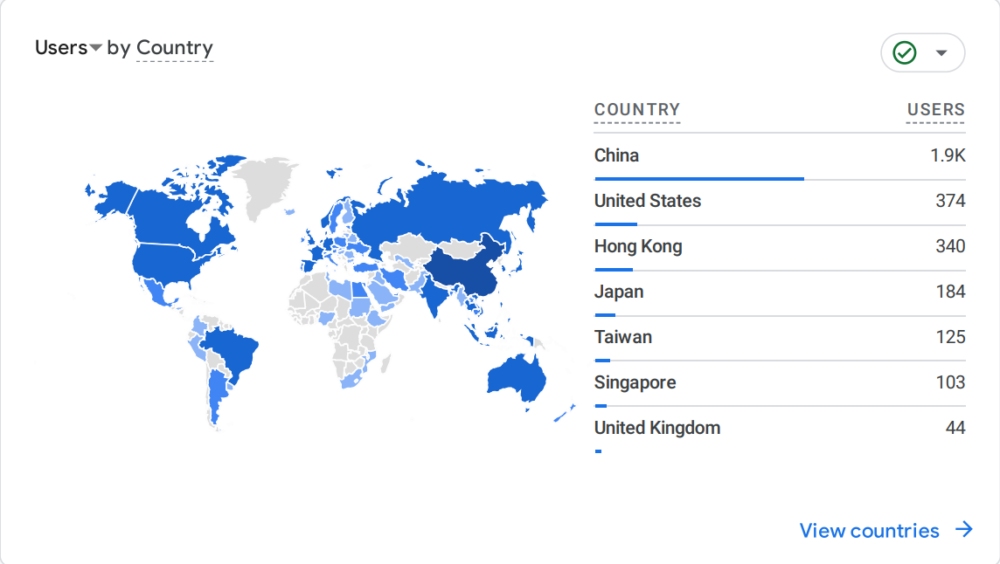
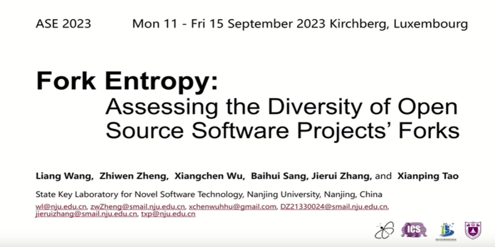
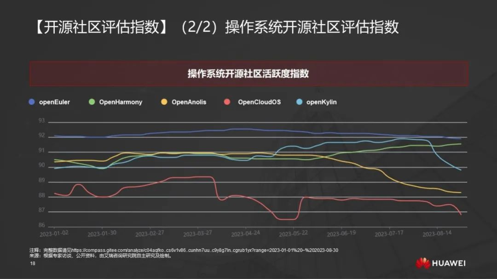
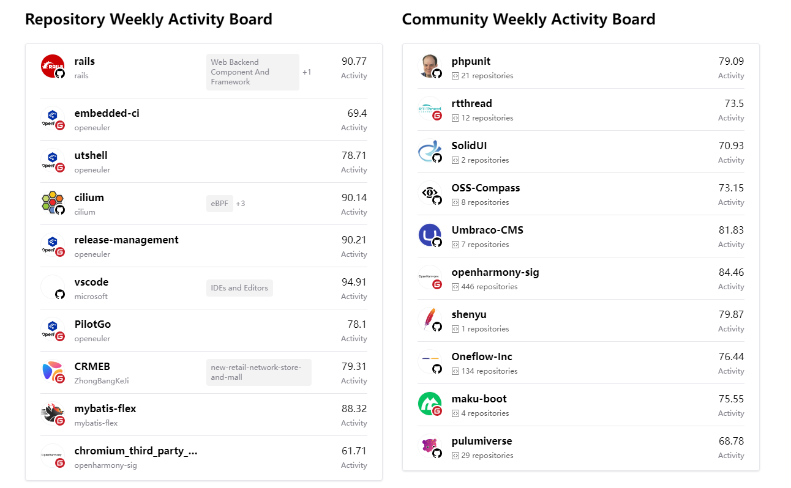
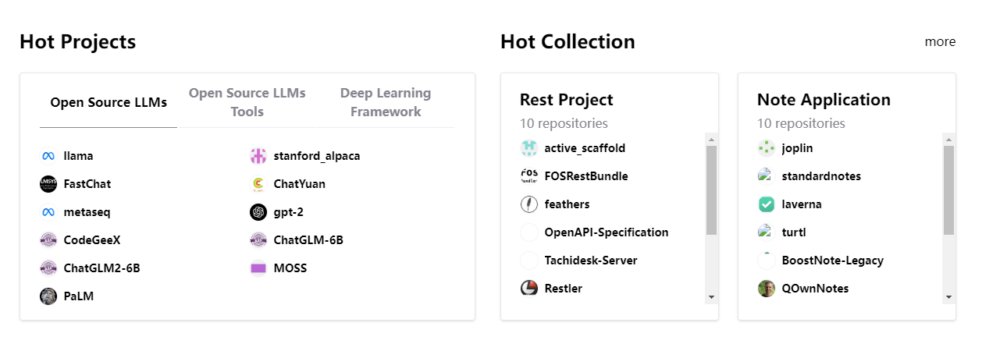
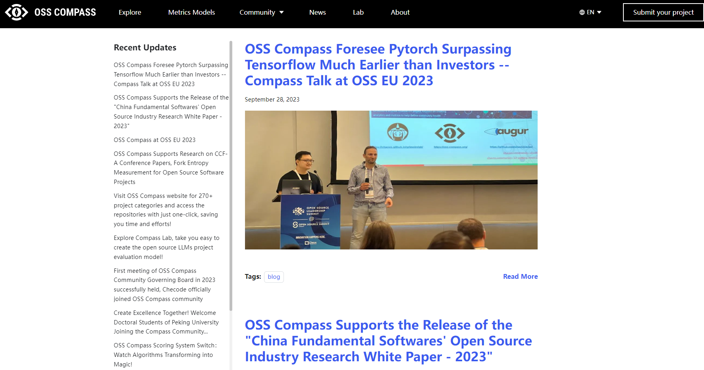
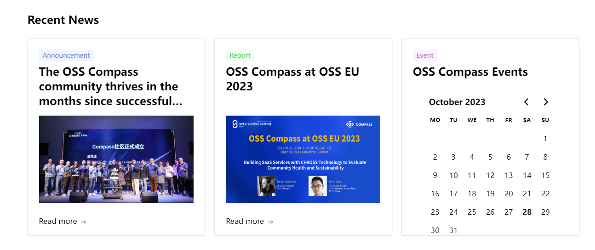
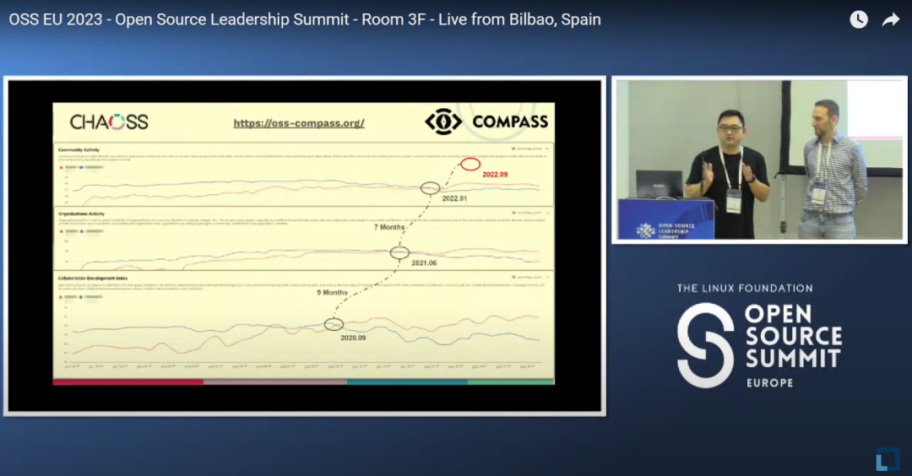

### Community Highlights

- On September 21st, we participated in OSS EU 2023 and delivered a speech, further expanding OSS Compass's influence in Europe and globally. After the event, we received collaboration invitations from an open source project both well-known in Europe and America.

- OSS Compass (hereinafter referred to as "Compass") has become a partner of CHAOSS, and CHAOSS is actively advancing deep collaboration with Compass.

- Compass is supporting academic research of Nanjing University, providing data support for the CCF-A class conference paper.

- Compass supported the release of the " 2023 China Fundamental Softwares' Open Source Industry Research White Paper".

- On August 23rd, we organized the first Compass community board meeting of 2023.

- On August 23rd, we hosted a live streaming event for the release of Compass Lab, reaching an audience of tens of thousands.

<!--truncate-->

### Part 1: Community Value

#### User Growth

From July to September, the total number of users on our official website increased to over 9,300, with over 3,300 new users.

The majority of users come from mainland China, but more than 30% of our users come from Europe, America, Japan, Singapore, Taiwan, Hong Kong, and other countries and regions.

#### Strategic Partnerships

On September 21st, Yehui Wang represented Compass and CHAOSS at OSS EU 2023 and delivered a speech, further expanding our influence in Europe and globally. We also received collaboration invitations from an open source project both well-known in Europe and America.

  

[https://compass.gitee.com/blog/2023/09/28/foresee-pytorch/foresee-pytorch](https://compass.gitee.com/blog/2023/09/28/foresee-pytorch/foresee-pytorch)

  

We have established a partnership with CHAOSS, and CHAOSS is actively promoting deep collaboration with Compass.

Compass is supporting academic research of Peking University, Nanjing University, and other universities, and have provided data support for Professor Liang Wang's CCF-A class conference papers.

  

[https://compass.gitee.com/blog/2023/09/15/supports-ccf-papers/supports-ccf-papers](https://compass.gitee.com/blog/2023/09/15/supports-ccf-papers/supports-ccf-papers)

  

Compass provided data support for the "2023 China Fundamental Softwares' Open Source Industry Research White Paper" released at the the Open Source Forum of HUAWEI CONNECT 2023 on September 21st. This report was published by iResearch.

  

[https://compass.gitee.com/blog/2023/09/28/release-white-paper/release-white-paper](https://compass.gitee.com/blog/2023/09/28/release-white-paper/release-white-paper)

  

### Part 2: Technical Progress

Since our official release on February 21, 2023, OSS Compass has been continuously accelerating its iterations and optimizations at the technical level to provide superior metric models and SaaS services, as well as expanding its data sets.

#### Data Sets

From July to September, Compass evaluation datasets have been expanded with over 30,000 projects added, and the total number of open source projects in our database has been increased from over 20,000 to 50,000, offering users a wider selection. We also optimized the technical categorization of projects, adding over 200 sub-categories, increasing the total number of categories from 100+ to 300+.

| Category                        | The numbers at the beginning of July | The numbers at the end of September | Increased by |
| ------------------------------- | ------------------------------------ | ----------------------------------- | ------------ |
| Numbers of open source projects | 20000+                               | 50000+                              | 30000+       |
| Technical catagories            | 100+                                 | 300+                                | 200+         |

#### Open Source Ecosystem Evaluation System

We optimized the existing 30+ evaluation metrics and 4 evaluation models, enhancing the "last updated" metric in the activity model and excluding archived repositories from evaluation metrics. We broke down all the metrics for the "Collaborative Development Index", "Community Service and Support", "Activity" and "Organization Activity" models, including five types: code, issues, pull requests, repositories, and contributors, totaling 45 individual metrics.

#### SaaS Services

From July to September, Compass introduced a new SaaS service called Compass Lab, along with some project dashboard features such as Compass badges, Y-axis Scaling for charts, switching between One-Point System and Percentage System, and one-click access to repositories.

[Compass Lab](https://compass.gitee.com/blog/2023/09/01/explore-compass-lab/explore-compass-lab)

[Compass badges](https://compass.gitee.com/blog/2023/07/22/compass-badge/compass-badge)

[Y-axis Scaling for charts](https://compass.gitee.com/blog/2023/07/28/y-axis-scaling/y-axis-scaling)

[Switching between One-Point System and Percentage System](https://compass.gitee.com/blog/2023/08/05/scoring-system-switch/scoring-system-switch)

[One-click access to repositories](https://compass.gitee.com/blog/2023/09/15/visit-project-categories/visit-project-categories)

### Part 3: Community Governance

#### Community Meetings

From July to September, we organized 19 technical meetings and provided meeting minutes in both English and Chinese for repository updates 17 times.
https://github.com/oss-compass/community/blob/main/meeting%20minutes/meeting-minutes_EN.md

On August 23rd, we hosted the first community board meeting of 2023, with one board meeting summary for repository updates.
https://github.com/oss-compass/community/blob/main/meeting%20minutes/board-meeting-minutes_EN.md

  

[https://compass.gitee.com/blog/2023/09/01/first-board-meeting/first-board-meeting](https://compass.gitee.com/blog/2023/09/01/first-board-meeting/first-board-meeting)

  

#### Official Website Maintenance

We added Gitee or Github repository icons to all project avatars on our official website, along with technical categorization tags for repositories to provide clearer information.

We optimized the previous hot field on homepage by dividing it into two sections: popular projects and popular categories. The popular projects section showcases recent, highly popular projects related to open source LLM and deep learning frameworks, while the popular categories randomly display projects from different technical categories.

We added a News page to the website, updating it with recent technical updates and community news, and showing the latest activities on the homepage.

### Part 4: Community Operations

#### Community Activities

On August 23rd, we organized a live streaming event for the release of Compass Lab, which was simultaneously broadcasted on six platforms and reached tens of thousands of viewers.

The first half of the live stream:
http://mp.weixin.qq.com/s?__biz=MzkxMDQzNjc2MQ==&mid=2247484283&idx=2&sn=f6fd46f82bec89a2d391aed54ffbe10e&chksm=c12a338df65dba9b750193dd74bf72aaf501883be3679b7fc3aa4f1dfba4b45345f823f1ee5b&scene=21#wechat_redirect

The second half of the live stream:
http://mp.weixin.qq.com/s?__biz=MzkxMDQzNjc2MQ==&mid=2247484324&idx=1&sn=4e54c0905909dc6b5ec3c14678092edb&chksm=c12a3352f65dba4418f3794c31b11de0b61693df39e7a53f3d8b6381a278455a69d0a2d2255b&scene=21#wechat_redirect

On September 21st, Yehui Wang represented Compass and CHAOSS in delivering a speech at OSS EU 2023.

http://mp.weixin.qq.com/s?__biz=MzkxMDQzNjc2MQ==&mid=2247484400&idx=1&sn=c3ac26dd4b5a96ca03fab5f52a230d3b&chksm=c12a3306f65dba10586c4eb8a093c333bf038191781001fe5891598f93536abf1cced876cf87&scene=21#wechat_redirect

#### Marketing and Communication

We sent out 15 articles via our WeChat official account platform from July to September, including 5 articles of feature updates, 6 articles of events previews and reviews, 1 article introducing community members, 2 articles for community partnership news, and 1 article about the community board meeting, getting more than 230 followers and nearly 3,000 views. We posted 10 updates on Twitter, with almost 300 views. We uploaded three videos on our WeChat video account, including two videos of the live event on August 23rd and the OSS EU 2023 speech on September 21st, with almost 700 plays. Our official WeChat group has nearly 300 members with over 90 new members added.

### Part 5: Conclusion

OSS Compass is dedicated to continuous improvement and expansion to meet the evolving needs of our users, providing a comprehensive, flexible, and efficient open source project evaluation service. We will continue to work hard to deliver innovations and valuable features in the field of open source evaluation for our large community of users.
