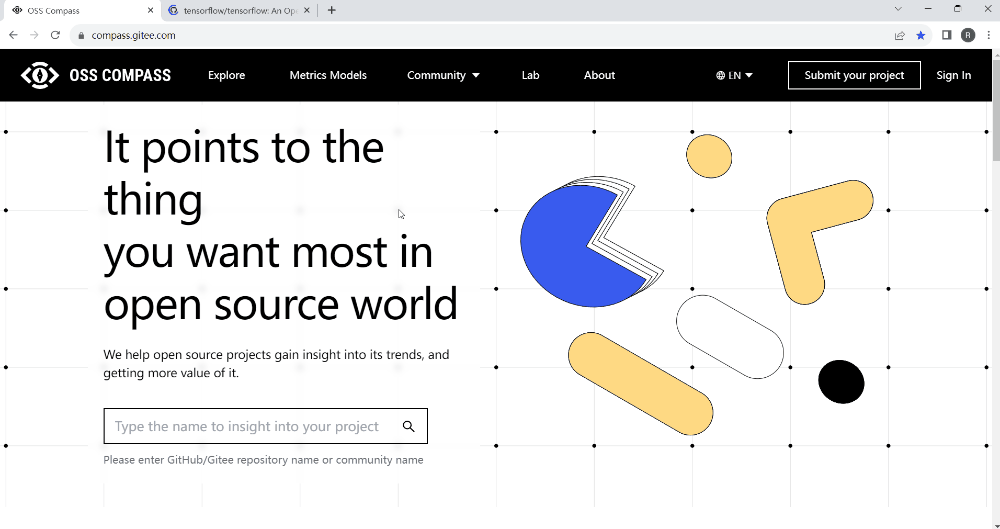

<!--truncate-->

### 01 Introduction to Compass Badge

OSS Compass has recently introduced the "Compass Badge" feature. After adding Compass Badge to an open source project, you can instantly view the latest values of evaluation metrics in three dimensions: productivity, robustness, and innovation. You can also easily navigate to the dashboard to learn more about the project's specific status.

### 02 How to Add Compass Badge

1. On the "Explore" page of the OSS Compass official website, find the open source project you're interested in and click on it to navigate to the project's dashboard.
2. On the dashboard page, click on the settings icon in the upper right corner. Find the "Compass Badge" feature and enable it. This will take you to the Compass Badge page.
3. On the Compass Badge page, choose the badges you want to add (either the overall project status badge or individual metric badges). Copy the badge URL.
4. Add the copied URL to the Readme document of the project's GitHub repository, save it, and you will be able to view the badges.

Here is a demonstration of how to add Compass Badge:

  

Important Note:
Compass Badge can only be added after the open source project has been evaluated using the OSS Compass evaluation models!

  

As mentioned earlier, adding badges will take you to the dashboard where you can learn about the latest status and trends of the open source project. In fact, on the dashboard, you can not only get insights into the project's current status but also compare its data with other projects. Stay tuned for more details in the next update.

OSS Compass has been released for just 5 months, and we have received a lot of positive feedback. One foreign user described OSS Compass as "a brilliant project."

In the future, OSS Compass will continue to evolve and give back to the broader user base, providing greater convenience for open source project evaluation and assisting in the healthy and sustainable development of open source communities.

We look forward to more developers joining the OSS Compass community and contributing to its development. At the same time, we welcome users to continue using Compass SaaS services and providing feedback, continuously powering the enhancement of OSS Compass's capabilities.
