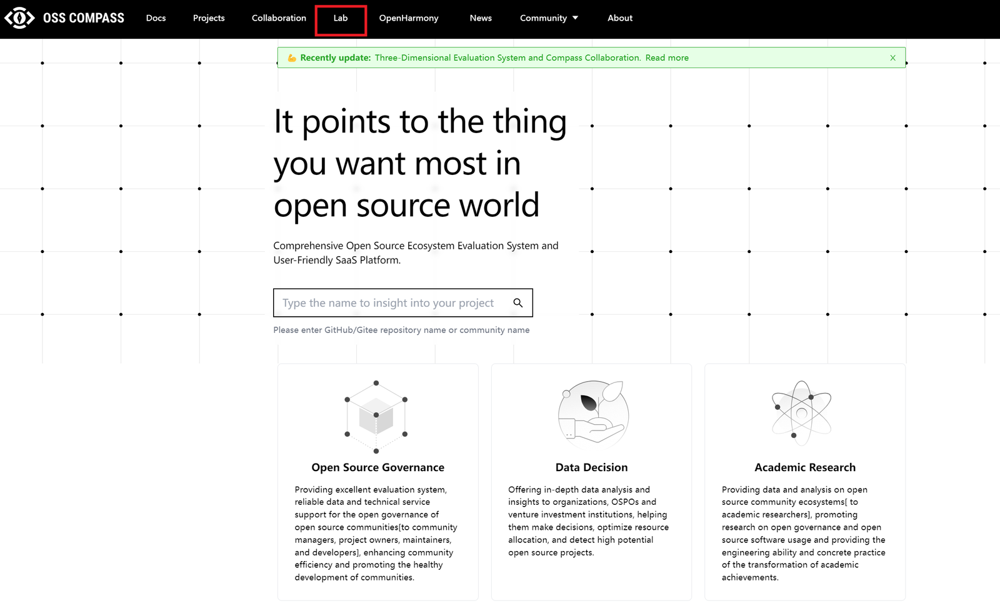
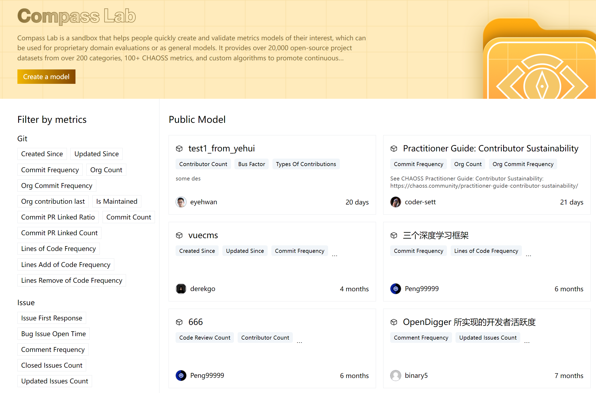
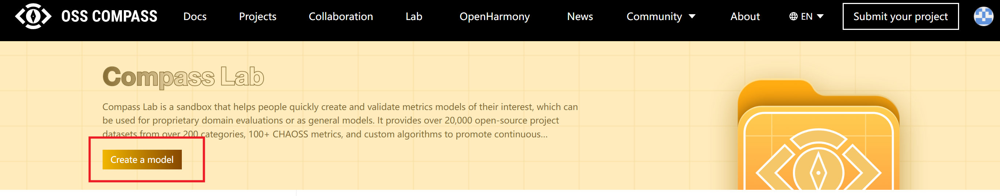
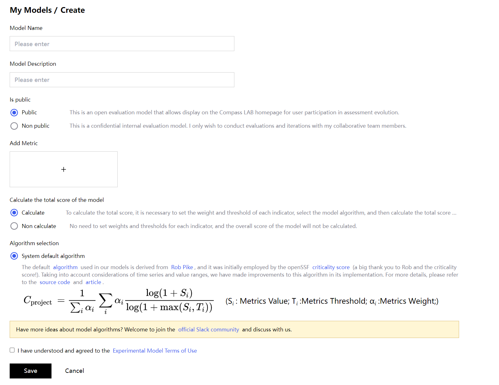
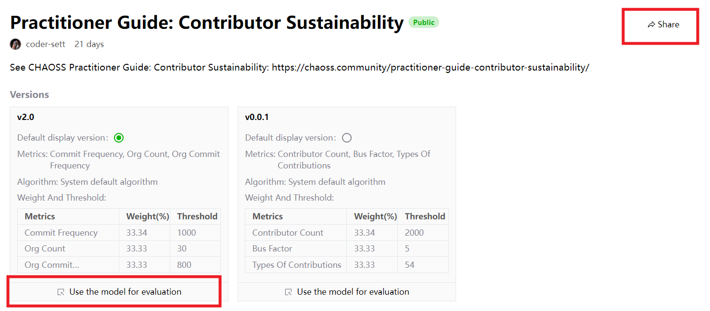
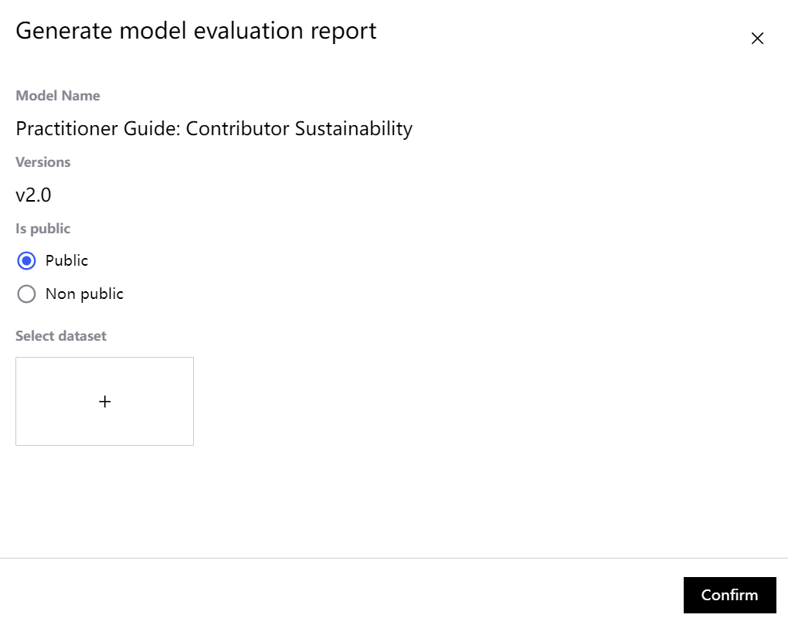
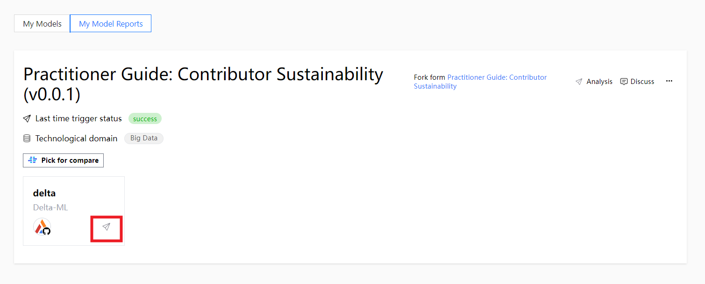

Hello, everyone, do you remember Compass Lab, the SaaS service launched by Compass last year? I believe many users have already experienced this awesome feature! It is a powerful assistant for users to manage evaluation projects, not only aggregates a huge amount of data, but also provides a full range of health assessment services, and has gained a lot of positive feedback from users over the past year.

<!--truncate-->

Now, we've upgraded Compass Lab with new features! Not only the functions are more diversified, but also the user operation becomes more convenient and fast, come and take a look with us to see what are the new changes~!

### **Explore the new changes to Compass Lab:**

First of all, let's go to the official website of OSS-Compass, click on “Lab”, and experience with us how much fun the updated Compass Lab are!

#### **1. Enter the home page: revamped and clearer**

When you enter the home page of Compass Lab, you can see that our model list has been revamped, and you can directly click on the model to enter the model details page; in addition, we have added new indicators to filter the conditions of classification, such as “frequency of submission of organizational code, and continuous contribution of the organization”. This will help you find your model more quickly and accurately.

#### **2.Create model: faster operation**

When you click Create Model, you will find that you don't need to select a dataset anymore! You only need to enter the model name and model description, select the metrics and adjust the weights and thresholds.

#### **3. Generate evaluation report: more accurate customization**

After the model is created, users can use the specified version of the model in “My Models” to evaluate, i.e., select the dataset and generate a model report. Different model versions can generate different model evaluation reports, so users can customize the reports according to their own preferences.

In addition, we have added a new sharing button for public models, so that other users can access the model through the link and view the public model report, or use the public model version to evaluate the model directly, isn't it convenient and practical?

#### **4. Viewing reports: shorter waiting time**

View the generated model report in the “My Model Reports” section or the model details page, click Trigger Analysis and wait for it to complete, then you can view the evaluation report.

We've also added a new model report to trigger individual project analysis, which reduces the wait time for all~

#### **5. More functions: continuously updating**

In addition, Compass Lab will join hands with CHAOSS to add more models and metrics, about how we are linking up, and what kind of sparks will collide? You can keep following the “Open Source Compass” public number to know the new trend as soon as possible~.

Finally, have you already understood almost all of the current updated features of Compass Lab, then come and try it out~!

In the future, OSS-Compass will continue to evolve, provide more convenient assessment services for the majority of users, and continue to improve the effectiveness of the community and promote the healthy development of the community.
