import png from './media/1111.png';

Zheng Liu，Xiaolan Zu，Xingyu Luo，Zihang Wang，Jierui zhang，Yehui wang，
Liang Wang, Xianping Tao
Department of Computer Science and Technology, State Key Laboratory for Novel Software Technology, Nanjing University Huawei Technologies Co, Ltd. OSS Compass

### Abstract

This study proposes a method to predict the future activeness of open source projects using OSS Compass indicators. It employs a feature-based time series classification approach, extracting statistical features from OSS Compass indicator series and using machine learning algorithms for prediction. The method demonstrated an accuracy of nearly 90% in cross-validation on a dataset of around 600 projects and about 80% accuracy on a larger set of over 10,000 repositories, indicating its practical applicability. The results partially reflect the future health status of open source projects, demonstrating the effectiveness of the OSS Compass indicator system in measuring the health of open source software. The method could provide valuable insights for users, developers, investors, and managers of open source software.

<!--truncate-->

### 1 OSS Compass Open Source Project Health Metrics Dataset

#### 1.1 Data Preparation

This research encompasses two principal datasets, designed to provide comprehensive information to support our study. Initially, we have the expansive dataset A, which includes data from 20,213 repositories. This dataset's vast scope encompasses a broad spectrum of open-source projects, offering a rich pool of reference materials for our analysis. Furthermore, we have curated a more focused subset, dataset B. This subset, extracted from the larger dataset A, was selected based on key metrics such as star and fork counts of open-source projects, thereby representing the most influential and exemplary projects within the open-source community. Dataset B comprises 735 repositories, whose data are pivotal for extracting features relevant to our research. We then gathered metrics time-series data for each repository, categorized into four dimensions and comprising 80 metrics (including a time dimension), with each metric forming a time series directly corresponding to each repository (zero imputation was employed for missing data).

#### 1.2 Data Cleaning

Upon an intensive review of the collected metric data, we engaged in a rigorous data filtering process to ensure the integrity and reliability of the datasets. Initially, repositories with challenging data retrieval, either due to data scarcity or the presence of irregular, 'dirty' data, were excluded. This filtration resulted in a refined dataset A, now consisting of 20,181 repositories, replete with all requisite metric information. Similarly, dataset B was condensed to 600 repositories, all demonstrating exemplary data quality and usability, laying a solid foundation for further analysis.

#### 1.3 Open Source Repository Selection

Considering the specific requirements for time series length in our predictive tasks, we implemented several data selection and processing steps to ensure the quality and appropriateness of our datasets. Repositories with insufficient time series length, including empty repositories, were excluded as they could not provide adequate data for reliable predictions. Additionally, our focus was on utilizing time series leading up to a project's transition to inactivity; hence, repositories that remained inactive throughout the recorded period were also discarded to ensure the feasibility and accuracy of model training and predictions.

After these meticulous selection and processing steps, we finalized dataset A, comprising 19,413 repositories, and dataset B, consisting of 585 repositories, both tailored to meet the requirements of our predictive tasks. Subsequent analyses were conducted to determine the activity status of these repositories, with specific criteria outlined in section 1.4. In dataset A, 5,411 repositories were deemed active and 14,002 inactive, reflecting an uneven distribution of labels, which aligns with the real-world scenario of fewer active projects. In contrast, dataset B exhibited a more balanced label distribution, with 325 active and 260 inactive repositories, beneficial for subsequent predictive tasks as it enables the model to more effectively learn and predict performance across different repository states.

#### 1.4 Criteria for Determining Active/Inactive Status

The aforementioned criteria serve as independent variables in our predictive analysis. To establish the dependent variable, each repository sample was analyzed and labeled as inactive or active, facilitating the training and prediction process.
A repository was classified as inactive if it met either of the following conditions:

1.A lack of activity, defined as commits, branch creations, issue tracking, or pull requests, over a period exceeding one year

2.Minimal commit activity within the past year, indicating sporadic engagement insufficient to maintain active status.

Based on these definitions, each repository was analyzed and accordingly labeled, ensuring an objective, quantifiable basis for subsequent analysis and predictions.

### 2 Feature-Based Method for Predicting Project Activeness

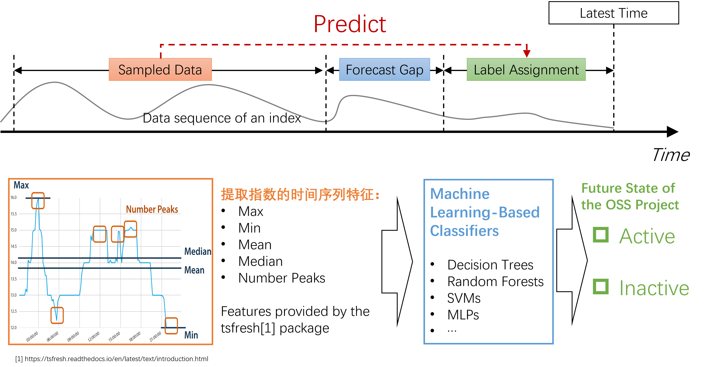

  

Figure2-1 Predictive Method Based on Feature Extraction and Classical Machine Learning Techniques

  

As illustrated in Figure 2-1, the feature-based approach is a classic machine learning methodology typically employed for processing time series data. The crux of this approach is to transform time series data into a set of features, which include, but are not limited to, statistical metrics like mean, median, maximum, minimum, and variance. By extracting these features, we convert the original time series data into a non-time series CSV data table, enabling the application of traditional data analysis and machine learning techniques such as KNN and Decision Trees. The advantage of this method lies in its ability to simplify complex time series data into fixed-dimension feature vectors, facilitating subsequent data processing and modeling. Additionally, feature extraction helps reduce noise and redundancy in the data, enhancing model stability and performance. The typical steps in the feature-based approach include:

1. Data Collection: Initially, time series data is collected, which may originate from sensors, financial markets, meteorological stations, or other domains.

2. Feature Extraction: This involves the computation of various statistical metrics such as mean, median, standard deviation, kurtosis, skewness, and the application of signal processing techniques like Fourier and wavelet transforms for frequency domain feature extraction.

3. Data Transformation: The extracted features are compiled into a tabular dataset, typically saved as a CSV file, with each row representing a time series sample and each column a feature.

4. Data Preprocessing: This step includes handling missing values, standardization, normalization, etc., to ensure data stability and usability in modeling.

5. Modeling and Analysis: Traditional machine learning algorithms such as Linear Regression, Decision Trees, Random Forests, Support Vector Machines, etc., are employed for modeling and analysis of the feature-based data.

6. Model Evaluation: The model's performance is assessed using techniques like cross-validation and metrics such as accuracy, mean squared error, ROC curve, etc.

Key steps in this process include feature extraction and the design of learning algorithms, elaborated as follows.

#### 2.1 Extracted Feature Set

In this work, we extracted features from 72 indices across four dimensions:

1. Activity Score: 19 indicators related to activity, such as active_C2_contributor_count_activity, active_C1_pr_create_contributor_activity, etc. (refer to Appendix B.1).

2. Code Quality Guarantee: 25 indicators including contributor_count_codequality, contributor_count_bot_codequality, etc. (see Appendix B.2).

3. Community Service and Support: 15 indicators such as issue_first_reponse_avg_community, issue_first_reponse_mid_community, etc. (refer to Appendix B.3).

4. Group Activity: 13 indicators like contributor_count_group_activity, contributor_count_bot_group_activity, etc. (see Appendix B.4).

Additionally, basic project information such as the project name and grimoire_creation_date were included in the feature computation. However, since these do not fall under the indicators and models proposed by OSS Compass, they were not subjected to feature extraction. For the numerical features in the 72 indices, multiple statistical functions were selected, including length, large standard deviation, mean, maximum, minimum, variance, etc., resulting in 16 representative statistical quantities (detailed in Appendix C). These were used to compute corresponding feature vectors. Further, based on the preferences of different classifiers, two sets of typical feature collections were selected through feature selection:

1. Feature Set 1: Comprising 596 distinct features for classifiers like XGBoost, RandomForest, AdaBoost, etc.

2. Feature Set 2: Including 134 features for classifiers such as KNN, Logistic, SVM, etc.

Details of these two feature sets can be found in Appendix B.

#### 2.2 Classification and Predictive Algorithms

1. XGBoost (Extreme Gradient Boosting): XGBoost enhances model performance by combining multiple decision trees, offering remarkable accuracy and robustness. It iteratively refines the model by optimizing the loss function, preventing overfitting, and supports feature selection. Widely employed in data science challenges like Kaggle competitions, XGBoost stands out for its efficiency in handling complex datasets.

2. RandomForest: As an ensemble learning method based on multiple decision trees, RandomForest classifies or regresses based on collective tree voting. It introduces randomness to mitigate overfitting risks, boasting excellent generalization capabilities and automatic feature selection. Suitable for a variety of data types, RandomForest is user-friendly and demands minimal hyperparameter tuning.

3. AdaBoost (Adaptive Boosting): An iterative learning algorithm, AdaBoost enhances model performance by integrating multiple weak learners. It adjusts sample weights based on previous learning errors, focusing more on incorrectly classified samples. Commonly used for binary classification problems, AdaBoost in this project employs decision trees as base learners, denoted as AdaBoost + DecisionTree.

4. Logistic Regression: A widely used linear model for classification problems, Logistic Regression employs a logistic function to estimate the relationship between input features and a binary target. Known for its simplicity and interpretability, it's frequently applied in probability-based predictions like customer churn or disease diagnosis.

5. SVM (Support Vector Machine): SVM is a powerful algorithm for classification and regression. It maximizes the margin between different categories by finding the optimal hyperplane. Excellently performing in high-dimensional spaces, SVM can adapt to various data types with different kernel functions.

6. KNN (K-Nearest Neighbors): KNN, an instance-based learning algorithm, is used for classification and regression. It makes predictions by measuring the nearest K neighbors to a query point. While KNN is straightforward and easy to comprehend, it may be less efficient for large datasets.

Built upon a multitude of classical machine learning algorithms, feature-based classification prediction methods offer diversity, simplicity in implementation, and a wealth of tools. Moreover, by extracting features with clear physical significance to characterize projects, these methods provide high interpretability.

### 3 Empirical Study Design and Results

This section, grounded on the aforementioned methods, conducts empirical research to validate the effectiveness of the OSS Compass indicator system in predicting future activity and health of projects, supported by machine learning and AI methodologies.

#### 3.1 Methodology of Empirical Study

This subsection introduces the datasets, methods, and evaluation metrics used in the empirical research.

#### 3.1.1 Dataset

Two datasets, A and B as introduced above, were utilized. We initially trained and predicted on dataset B, observing commendable performance. Then, we applied the model to dataset A to assess its generalization capability, i.e., how the model performs in unseen real-world contexts.

#### 3.1.2 Validation Method

1. Ten-Fold Cross-Validation: Employing ten-fold cross-validation ensured robustness and generalizability in evaluating our classification models. The dataset was divided into ten subsets, with nine serving as training sets and one as a test set, in a repeated process to mitigate the impact of randomness on performance assessment. This method reliably gauges model performance across different data subsets, averting overfitting.

2. Feature Selection Experiment: Utilizing Tsfresh's select_features function and adjusting the fdr_level parameter, we obtained a carefully curated feature set. These features significantly contributed to classification tasks, enhancing model performance. Our selection, based on statistical significance, managed FDR (False Discovery Rate) stringency. A lower fdr_level ensured highly significant features were chosen, aiding in developing high-performance, reliable classification models.

#### 3.1.3 Evaluation Metrics

The following metrics are commonly used to evaluate the performance of classification models and to verify their effectiveness in processing data:

1. Accuracy：

- Accuracy is a fundamental metric for assessing the performance of a classification model.
- It represents the ratio of the number of correctly classified samples to the total number of samples.
- Formula: Accuracy= (TP+TN) / (TP+TN+FP+FN)

  TP：True Positive (Number of samples correctly predicted as positive)

  TN：True Negative (Number of samples correctly predicted as negative)

  FP：False Positive (Number of samples incorrectly predicted as positive)

  FN：False Negative (Number of samples incorrectly predicted as negative)

2. Precision：

- Precision measures the proportion of samples that are actually positive among those predicted as positive.
- ormula: Precision = TP/(TP+FP)

3. Recall：：

- Recall measures the proportion of positive samples correctly identified by the model out of the total positive samples.

- Formula: Recall = TP/(TP+FN)

4. F1 Score：

- The F1 Score is the harmonic mean of precision and recall, used for a comprehensive assessment of model performance.
- Formula: F1 Score = 2*P*R/(P+R)

5. AUC（Area Under the Curve）：

- AUC is the area under the ROC (Receiver Operating Characteristic) curve, used to measure the performance of a model at different thresholds.
- The ROC curve plots FPR (False Positive Rate) on the x-axis against TPR (True Positive Rate, or Recall) on the y-axis, illustrating classification performance at various thresholds.
- An AUC value closer to 1 indicates better model performance.

6. Confusion Matrix：

- The Confusion Matrix is a matrix that displays the classification results of a model.
- It includes the counts of True Positives (TP), True Negatives (TN), False Positives (FP), and False Negatives (FN).
- It is usually presented in a tabular form for a clear, visual representation of model performance.

#### 3.2 Assessment Results: Validation Results on Dataset B

Utilizing ten-fold cross-validation, we employed classifiers including XGBoost, RandomForest, AdaBoost, SVM, KNN, Logistic Regression, and their ensemble models for prediction. The results were measured comprehensively using various metrics as described earlier. XGBoost, RandomForest, and AdaBoost demonstrated effective performance, with accuracies nearing 90%. For the Logistic Regression method, performance was weaker in Feature Set 1 due to a high number of features leading to predictions tending towards all-ones, likely due to overfitting. However, in Feature Set 2, its accuracy reached 86%. SVM and KNN showed moderate performance, sensitive to data and requiring parameter tuning and specific data-condition optimization. Ultimately, we selected XGBoost, RandomForest, and AdaBoost for multiple prediction integrations, achieving an overall prediction accuracy of 90%. Combining multiple models' predictions can enhance overall performance, reduce the risk of overfitting, and decrease the number of prediction errors by a single classifier. The performance of each classifier is detailed below:

#### 3.2.1 Classification Prediction Performance Assessment Based on Feature Set 1

As described in section 2.1, Feature Set 1 includes 596 different features used for classifiers such as XGBoost, RandomForest, and AdaBoost.

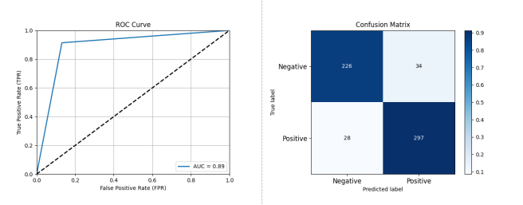

  

Figure 3-1: Performance Assessment of Open Source Project Activity Classification Prediction Based on XGBoost

  

As shown in Figure 3-1, using XGBoost on a dataset of 585 open source projects with ten-fold cross-validation, the performance was: Accuracy: 0.8940, Precision: 0.8973, Recall: 0.9138, F1 Score: 0.9055, AUC: 0.8915. The confusion matrix reveals that XGBoost can accurately predict the future activity of projects based on OSS Compass indices.

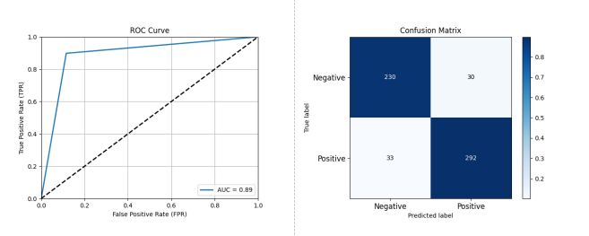

  

Figure 3-2: Performance Assessment of Open Source Project Activity Classification Prediction Based on Random Forest

  

Figure 3-2 shows that using Random Forest, we achieved classification prediction performance close to that of XGBoost. With ten-fold cross-validation, the performance was: Accuracy: 0.8923, Precision: 0.9068, Recall: 0.8985, F1 Score: 0.9026, AUC: 0.8915.

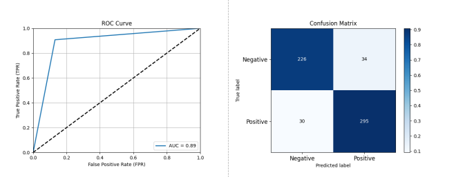

  

Figure 3-3: Performance Assessment of Open Source Project Activity Classification Prediction Based on AdaBoost + DecisionTree

  

As depicted in Figure 3-3, the AdaBoost + DecisionTree classifier also demonstrated strong predictive capability: Accuracy: 0.8906, Precision: 0.8967, Recall: 0.9077, F1 Score: 0.9021, AUC: 0.8885.

The performances of XGBoost, Random Forest, and AdaBoost were consistent, all achieving close to 90% classification accuracy. Minor differences in classifier performance, as shown, might result from randomness in the ten-fold cross-validation process.

#### 3.2.2 Classification Prediction Performance Assessment Based on Feature Set 2

As mentioned in section 2.1, Feature Set 2 comprises 134 features, used for classifiers including KNN, Logistic Regression, and SVM. Compared to Feature Set 1, these classifiers achieved better results with Feature Set 2.

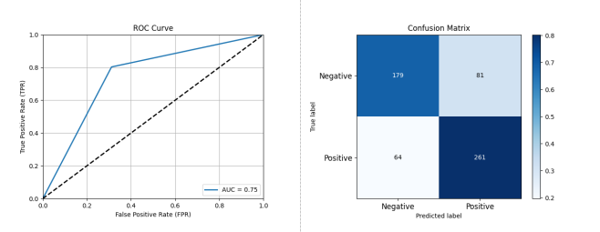

  

Figure 3-4: Performance Assessment of Open Source Project Activity Classification Prediction Based on KNN

  

As shown in Figure 3-4, the KNN method effectively predicted future activity levels of open source projects: Accuracy: 0.7521, Precision: 0.7632, Recall: 0.8031, F1 Score: 0.7826, AUC: 0.7457.

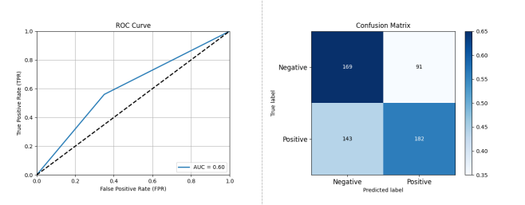

  

Figure 3-5: Performance Assessment of Open Source Project Activity Classification Prediction Based on SVM

  

As illustrated in Figure 3-5, SVM's classification prediction capability was relatively weak: Accuracy: 0.6291, Precision: 0.6812, Recall: 0.6246, F1 Score: 0.6517, AUC: 0.6296.

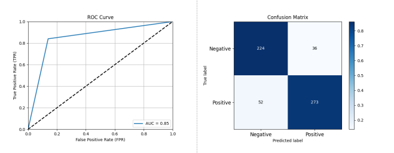

  

Figure 3-6: Performance Assessment of Open Source Project Activity Classification Prediction Based on Logistic Regression

  

As depicted in Figure 3-6, Logistic Regression showed superior performance to KNN and SVM in Feature Set 2: Accuracy: 0.8496, Precision: 0.8835, Recall: 0.84, F1 Score: 0.8611, AUC: 0.8508.

Compared to Feature Set 1, classifiers corresponding to Feature Set 2 were relatively weaker, but Logistic Regression approached the performance of Feature Set 1 classifiers.

#### 3.2.3 Ensemble Learning and Overall Results

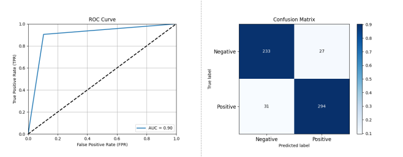

  

Figure 3-7: Performance Assessment After Ensemble of XGBoost, AdaBoost, and RandomForest Classifiers

  

Based on the aforementioned results, we opted for a majority-vote ensemble learning approach with the three classifiers from section 2.1 using Feature Set 1, achieving the best results: Accuracy: 0.9009, Precision: 0.9159, Recall: 0.9046, F1 Score: 0.9102, AUC: 0.9004.

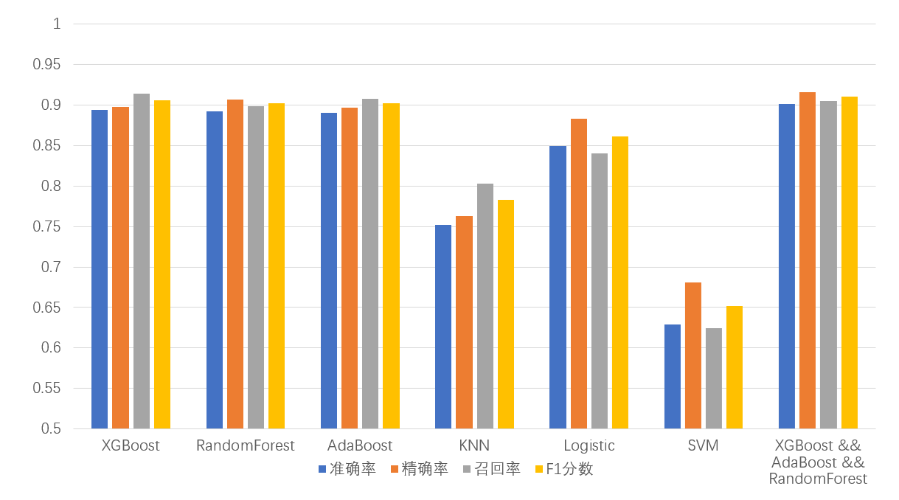

  

Figure 3-8: Overview of Prediction Results

  

Finally, Figure 3-8 summarizes the validation results on dataset B, listing the performance of different classifiers including accuracy, precision, recall, and F1 score. The results show that, except for KNN and SVM, the remaining classifiers achieved over 85% classification accuracy. The ensemble learning method combining multiple classifiers demonstrated the best classification prediction performance, showing promise for real-world application.

#### 3.3 Assessment Results: Generalization Results on Dataset A

Utilizing the models trained on dataset B as described in section 3.2, which included XGBoost, RandomForest, AdaBoost, SVM, KNN, Logistic Regression, and their ensemble models, we tested these models on dataset A to evaluate their generalization capabilities. The performance of each classifier is detailed below:

#### 3.3.1 Classification Prediction Performance Assessment Based on Feature Set 1

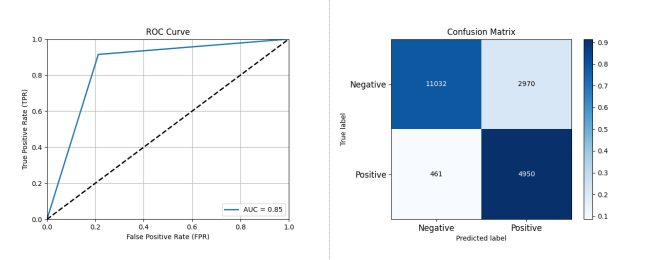

  

Figure 3-9: Performance Assessment of Open Source Project Activity Classification Prediction Based on XGBoost

  

As shown in Figure 3-9, using XGBoost on dataset A, the performance was: Accuracy: 0.8233, Precision: 0.6250, Recall: 0.9148, F1 Score: 0.7426, AUC: 0.8513.

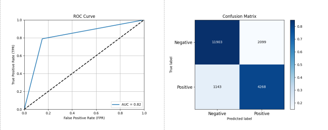

  

Figure 3-10: Performance Assessment of Open Source Project Activity Classification Prediction Based on RandomForest

  

As depicted in Figure 3-10, using RandomForest on dataset A, the performance was: Accuracy: 0.8330, Precision: 0.6703, Recall: 0.7888, F1 Score: 0.7247, AUC: 0.8194.

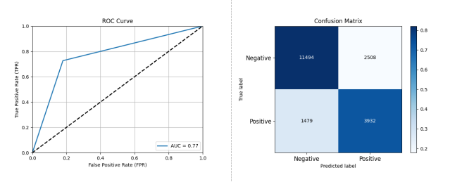

  

Figure 3-11: Performance Assessment of Open Source Project Activity Classification Prediction Based on AdaBoost

  

Figure 3-11 shows that using AdaBoost on dataset A, the performance was: Accuracy: 0.8940, Precision: 0.7946, Recall: 0.6106, F1 Score: 0.6636, AUC: 0.7738.

#### 3.3.2 Classification Prediction Performance Assessment Based on Feature Set 2

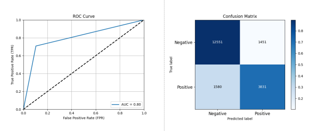

  

Figure 3-12: Performance Assessment of Open Source Project Activity Classification Prediction Based on KNN

  

As shown in Figure 3-12, using KNN on dataset A, the performance was: Accuracy: 0.8439, Precision: 0.7253, Recall: 0.7080, F1 Score: 0.7165, AUC: 0.8022.

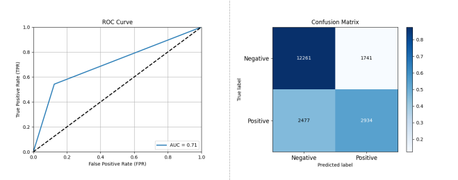

  

Figure 3-13: Performance Assessment of Open Source Project Activity Classification Prediction Based on SVM

  

Figure 3-13 reveals that using SVM on dataset A, the performance was: Accuracy: 0.7827, Precision: 0.6276, Recall: 0.5422, F1 Score: 0.5818, AUC: 0.7089.

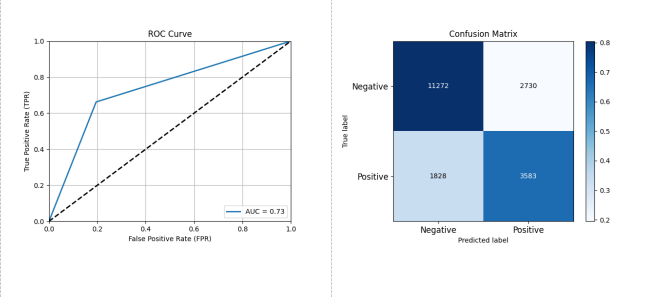

  

Figure 3-14: Performance Assessment of Open Source Project Activity Classification Prediction Based on Logistic Regression

  

As depicted in Figure 3-14, using Logistic Regression on dataset A, the performance was: Accuracy: 0.7652, Precision: 0.5676, Recall: 0.6622, F1 Score: 0.6112, AUC: 0.7336.

#### 3.3.3 Ensemble Learning and Overall Results

  

Figure 3-15: Performance Assessment After Ensemble of XGBoost, AdaBoost, and RandomForest Classifiers

  

As shown in Figure 3-15, using an ensemble of XGBoost, AdaBoost, and RandomForest on dataset A, the performance was: Accuracy: 0.8348, Precision: 0.6587, Recall: 0.8451, F1 Score: 0.7404, AUC: 0.8380.

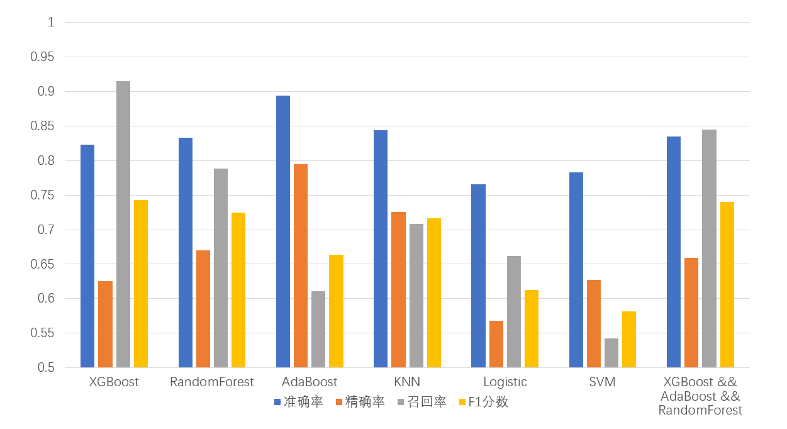

  

Figure 3-16: Overview of Prediction Results

  

Finally, Figure 3-16 summarizes the generalization results on dataset A, listing the performance of different classifiers including accuracy, precision, recall, and F1 score. The results indicate that KNN and the ensemble learning method combining multiple classifiers exhibit strong generalization capabilities and effective classification prediction. These two models are recommended for future predictions.

#### 3.4 Threats to Validity

Firstly, concerning internal validity threats, although mature machine learning models were employed, the effectiveness of these models is not extensively validated due to the limited data volume of the dataset. Thus, their practical applicability remains to be further experimented and proven in real-world scenarios. On another note, this method was exclusively applied to the model indices of OSS-Compass. While theoretically suitable for all time series prediction scenarios, its applicability in other contexts requires further validation.

### 4 Recommended Deployment Scheme

Based on the experimental results, it is recommended to use KNN and an ensemble learning approach combining multiple classifiers as the learning models. After comprehensive training on the large-scale dataset A, these models should be deployed on practical platforms for actual use.

### Acknowledgments

Gratitude is extended to the contributors of the open-source community and the OSS Compass platform for providing the data. Thanks are also due to the guiding teachers and fellow students. This work was supported by the Nanjing University Undergraduate Innovation Training Program "Research on Health Prediction Technology of Open Source Software Projects Based on Metric Indicators."

### Appendix A: Feature Sets

#### A.1 Feature Set 1 (Comprising 596 features, named as: Index Name\_\_Feature Function)

1. commit_frequency_activity\_\_minimum
2. commit_frequency_codequality\_\_minimum
3. commit_frequency_without_bot_activity\_\_minimum
4. commit_frequency_without_bot_codequality\_\_minimum
5. pr_commit_count_codequality\_\_minimum
6. is_maintained_codequality\_\_minimum
7. lines_added_frequency_codequality\_\_minimum
8. LOC_frequency_codequality\_\_minimum
9. updated_since_activity\_\_variance
10. updated_since_activity\_\_mean
11. active_C2_contributor_count_codequality\_\_minimum
12. active_C2_contributor_count_activity\_\_minimum
13. is_maintained_codequality\_\_sum_values
14. lines_removed_frequency_codequality\_\_minimum
15. updated_since_activity\_\_maximum
16. code_quality_guarantee_codequality\_\_minimum
17. is_maintained_codequality\_\_mean
18. community_support_score_community\_\_sum_values
19. issue_open_time_avg_community\_\_length
20. pr_issue_linked_ratio_codequality\_\_length
21. commit_frequency_group_activity\_\_length
22. commit_frequency_without_bot_activity\_\_length
23. issue_first_reponse_mid_community\_\_length
24. active_C1_issue_create_contributor_activity\_\_length
25. community_support_score_community\_\_length
26. bug_issue_open_time_mid_community\_\_length
27. issue_open_time_mid_community\_\_length
28. pr_open_time_mid_community\_\_length
29. contribution_last_group_activity\_\_length
30. code_review_ratio_codequality\_\_length
31. contributor_count_bot_codequality\_\_length
32. bug_issue_open_time_avg_community\_\_length
33. lines_removed_frequency_codequality\_\_length
34. pr_first_response_time_avg_community\_\_length
35. commit_frequency_org_group_activity\_\_length
36. commit_frequency_without_bot_codequality\_\_length
37. commit_frequency_bot_activity\_\_length
38. code_review_count_community\_\_length
39. activity_score_activity\_\_length
40. code_merge_ratio_codequality\_\_length
41. contributor_count_without_bot_codequality\_\_length
42. code_review_count_activity\_\_length
43. commit_frequency_percentage_group_activity\_\_length
44. org_count_activity\_\_length
45. closed_issues_count_activity\_\_length
46. pr_count_codequality\_\_length
47. updated_since_activity\_\_length
48. contributor_count_without_bot_activity\_\_length
49. pr_first_response_time_mid_community\_\_length
50. org_count_group_activity\_\_length
51. comment_frequency_community\_\_length
52. recent_releases_count_activity\_\_length
53. active_C1_pr_create_contributor_codequality\_\_length
54. contributor_count_activity\_\_length
55. active_C2_contributor_count_activity\_\_length
56. updated_issues_count_activity\_\_length
57. updated_issues_count_community\_\_length
58. is_maintained_codequality\_\_length
59. active_C1_pr_comments_contributor_activity\_\_length
60. comment_frequency_activity\_\_length
61. active_C1_pr_create_contributor_activity\_\_length
62. code_quality_guarantee_codequality\_\_length
63. contributor_count_codequality\_\_length
64. commit_frequency_inside_codequality\_\_length
65. contributor_count_group_activity\_\_length
66. contributor_count_without_bot_group_activity\_\_length
67. contributor_count_bot_group_activity\_\_length
68. commit_frequency_codequality\_\_length
69. git_pr_linked_ratio_codequality\_\_length
70. commit_frequency_inside_without_bot_codequality\_\_length
71. commit_frequency_inside_bot_codequality\_\_length
72. commit_frequency_bot_codequality\_\_length
73. active_C1_pr_comments_contributor_codequality\_\_length
74. commit_frequency_bot_group_activity\_\_length
75. contributor_count_bot_activity\_\_length
76. pr_commit_count_codequality\_\_length
77. lines_added_frequency_codequality\_\_length
78. pr_open_time_avg_community\_\_length
79. commit_frequency_without_bot_group_activity\_\_length
80. contributor_org_count_group_activity\_\_length
81. issue_first_reponse_avg_community\_\_length
82. LOC_frequency_codequality\_\_length
83. active_C2_contributor_count_codequality\_\_length
84. commit_frequency_activity\_\_length
85. organizations_activity_group_activity\_\_length
86. active_C1_issue_comments_contributor_activity\_\_length
87. closed_prs_count_community\_\_length
88. pr_merged_count_codequality\_\_length
89. pr_commit_linked_count_codequality\_\_length
90. commit_frequency_org_percentage_group_activity\_\_length
91. community_support_score_community\_\_minimum
92. updated_since_activity\_\_mean_abs_change
93. activity_score_activity\_\_sum_values
94. closed_prs_count_community\_\_minimum
95. code_quality_guarantee_codequality\_\_sum_values
96. commit_frequency_org_percentage_group_activity\_\_maximum
97. activity_score_activity\_\_minimum
98. pr_merged_count_codequality\_\_minimum
99. commit_frequency_codequality\_\_sum_values
100. commit_frequency_activity\_\_sum_values
101. contributor_count_codequality\_\_minimum
102. commit_frequency_without_bot_codequality\_\_sum_values
103. commit_frequency_without_bot_activity\_\_sum_values
104. contributor_count_without_bot_codequality\_\_minimum
105. community_support_score_community\_\_mean
106. pr_commit_count_codequality\_\_sum_values
107. active_C2_contributor_count_codequality\_\_sum_values
108. active_C2_contributor_count_activity\_\_sum_values
109. closed_prs_count_community\_\_sum_values
110. pr_count_codequality\_\_minimum
111. commit_frequency_org_percentage_group_activity\_\_mean
112. commit_frequency_codequality\_\_mean
113. commit_frequency_activity\_\_mean
114. commit_frequency_without_bot_codequality\_\_mean
115. commit_frequency_without_bot_activity\_\_mean
116. activity_score_activity\_\_mean
117. contributor_org_count_group_activity\_\_sum_values
118. updated_since_activity\_\_sum_values
119. pr_count_codequality\_\_sum_values
120. pr_commit_count_codequality\_\_mean
121. commit_frequency_org_group_activity\_\_absolute_sum_of_changes
122. commit_frequency_codequality\_\_absolute_sum_of_changes
123. commit_frequency_activity\_\_absolute_sum_of_changes
124. commit_frequency_without_bot_activity\_\_absolute_sum_of_changes
125. commit_frequency_without_bot_codequality\_\_absolute_sum_of_changes
126. commit_frequency_org_group_activity\_\_sum_values
127. closed_prs_count_community\_\_absolute_sum_of_changes
128. pr_count_codequality\_\_absolute_sum_of_changes
129. closed_prs_count_community\_\_mean
130. code_quality_guarantee_codequality\_\_mean
131. active_C2_contributor_count_codequality\_\_mean
132. active_C2_contributor_count_activity\_\_mean
133. pr_merged_count_codequality\_\_sum_values
134. pr_commit_count_codequality\_\_absolute_sum_of_changes
135. pr_merged_count_codequality\_\_absolute_sum_of_changes
136. commit_frequency_org_group_activity\_\_mean_abs_change
137. pr_open_time_avg_community\_\_variance
138. commit_frequency_activity\_\_mean_abs_change
139. is_maintained_codequality\_\_maximum
140. commit_frequency_codequality\_\_mean_abs_change
141. commit_frequency_org_percentage_group_activity\_\_last_location_of_maximum
142. active_C1_pr_comments_contributor_activity\_\_sum_values
143. active_C1_pr_comments_contributor_codequality\_\_sum_values
144. commit_frequency_without_bot_activity\_\_mean_abs_change
145. commit_frequency_without_bot_codequality\_\_mean_abs_change
146. pr_open_time_mid_community\_\_mean_abs_change
147. commit_frequency_org_group_activity\_\_mean
148. pr_open_time_mid_community\_\_variance
149. pr_count_codequality\_\_mean
150. pr_open_time_avg_community\_\_mean_abs_change
151. active_C1_pr_comments_contributor_activity\_\_minimum
152. active_C1_pr_comments_contributor_codequality\_\_minimum
153. active_C1_pr_create_contributor_activity\_\_minimum
154. active_C1_pr_create_contributor_codequality\_\_minimum
155. pr_merged_count_codequality\_\_mean
156. contributor_count_codequality\_\_sum_values
157. contributor_count_without_bot_codequality\_\_sum_values
158. closed_prs_count_community\_\_mean_abs_change
159. contributor_org_count_group_activity\_\_absolute_sum_of_changes
160. pr_commit_count_codequality\_\_mean_abs_change
161. pr_merged_count_codequality\_\_mean_abs_change
162. pr_count_codequality\_\_mean_abs_change
163. code_review_count_community\_\_sum_values
164. active_C2_contributor_count_codequality\_\_absolute_sum_of_changes
165. active_C2_contributor_count_activity\_\_absolute_sum_of_changes
166. pr_count_codequality\_\_maximum
167. active_C1_pr_comments_contributor_codequality\_\_mean
168. active_C1_pr_comments_contributor_activity\_\_mean
169. commit_frequency_percentage_group_activity\_\_mean
170. closed_prs_count_community\_\_maximum
171. commit_frequency_codequality\_\_maximum
172. commit_frequency_activity\_\_maximum
173. pr_open_time_avg_community\_\_maximum
174. pr_open_time_mid_community\_\_maximum
175. commit_frequency_without_bot_activity\_\_maximum
176. commit_frequency_without_bot_codequality\_\_maximum
177. pr_merged_count_codequality\_\_maximum
178. contributor_org_count_group_activity\_\_mean_abs_change
179. active_C1_pr_create_contributor_codequality\_\_sum_values
180. active_C1_pr_create_contributor_activity\_\_sum_values
181. active_C1_pr_comments_contributor_codequality\_\_absolute_sum_of_changes
182. active_C1_pr_comments_contributor_activity\_\_absolute_sum_of_changes
183. pr_commit_count_codequality\_\_maximum
184. community_support_score_community\_\_maximum
185. closed_issues_count_activity\_\_minimum
186. pr_first_response_time_mid_community\_\_last_location_of_minimum
187. code_review_count_community\_\_mean
188. pr_open_time_mid_community\_\_mean
189. commit_frequency_org_group_activity\_\_variance
190. active_C1_pr_comments_contributor_codequality\_\_maximum
191. active_C1_pr_comments_contributor_activity\_\_maximum
192. contributor_org_count_group_activity\_\_mean
193. code_review_count_community\_\_last_location_of_minimum
194. active_C2_contributor_count_activity\_\_maximum
195. active_C2_contributor_count_codequality\_\_maximum
196. contributor_count_codequality\_\_mean
197. contributor_count_without_bot_codequality\_\_mean
198. active_C2_contributor_count_codequality\_\_mean_abs_change
199. active_C2_contributor_count_activity\_\_mean_abs_change
200. commit_frequency_org_percentage_group_activity\_\_skewness
201. code_review_ratio_codequality\_\_last_location_of_minimum
202. commit_frequency_org_group_activity\_\_maximum
203. code_review_count_activity\_\_last_location_of_minimum
204. pr_merged_count_codequality\_\_variance
205. code_merge_ratio_codequality\_\_minimum
206. activity_score_activity\_\_skewness
207. pr_count_codequality\_\_variance
208. activity_score_activity\_\_maximum
209. updated_since_activity\_\_kurtosis
210. contributor_org_count_group_activity\_\_variance
211. contributor_count_codequality\_\_absolute_sum_of_changes
212. contributor_count_without_bot_codequality\_\_absolute_sum_of_changes
213. code_review_ratio_codequality\_\_minimum
214. active_C2_contributor_count_codequality\_\_last_location_of_minimum
215. active_C2_contributor_count_activity\_\_last_location_of_minimum
216. active_C1_pr_comments_contributor_activity\_\_mean_abs_change
217. active_C1_pr_comments_contributor_codequality\_\_mean_abs_change
218. active_C1_pr_create_contributor_activity\_\_mean
219. active_C1_pr_create_contributor_codequality\_\_mean
220. code_quality_guarantee_codequality\_\_maximum
221. pr_issue_linked_ratio_codequality**large_standard_deviation**r_0.05
222. active_C1_pr_create_contributor_codequality\_\_absolute_sum_of_changes
223. active_C1_pr_create_contributor_activity\_\_absolute_sum_of_changes
224. contributor_org_count_group_activity\_\_maximum
225. pr_first_response_time_mid_community\_\_minimum
226. pr_first_response_time_avg_community\_\_minimum
227. closed_prs_count_community\_\_variance
228. pr_issue_linked_ratio_codequality**large_standard_deviation**r_0.1
229. code_review_count_activity\_\_minimum
230. commit_frequency_activity\_\_last_location_of_minimum
231. commit_frequency_codequality\_\_last_location_of_minimum
232. commit_frequency_without_bot_activity\_\_last_location_of_minimum
233. commit_frequency_without_bot_codequality\_\_last_location_of_minimum
234. code_review_count_community\_\_minimum
235. contributor_count_codequality\_\_maximum
236. contributor_count_without_bot_codequality\_\_maximum
237. pr_open_time_mid_community\_\_absolute_sum_of_changes
238. lines_removed_frequency_codequality\_\_sum_values
239. commit_frequency_codequality\_\_variance
240. commit_frequency_activity\_\_variance
241. commit_frequency_percentage_group_activity\_\_last_location_of_maximum
242. commit_frequency_without_bot_codequality\_\_variance
243. LOC_frequency_codequality\_\_sum_values
244. commit_frequency_without_bot_activity\_\_variance
245. contributor_count_activity\_\_minimum
246. contributor_count_without_bot_activity\_\_minimum
247. lines_added_frequency_codequality\_\_sum_values
248. code_review_count_activity\_\_sum_values
249. lines_removed_frequency_codequality\_\_absolute_sum_of_changes
250. code_review_count_community\_\_absolute_sum_of_changes
251. bug_issue_open_time_mid_community\_\_last_location_of_minimum
252. pr_first_response_time_avg_community\_\_last_location_of_minimum
253. updated_since_activity\_\_mean_change
254. closed_issues_count_activity\_\_sum_values
255. pr_issue_linked_ratio_codequality\_\_sum_values
256. pr_commit_linked_count_codequality\_\_absolute_sum_of_changes
257. active_C1_pr_comments_contributor_activity\_\_variance
258. active_C1_pr_comments_contributor_codequality\_\_variance
259. LOC_frequency_codequality\_\_absolute_sum_of_changes
260. lines_added_frequency_codequality\_\_absolute_sum_of_changes
261. pr_commit_count_codequality\_\_variance
262. updated_issues_count_activity\_\_sum_values
263. updated_issues_count_community\_\_sum_values
264. pr_commit_linked_count_codequality\_\_sum_values
265. bug_issue_open_time_avg_community\_\_last_location_of_minimum
266. pr_issue_linked_ratio_codequality\_\_mean
267. active_C1_issue_create_contributor_activity\_\_minimum
268. recent_releases_count_activity\_\_minimum
269. active_C1_pr_create_contributor_activity\_\_maximum
270. active_C1_pr_create_contributor_codequality\_\_maximum
271. lines_removed_frequency_codequality\_\_mean
272. updated_issues_count_activity\_\_minimum
273. updated_issues_count_community\_\_minimum
274. LOC_frequency_codequality\_\_mean
275. lines_added_frequency_codequality\_\_mean
276. code_review_ratio_codequality\_\_sum_values
277. lines_removed_frequency_codequality\_\_mean_abs_change
278. updated_since_activity\_\_last_location_of_minimum
279. pr_issue_linked_ratio_codequality\_\_absolute_sum_of_changes
280. code_review_count_community\_\_maximum
281. pr_commit_linked_count_codequality\_\_maximum
282. pr_issue_linked_ratio_codequality\_\_mean_abs_change
283. code_review_count_activity\_\_mean
284. pr_commit_linked_count_codequality\_\_mean_abs_change
285. LOC_frequency_codequality\_\_mean_abs_change
286. updated_issues_count_community\_\_absolute_sum_of_changes
287. updated_issues_count_activity\_\_absolute_sum_of_changes
288. contributor_count_without_bot_activity\_\_sum_values
289. contributor_count_activity\_\_sum_values
290. lines_added_frequency_codequality\_\_mean_abs_change
291. pr_open_time_avg_community\_\_absolute_sum_of_changes
292. active_C1_pr_comments_contributor_codequality\_\_last_location_of_minimum
293. active_C1_pr_comments_contributor_activity\_\_last_location_of_minimum
294. pr_issue_linked_ratio_codequality\_\_first_location_of_maximum
295. pr_issue_linked_ratio_codequality\_\_last_location_of_maximum
296. comment_frequency_activity\_\_minimum
297. comment_frequency_community\_\_minimum
298. pr_commit_count_codequality\_\_last_location_of_minimum
299. active_C1_issue_comments_contributor_activity\_\_minimum
300. pr_commit_linked_count_codequality\_\_mean
301. pr_open_time_avg_community\_\_mean
302. updated_since_activity\_\_skewness
303. contributor_count_codequality\_\_mean_abs_change
304. contributor_count_without_bot_codequality\_\_mean_abs_change
305. pr_open_time_mid_community\_\_sum_values
306. active_C1_issue_create_contributor_activity\_\_sum_values
307. pr_issue_linked_ratio_codequality\_\_last_location_of_minimum
308. lines_removed_frequency_codequality\_\_maximum
309. closed_issues_count_activity\_\_absolute_sum_of_changes
310. code_review_count_community\_\_mean_abs_change
311. pr_issue_linked_ratio_codequality\_\_variance
312. commit_frequency_percentage_group_activity\_\_skewness
313. active_C1_pr_create_contributor_codequality\_\_mean_abs_change
314. active_C1_pr_create_contributor_activity\_\_mean_abs_change
315. updated_since_activity\_\_absolute_sum_of_changes
316. pr_commit_linked_count_codequality\_\_variance
317. pr_issue_linked_ratio_codequality\_\_maximum
318. closed_issues_count_activity\_\_mean
319. LOC_frequency_codequality\_\_maximum
320. pr_first_response_time_avg_community\_\_first_location_of_minimum
321. issue_open_time_avg_community\_\_variance
322. active_C1_issue_create_contributor_activity\_\_absolute_sum_of_changes
323. code_review_count_activity\_\_first_location_of_minimum
324. code_review_count_community\_\_first_location_of_minimum
325. active_C2_contributor_count_activity\_\_variance
326. active_C2_contributor_count_codequality\_\_variance
327. code_quality_guarantee_codequality\_\_variance
328. pr_issue_linked_ratio_codequality\_\_first_location_of_minimum
329. lines_added_frequency_codequality\_\_maximum
330. lines_removed_frequency_codequality\_\_variance
331. code_merge_ratio_codequality\_\_last_location_of_minimum
332. active_C1_issue_comments_contributor_activity\_\_sum_values
333. commit_frequency_percentage_group_activity\_\_absolute_sum_of_changes
334. issue_open_time_mid_community\_\_variance
335. code_review_ratio_codequality\_\_first_location_of_minimum
336. bug_issue_open_time_avg_community\_\_minimum
337. updated_issues_count_activity\_\_mean
338. updated_issues_count_community\_\_mean
339. code_review_ratio_codequality\_\_mean
340. updated_since_activity\_\_minimum
341. LOC_frequency_codequality\_\_variance
342. issue_open_time_avg_community\_\_mean_abs_change
343. activity_score_activity\_\_mean_change
344. bug_issue_open_time_mid_community\_\_minimum
345. issue_open_time_avg_community\_\_maximum
346. is_maintained_codequality**large_standard_deviation**r_0.1
347. contributor_count_without_bot_activity\_\_absolute_sum_of_changes
348. updated_issues_count_activity\_\_last_location_of_minimum
349. updated_issues_count_community\_\_last_location_of_minimum
350. contributor_count_activity\_\_absolute_sum_of_changes
351. issue_first_reponse_mid_community\_\_mean_abs_change
352. lines_added_frequency_codequality\_\_variance
353. code_quality_guarantee_codequality\_\_mean_abs_change
354. issue_open_time_mid_community\_\_mean_abs_change
355. is_maintained_codequality**large_standard_deviation**r_0.05
356. issue_open_time_mid_community\_\_maximum
357. pr_commit_linked_count_codequality\_\_minimum
358. recent_releases_count_activity\_\_sum_values
359. pr_first_response_time_mid_community\_\_first_location_of_minimum
360. issue_first_reponse_mid_community\_\_variance
361. community_support_score_community\_\_mean_abs_change
362. is_maintained_codequality\_\_last_location_of_maximum
363. pr_merged_count_codequality\_\_last_location_of_minimum
364. updated_issues_count_activity\_\_maximum
365. updated_issues_count_community\_\_maximum
366. recent_releases_count_activity\_\_absolute_sum_of_changes
367. issue_first_reponse_avg_community\_\_mean_abs_change
368. contributor_count_activity\_\_mean
369. contributor_count_without_bot_activity\_\_mean
370. active_C1_issue_comments_contributor_activity\_\_absolute_sum_of_changes
371. code_review_count_activity\_\_absolute_sum_of_changes
372. active_C1_issue_create_contributor_activity\_\_mean
373. issue_first_reponse_mid_community\_\_maximum
374. closed_issues_count_activity\_\_maximum
375. code_review_count_activity**large_standard_deviation**r_0.05
376. code_review_count_activity**large_standard_deviation**r_0.1
377. code_review_count_community**large_standard_deviation**r_0.05
378. code_review_count_community**large_standard_deviation**r_0.1
379. recent_releases_count_activity\_\_mean
380. closed_issues_count_activity\_\_mean_abs_change
381. contributor_count_codequality\_\_variance
382. contributor_count_without_bot_codequality\_\_variance
383. code_review_ratio_codequality**large_standard_deviation**r_0.05
384. code_review_ratio_codequality**large_standard_deviation**r_0.1
385. pr_first_response_time_avg_community**large_standard_deviation**r_0.1
386. commit_frequency_org_percentage_group_activity\_\_absolute_sum_of_changes
387. pr_first_response_time_mid_community**large_standard_deviation**r_0.05
388. pr_first_response_time_avg_community**large_standard_deviation**r_0.05
389. issue_first_reponse_avg_community\_\_last_location_of_maximum
390. pr_first_response_time_mid_community**large_standard_deviation**r_0.1
391. code_merge_ratio_codequality\_\_first_location_of_maximum
392. community_support_score_community\_\_variance
393. code_merge_ratio_codequality\_\_variance
394. contributor_count_without_bot_group_activity\_\_absolute_sum_of_changes
395. recent_releases_count_activity\_\_maximum
396. issue_first_reponse_mid_community\_\_mean
397. commit_frequency_org_percentage_group_activity\_\_sum_values
398. contributor_count_group_activity\_\_absolute_sum_of_changes
399. updated_issues_count_activity\_\_mean_abs_change
400. updated_issues_count_community\_\_mean_abs_change
401. active_C1_pr_create_contributor_activity\_\_variance
402. active_C1_pr_create_contributor_codequality\_\_variance
403. closed_prs_count_community\_\_last_location_of_minimum
404. org_count_group_activity\_\_sum_values
405. org_count_activity\_\_sum_values
406. contributor_count_group_activity\_\_sum_values
407. contributor_count_without_bot_group_activity\_\_sum_values
408. organizations_activity_group_activity\_\_sum_values
409. comment_frequency_community\_\_sum_values
410. comment_frequency_activity\_\_sum_values
411. contributor_count_group_activity\_\_maximum
412. contributor_count_without_bot_group_activity\_\_maximum
413. recent_releases_count_activity\_\_mean_abs_change
414. contribution_last_group_activity\_\_sum_values
415. org_count_group_activity\_\_maximum
416. org_count_activity\_\_maximum
417. active_C1_issue_create_contributor_activity\_\_maximum
418. pr_issue_linked_ratio_codequality\_\_skewness
419. community_support_score_community\_\_mean_change
420. activity_score_activity\_\_absolute_sum_of_changes
421. code_review_count_community\_\_first_location_of_maximum
422. organizations_activity_group_activity\_\_absolute_sum_of_changes
423. organizations_activity_group_activity\_\_maximum
424. active_C1_issue_comments_contributor_activity\_\_mean
425. git_pr_linked_ratio_codequality\_\_last_location_of_maximum
426. contributor_count_without_bot_activity\_\_maximum
427. contributor_count_activity\_\_maximum
428. issue_first_reponse_avg_community\_\_variance
429. bug_issue_open_time_avg_community\_\_sum_values
430. contribution_last_group_activity\_\_absolute_sum_of_changes
431. org_count_group_activity\_\_absolute_sum_of_changes
432. commit_frequency_org_percentage_group_activity\_\_first_location_of_maximum
433. org_count_activity\_\_absolute_sum_of_changes
434. contribution_last_group_activity\_\_maximum
435. contributor_count_without_bot_group_activity\_\_mean_abs_change
436. org_count_group_activity\_\_mean
437. org_count_activity\_\_mean
438. contributor_count_group_activity\_\_mean
439. code_review_count_activity\_\_maximum
440. contributor_count_without_bot_group_activity\_\_mean
441. contributor_count_group_activity\_\_mean_abs_change
442. issue_first_reponse_mid_community\_\_absolute_sum_of_changes
443. commit_frequency_group_activity\_\_absolute_sum_of_changes
444. organizations_activity_group_activity\_\_mean
445. commit_frequency_without_bot_group_activity\_\_absolute_sum_of_changes
446. commit_frequency_group_activity\_\_sum_values
447. commit_frequency_without_bot_group_activity\_\_sum_values
448. lines_removed_frequency_codequality\_\_last_location_of_minimum
449. active_C1_pr_comments_contributor_codequality\_\_first_location_of_minimum
450. active_C1_pr_comments_contributor_activity\_\_first_location_of_minimum
451. contributor_count_group_activity\_\_variance
452. contributor_count_without_bot_group_activity\_\_variance
453. contribution_last_group_activity\_\_mean
454. pr_open_time_avg_community\_\_minimum
455. lines_added_frequency_codequality\_\_last_location_of_minimum
456. issue_first_reponse_avg_community\_\_maximum
457. code_review_count_activity\_\_mean_abs_change
458. commit_frequency_group_activity\_\_maximum
459. commit_frequency_without_bot_group_activity\_\_maximum
460. active_C1_issue_create_contributor_activity\_\_mean_abs_change
461. issue_first_reponse_avg_community\_\_first_location_of_minimum
462. updated_issues_count_activity\_\_mean_change
463. updated_issues_count_community\_\_mean_change
464. commit_frequency_group_activity\_\_mean
465. commit_frequency_group_activity\_\_mean_abs_change
466. commit_frequency_without_bot_group_activity\_\_mean
467. commit_frequency_without_bot_group_activity\_\_mean_abs_change
468. code_merge_ratio_codequality\_\_last_location_of_maximum
469. pr_commit_linked_count_codequality\_\_last_location_of_minimum
470. updated_issues_count_activity\_\_variance
471. updated_issues_count_community\_\_variance
472. commit_frequency_percentage_group_activity\_\_mean_abs_change
473. contribution_last_group_activity\_\_mean_abs_change
474. commit_frequency_without_bot_group_activity\_\_last_location_of_minimum
475. organizations_activity_group_activity\_\_last_location_of_minimum
476. closed_issues_count_activity\_\_last_location_of_minimum
477. commit_frequency_group_activity\_\_last_location_of_minimum
478. commit_frequency_group_activity\_\_variance
479. commit_frequency_without_bot_group_activity\_\_variance
480. LOC_frequency_codequality\_\_last_location_of_minimum
481. pr_first_response_time_mid_community\_\_first_location_of_maximum
482. active_C1_issue_comments_contributor_activity\_\_maximum
483. code_review_count_community\_\_variance
484. issue_open_time_mid_community\_\_mean
485. org_count_group_activity\_\_mean_abs_change
486. org_count_activity\_\_mean_abs_change
487. organizations_activity_group_activity\_\_mean_abs_change
488. contribution_last_group_activity\_\_variance
489. recent_releases_count_activity\_\_last_location_of_minimum
490. contributor_count_codequality\_\_last_location_of_minimum
491. is_maintained_codequality\_\_variance
492. pr_first_response_time_avg_community\_\_last_location_of_maximum
493. contributor_count_without_bot_codequality\_\_last_location_of_minimum
494. org_count_group_activity\_\_variance
495. org_count_activity\_\_variance
496. contributor_count_group_activity\_\_last_location_of_minimum
497. commit_frequency_without_bot_group_activity**large_standard_deviation**r_0.1
498. commit_frequency_group_activity**large_standard_deviation**r_0.1
499. pr_count_codequality\_\_last_location_of_minimum
500. commit_frequency_group_activity**large_standard_deviation**r_0.05
501. commit_frequency_without_bot_group_activity**large_standard_deviation**r_0.05
502. contributor_count_without_bot_group_activity**large_standard_deviation**r_0.1
503. contributor_count_group_activity**large_standard_deviation**r_0.1
504. git_pr_linked_ratio_codequality\_\_maximum
505. contributor_count_without_bot_group_activity\_\_last_location_of_minimum
506. issue_first_reponse_mid_community\_\_sum_values
507. contribution_last_group_activity\_\_minimum
508. commit_frequency_org_percentage_group_activity\_\_minimum
509. organizations_activity_group_activity**large_standard_deviation**r_0.1
510. contribution_last_group_activity\_\_last_location_of_minimum
511. recent_releases_count_activity\_\_variance
512. commit_frequency_without_bot_group_activity\_\_first_location_of_minimum
513. contributor_count_group_activity**large_standard_deviation**r_0.05
514. contributor_count_without_bot_group_activity**large_standard_deviation**r_0.05
515. bug_issue_open_time_avg_community\_\_mean
516. is_maintained_codequality\_\_mean_abs_change
517. contribution_last_group_activity**large_standard_deviation**r_0.1
518. contribution_last_group_activity**large_standard_deviation**r_0.05
519. organizations_activity_group_activity**large_standard_deviation**r_0.05
520. commit_frequency_group_activity\_\_first_location_of_minimum
521. code_merge_ratio_codequality\_\_maximum
522. contributor_org_count_group_activity**large_standard_deviation**r_0.05
523. organizations_activity_group_activity\_\_minimum
524. contributor_count_group_activity\_\_minimum
525. closed_issues_count_activity\_\_variance
526. org_count_activity\_\_minimum
527. org_count_group_activity\_\_minimum
528. commit_frequency_group_activity\_\_minimum
529. commit_frequency_percentage_group_activity\_\_first_location_of_maximum
530. git_pr_linked_ratio_codequality\_\_minimum
531. contributor_org_count_group_activity**large_standard_deviation**r_0.1
532. issue_first_reponse_avg_community\_\_mean
533. organizations_activity_group_activity\_\_first_location_of_minimum
534. is_maintained_codequality\_\_skewness
535. contributor_count_without_bot_activity\_\_mean_abs_change
536. contributor_count_bot_activity\_\_sum_values
537. org_count_activity**large_standard_deviation**r_0.1
538. org_count_group_activity**large_standard_deviation**r_0.1
539. contributor_count_activity\_\_mean_abs_change
540. pr_merged_count_codequality\_\_first_location_of_maximum
541. community_support_score_community\_\_last_location_of_minimum
542. git_pr_linked_ratio_codequality\_\_variance
543. issue_first_reponse_avg_community\_\_absolute_sum_of_changes
544. contribution_last_group_activity\_\_first_location_of_minimum
545. bug_issue_open_time_mid_community\_\_sum_values
546. comment_frequency_activity\_\_variance
547. comment_frequency_community\_\_variance
548. code_review_count_activity\_\_variance
549. commit_frequency_without_bot_group_activity\_\_last_location_of_maximum
550. commit_frequency_group_activity\_\_last_location_of_maximum
551. contributor_count_without_bot_group_activity\_\_minimum
552. contributor_org_count_group_activity\_\_last_location_of_minimum
553. bug_issue_open_time_avg_community\_\_first_location_of_minimum
554. pr_first_response_time_avg_community\_\_sum_values
555. org_count_activity**large_standard_deviation**r_0.05
556. org_count_group_activity**large_standard_deviation**r_0.05
557. commit_frequency_without_bot_group_activity\_\_minimum
558. commit_frequency_percentage_group_activity\_\_sum_values
559. commit_frequency_percentage_group_activity\_\_minimum
560. contributor_count_without_bot_group_activity\_\_first_location_of_minimum
561. code_review_ratio_codequality\_\_last_location_of_maximum
562. org_count_group_activity\_\_last_location_of_minimum
563. org_count_activity\_\_last_location_of_minimum
564. code_review_ratio_codequality\_\_first_location_of_maximum
565. contributor_count_group_activity\_\_first_location_of_minimum
566. contributor_count_bot_activity\_\_mean
567. commit_frequency_org_group_activity\_\_first_location_of_maximum
568. active_C1_issue_comments_contributor_activity\_\_mean_abs_change
569. recent_releases_count_activity\_\_first_location_of_maximum
570. code_merge_ratio_codequality\_\_sum_values
571. contributor_count_without_bot_group_activity\_\_first_location_of_maximum
572. contributor_count_group_activity\_\_first_location_of_maximum
573. active_C1_pr_comments_contributor_activity**large_standard_deviation**r_0.05
574. active_C1_pr_comments_contributor_codequality**large_standard_deviation**r_0.05
575. active_C1_pr_comments_contributor_activity**large_standard_deviation**r_0.1
576. active_C1_pr_comments_contributor_codequality**large_standard_deviation**r_0.1
577. commit_frequency_percentage_group_activity**large_standard_deviation**r_0.05
578. active_C1_pr_create_contributor_codequality\_\_last_location_of_minimum
579. active_C1_pr_create_contributor_activity\_\_last_location_of_minimum
580. bug_issue_open_time_mid_community**large_standard_deviation**r_0.05
581. bug_issue_open_time_mid_community**large_standard_deviation**r_0.1
582. bug_issue_open_time_avg_community**large_standard_deviation**r_0.05
583. bug_issue_open_time_avg_community**large_standard_deviation**r_0.1
584. activity_score_activity\_\_last_location_of_minimum
585. contributor_count_bot_activity\_\_maximum
586. bug_issue_open_time_mid_community\_\_first_location_of_maximum
587. contributor_org_count_group_activity\_\_first_location_of_maximum
588. organizations_activity_group_activity\_\_first_location_of_maximum
589. commit_frequency_without_bot_group_activity\_\_first_location_of_maximum
590. code_review_count_activity\_\_first_location_of_maximum
591. commit_frequency_group_activity\_\_first_location_of_maximum
592. bug_issue_open_time_mid_community\_\_first_location_of_minimum
593. commit_frequency_org_percentage_group_activity**large_standard_deviation**r_0.1
594. commit_frequency_org_percentage_group_activity**large_standard_deviation**r_0.05
595. pr_open_time_mid_community\_\_minimum
596. organizations_activity_group_activity\*\*last_location_of_maximum

#### A.2 Feature Set 2 (Comprising 134 features, named as: Index Name\_\_Feature Function)

597. commit_frequency_activity\_\_minimum
598. commit_frequency_codequality\_\_minimum
599. commit_frequency_without_bot_activity\_\_minimum
600. commit_frequency_without_bot_codequality\_\_minimum
601. pr_commit_count_codequality\_\_minimum
602. is_maintained_codequality\_\_minimum
603. lines_added_frequency_codequality\_\_minimum
604. LOC_frequency_codequality\_\_minimum
605. updated_since_activity\_\_variance
606. updated_since_activity\_\_mean
607. active_C2_contributor_count_codequality\_\_minimum
608. active_C2_contributor_count_activity\_\_minimum
609. is_maintained_codequality\_\_sum_values
610. lines_removed_frequency_codequality\_\_minimum
611. updated_since_activity\_\_maximum
612. code_quality_guarantee_codequality\_\_minimum
613. is_maintained_codequality\_\_mean
614. community_support_score_community\_\_sum_values
615. issue_open_time_avg_community\_\_length
616. pr_issue_linked_ratio_codequality\_\_length
617. commit_frequency_group_activity\_\_length
618. commit_frequency_without_bot_activity\_\_length
619. issue_first_reponse_mid_community\_\_length
620. active_C1_issue_create_contributor_activity\_\_length
621. community_support_score_community\_\_length
622. bug_issue_open_time_mid_community\_\_length
623. issue_open_time_mid_community\_\_length
624. pr_open_time_mid_community\_\_length
625. contribution_last_group_activity\_\_length
626. code_review_ratio_codequality\_\_length
627. contributor_count_bot_codequality\_\_length
628. bug_issue_open_time_avg_community\_\_length
629. lines_removed_frequency_codequality\_\_length
630. pr_first_response_time_avg_community\_\_length
631. commit_frequency_org_group_activity\_\_length
632. commit_frequency_without_bot_codequality\_\_length
633. commit_frequency_bot_activity\_\_length
634. code_review_count_community\_\_length
635. activity_score_activity\_\_length
636. code_merge_ratio_codequality\_\_length
637. contributor_count_without_bot_codequality\_\_length
638. code_review_count_activity\_\_length
639. commit_frequency_percentage_group_activity\_\_length
640. org_count_activity\_\_length
641. closed_issues_count_activity\_\_length
642. pr_count_codequality\_\_length
643. updated_since_activity\_\_length
644. contributor_count_without_bot_activity\_\_length
645. pr_first_response_time_mid_community\_\_length
646. org_count_group_activity\_\_length
647. comment_frequency_community\_\_length
648. recent_releases_count_activity\_\_length
649. active_C1_pr_create_contributor_codequality\_\_length
650. contributor_count_activity\_\_length
651. active_C2_contributor_count_activity\_\_length
652. updated_issues_count_activity\_\_length
653. updated_issues_count_community\_\_length
654. is_maintained_codequality\_\_length
655. active_C1_pr_comments_contributor_activity\_\_length
656. comment_frequency_activity\_\_length
657. active_C1_pr_create_contributor_activity\_\_length
658. code_quality_guarantee_codequality\_\_length
659. contributor_count_codequality\_\_length
660. commit_frequency_inside_codequality\_\_length
661. contributor_count_group_activity\_\_length
662. contributor_count_without_bot_group_activity\_\_length
663. contributor_count_bot_group_activity\_\_length
664. commit_frequency_codequality\_\_length
665. git_pr_linked_ratio_codequality\_\_length
666. commit_frequency_inside_without_bot_codequality\_\_length
667. commit_frequency_inside_bot_codequality\_\_length
668. commit_frequency_bot_codequality\_\_length
669. active_C1_pr_comments_contributor_codequality\_\_length
670. commit_frequency_bot_group_activity\_\_length
671. contributor_count_bot_activity\_\_length
672. pr_commit_count_codequality\_\_length
673. lines_added_frequency_codequality\_\_length
674. pr_open_time_avg_community\_\_length
675. commit_frequency_without_bot_group_activity\_\_length
676. contributor_org_count_group_activity\_\_length
677. issue_first_reponse_avg_community\_\_length
678. LOC_frequency_codequality\_\_length
679. active_C2_contributor_count_codequality\_\_length
680. commit_frequency_activity\_\_length
681. organizations_activity_group_activity\_\_length
682. active_C1_issue_comments_contributor_activity\_\_length
683. closed_prs_count_community\_\_length
684. pr_merged_count_codequality\_\_length
685. pr_commit_linked_count_codequality\_\_length
686. commit_frequency_org_percentage_group_activity\_\_length
687. community_support_score_community\_\_minimum
688. updated_since_activity\_\_mean_abs_change
689. activity_score_activity\_\_sum_values
690. closed_prs_count_community\_\_minimum
691. code_quality_guarantee_codequality\_\_sum_values
692. commit_frequency_org_percentage_group_activity\_\_maximum
693. activity_score_activity\_\_minimum
694. pr_merged_count_codequality\_\_minimum
695. commit_frequency_codequality\_\_sum_values
696. commit_frequency_activity\_\_sum_values
697. contributor_count_codequality\_\_minimum
698. commit_frequency_without_bot_codequality\_\_sum_values
699. commit_frequency_without_bot_activity\_\_sum_values
700. contributor_count_without_bot_codequality\_\_minimum
701. community_support_score_community\_\_mean
702. pr_commit_count_codequality\_\_sum_values
703. active_C2_contributor_count_codequality\_\_sum_values
704. active_C2_contributor_count_activity\_\_sum_values
705. closed_prs_count_community\_\_sum_values
706. pr_count_codequality\_\_minimum
707. commit_frequency_org_percentage_group_activity\_\_mean
708. commit_frequency_codequality\_\_mean
709. commit_frequency_activity\_\_mean
710. commit_frequency_without_bot_codequality\_\_mean
711. commit_frequency_without_bot_activity\_\_mean
712. activity_score_activity\_\_mean
713. contributor_org_count_group_activity\_\_sum_values
714. updated_since_activity\_\_sum_values
715. pr_count_codequality\_\_sum_values
716. pr_commit_count_codequality\_\_mean
717. commit_frequency_org_group_activity\_\_absolute_sum_of_changes
718. commit_frequency_codequality\_\_absolute_sum_of_changes
719. commit_frequency_activity\_\_absolute_sum_of_changes
720. commit_frequency_without_bot_activity\_\_absolute_sum_of_changes
721. commit_frequency_without_bot_codequality\_\_absolute_sum_of_changes
722. commit_frequency_org_group_activity\_\_sum_values
723. closed_prs_count_community\_\_absolute_sum_of_changes
724. pr_count_codequality\_\_absolute_sum_of_changes
725. closed_prs_count_community\_\_mean
726. code_quality_guarantee_codequality\_\_mean
727. active_C2_contributor_count_codequality\_\_mean
728. active_C2_contributor_count_activity\_\_mean
729. pr_merged_count_codequality\_\_sum_values
730. pr_commit_count_codequality\_\_absolute_sum_of_changes

### Appendix B: Indices for Feature Extraction

Four aspects encompassing 72 indices were involved in the computation of features:

#### B.1 Indices Related to Activity

731. contributor_count_activity,
732. contributor_count_bot_activity,
733. contributor_count_without_bot_activity,
734. active_C2_contributor_count_activity,
735. active_C1_pr_create_contributor_activity,
736. active_C1_pr_comments_contributor_activity,
737. active_C1_issue_create_contributor_activity,
738. active_C1_issue_comments_contributor_activity,
739. commit_frequency_activity,
740. commit_frequency_bot_activity,
741. commit_frequency_without_bot_activity,
742. org_count_activity,
743. comment_frequency_activity,
744. code_review_count_activity,
745. updated_since_activity,
746. closed_issues_count_activity,
747. updated_issues_count_activity,
748. recent_releases_count_activity,
749. activity_score_activity,

#### B.2 Indices Related to Code Quality Assurance

750. contributor_count_codequality,
751. contributor_count_bot_codequality,
752. contributor_count_without_bot_codequality,
753. active_C2_contributor_count_codequality,
754. active_C1_pr_create_contributor_codequality,
755. active_C1_pr_comments_contributor_codequality,
756. commit_frequency_codequality,
757. commit_frequency_bot_codequality,
758. commit_frequency_without_bot_codequality,
759. commit_frequency_inside_codequality,
760. commit_frequency_inside_bot_codequality,
761. commit_frequency_inside_without_bot_codequality,
762. is_maintained_codequality,
763. LOC_frequency_codequality,
764. lines_added_frequency_codequality,
765. lines_removed_frequency_codequality,
766. pr_issue_linked_ratio_codequality,
767. code_review_ratio_codequality,
768. code_merge_ratio_codequality,
769. pr_count_codequality,
770. pr_merged_count_codequality,
771. pr_commit_count_codequality,
772. pr_commit_linked_count_codequality,
773. git_pr_linked_ratio_codequality,
774. code_quality_guarantee_codequality,

#### B.3 Indices Related to Community Service and Support

775. issue_first_reponse_avg_community,
776. issue_first_reponse_mid_community,
777. issue_open_time_avg_community,
778. issue_open_time_mid_community,
779. bug_issue_open_time_avg_community,
780. bug_issue_open_time_mid_community,
781. pr_open_time_avg_community,
782. pr_open_time_mid_community,
783. pr_first_response_time_avg_community,
784. pr_first_response_time_mid_community,
785. comment_frequency_community,
786. code_review_count_community,
787. updated_issues_count_community,
788. closed_prs_count_community,
789. community_support_score_community,

#### B.4 Indices Related to Collaborative Development

790. contributor_count_group_activity,
791. contributor_count_bot_group_activity,
792. contributor_count_without_bot_group_activity,
793. contributor_org_count_group_activity,
794. commit_frequency_group_activity,
795. commit_frequency_bot_group_activity,
796. commit_frequency_without_bot_group_activity,
797. commit_frequency_org_group_activity,
798. commit_frequency_org_percentage_group_activity,
799. commit_frequency_percentage_group_activity,
800. org_count_group_activity,
801. contribution_last_group_activity,
802. organizations_activity_group_activity

### Appendix C: 16 Feature Functions

1. length (Length): This function calculates the length of the dataset, i.e., the number of data points or samples contained.

2. large_standard_deviation (Large Standard Deviation): Detects the proportion of values in the data that are greater than a given standard deviation. Different threshold values (r values) can be set to determine what constitutes a large standard deviation.

3. mean (Mean): Calculates the average of all data points in the dataset.

4. maximum (Maximum): Identifies the maximum value in the dataset.

5. minimum (Minimum): Identifies the minimum value in the dataset.

6. sum_values (Sum of Values): Computes the total sum of all data points in the dataset.

7. variance (Variance): Measures the variance of the dataset, indicating the degree of dispersion of the data points from the mean.

8. skewness (Skewness): Skewness measures the degree of asymmetry of data distribution, indicating whether the data is left-skewed (negative skewness) or right-skewed (positive skewness).

9. kurtosis (Kurtosis): Kurtosis assesses the peakedness or flatness of the data distribution, reflecting the shape of the distribution.

10. absolute_sum_of_changes (Absolute Sum of Changes): Calculates the sum of absolute changes between adjacent data points.

11. mean_abs_change (Mean Absolute Change): Computes the average absolute change between adjacent data points in the dataset.

12. mean_change (Mean Change): Calculates the average change between adjacent data points in the dataset.

13. first_location_of_maximum (First Location of Maximum): Identifies the first occurrence of the maximum value in the dataset.

14. first_location_of_minimum (First Location of Minimum): Identifies the first occurrence of the minimum value in the dataset.

15. last_location_of_maximum (Last Location of Maximum): Determines the last occurrence of the maximum value in the dataset.

16. last_location_of_minimum (Last Location of Minimum): Determines the last occurrence of the minimum value in the dataset.
