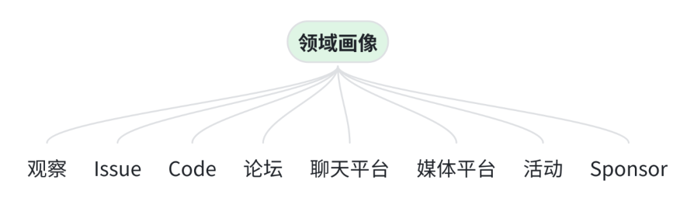
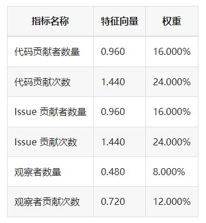
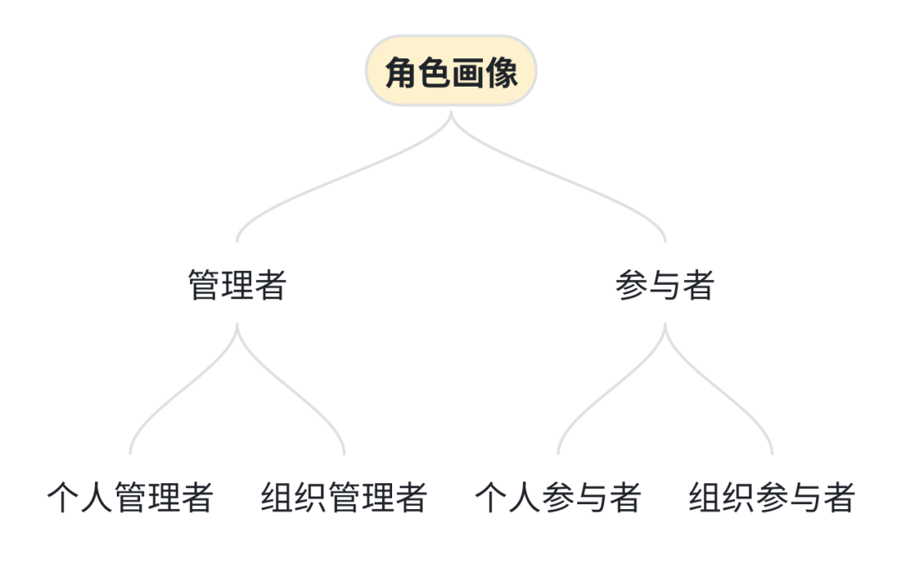
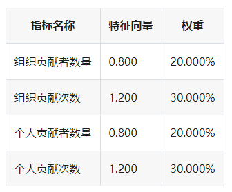
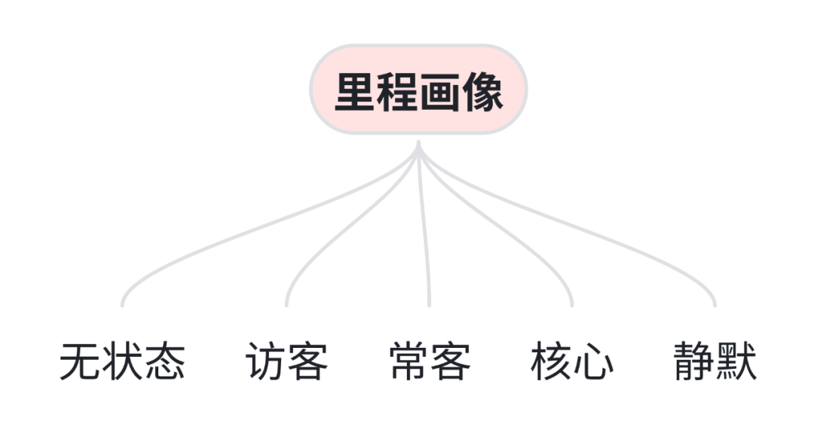

Countless projects emerge in the open source world every day, but accurately assessing the health of an open source project has always been a challenge. Fortunately, we now have the open source project's health check doctor - OSS Compass, and recently its open source ecosystem evaluation system and SaaS services have undergone comprehensive upgrades! Let's take a look at the exciting updates together.

<!--truncate-->

### 01 Brand New Open Source Ecosystem Evaluation System: Addition of Contributor Persona Model

<embed
  height={398}
  width={'100%'}
  src={'https://www.youtube.com/embed/Cy0DKvLXzLg'}
  sandbox={''}
></embed>

Recently, a brand new open source ecosystem evaluation system was announced on the OSS Compass official website documentation page. Through this new architecture diagram, we have constructed over a dozen evaluation models in the three-dimensional space interwoven with "Productivity, Robustness, Niche Creation" and "Software, Collaboration, People".

The original SaaS platform had only four evaluation models: "Collaborative Development Index", "Community Service and Support", "Community Activity" and "Organizations Activity". Now, we have added three new contributor persona models, including "Contributor Domain Persona", "Contributor Milestone Persona" and "Contributor Role Persona".

The Contributor Domain Persona Model divides the contributions made by contributors to the community into domains. This includes observations, issue contributions, code contributions, forum contributions, chat platform contributions, media platform contributions, activity contributions, and sponsor contributions. There are six statistics metrics, including the number of code contributors, code contribution frequency, number of issue contributors, issue contribution frequency, number of observers, and observer contribution frequency.

In the Contributor Role Persona Model, contributors who have managerial behavior on code hosting platforms are called managers, while those without managerial behavior are called participants. Managerial behavior typically refers to contributions related to issue management or code management. Contributors are distinguished as organizational or individual based on whether they declare their organizational identity, such as submitting code through a public organizational email.

Thus, the role persona model divides contributor roles into four categories: organizational managers, individual managers, organizational participants, and individual participants. There are four statistical metrics, including the number of organizational contributors, organizational contribution frequency, number of individual contributors, and individual contribution frequency.

The Contributor Milestone Persona Model divides contributor milestones into five states based on the contributor's contribution volume, frequency, and type: no status, silent, visitor, regular, and core. There are six statistical metrics, including the number of core contributors, core contribution frequency, number of regular contributors, regular contribution frequency, number of visitor contributors, and visitor contribution frequency.

Contributors are the driving force behind the development of open source communities. Therefore, understanding the situation of contributors in open source projects is crucial for open source community management. The statistical metrics of the above three models have been selected through extensive insight and practice, and it is believed that they can provide open source community managers with the information they most need to know.

### 02 SaaS Service Upgrade: Launch of Project Deep Dive Insight Solution

<embed
  height={398}
  width={'100%'}
  src={'https://www.youtube.com/embed/OytlB5-bvaE'}
  sandbox={''}
></embed>

On the OSS Compass official website's open source project evaluation report page, you can perceive the development status of the community through the curve changes of different metrics models. In the latest upgrade, our project evaluation report has introduced the Project Deep Dive Insight Solution, making it even more powerful! Currently, the deep dive insight page mainly presents data on contributor personas, issues, and pull requests.

In the contributor persona section, we can view detailed information such as contributor IDs on code hosting platforms, role profiles, milestone profiles, domain profiles, contributing organizations, and contribution counts, and we can also filter and sort them. The details pages of issues and pull requests display relevant information for each issue and pull request, including title, URL, status, first response time, etc. Additionally, the distribution of issue and pull request resolution statuses and comment counts is shown through pie charts.

Overall, this update is a boon for open source community managers, bringing many benefits to their open source community governance work, and it also provides people who want to understand the development status of a particular open source project with timely access to relevant information.

What are you waiting for? Quickly log in to the OSS Compass official website to view your project insight report! Perhaps there are unexpected gains~
