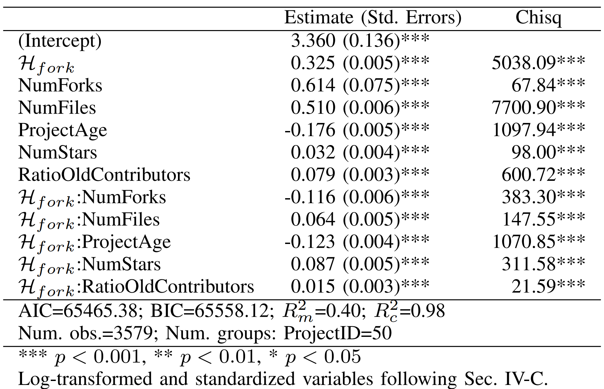
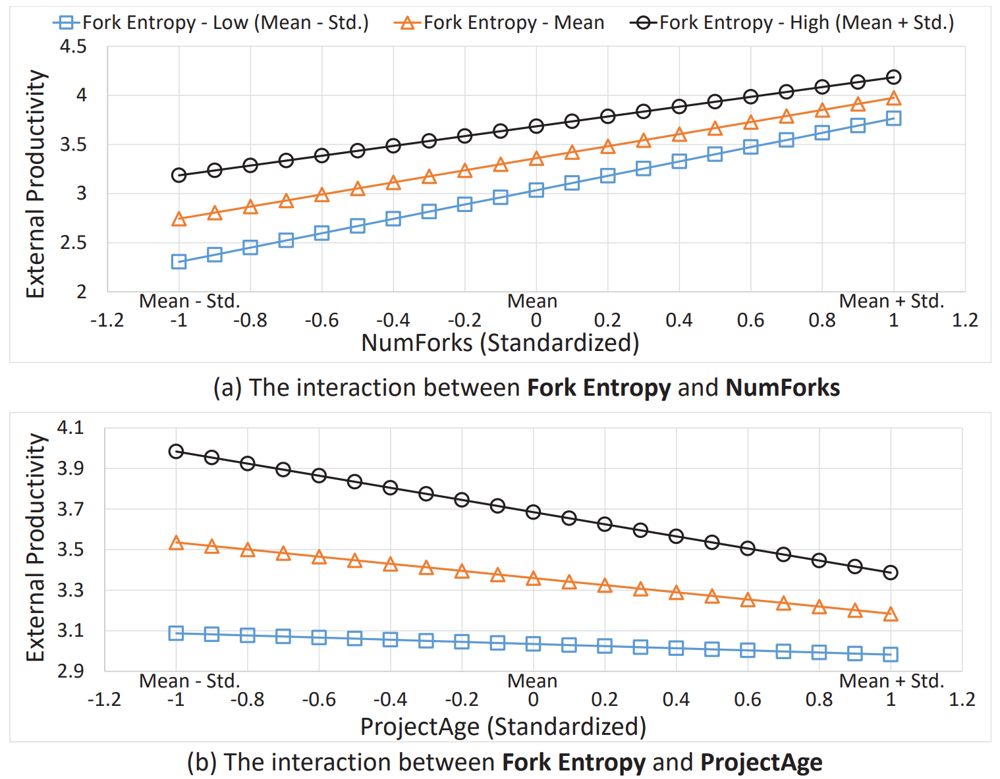
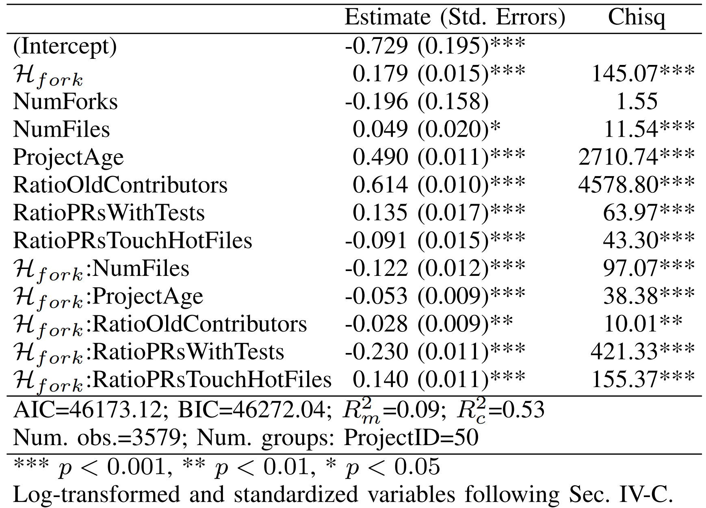
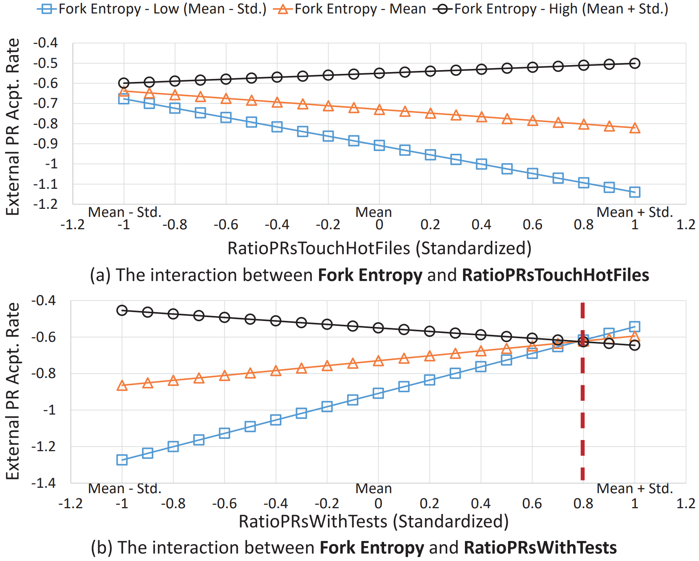
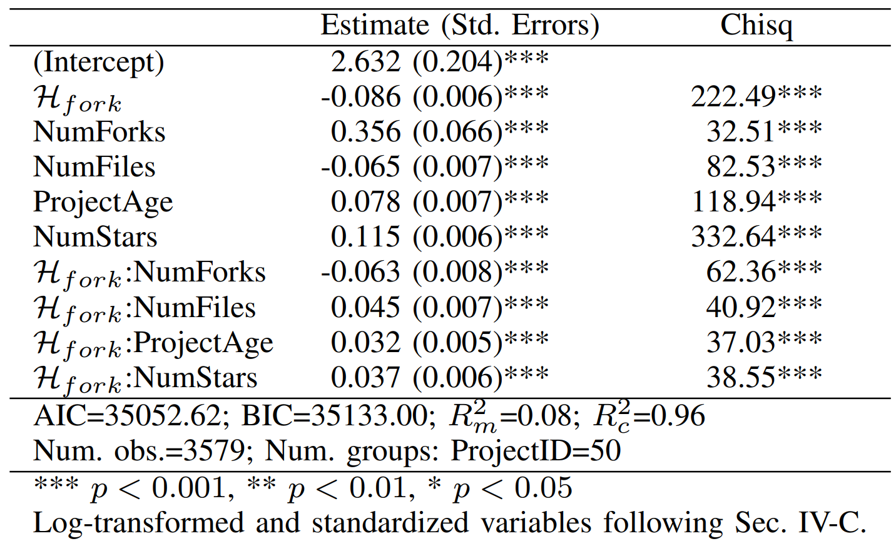
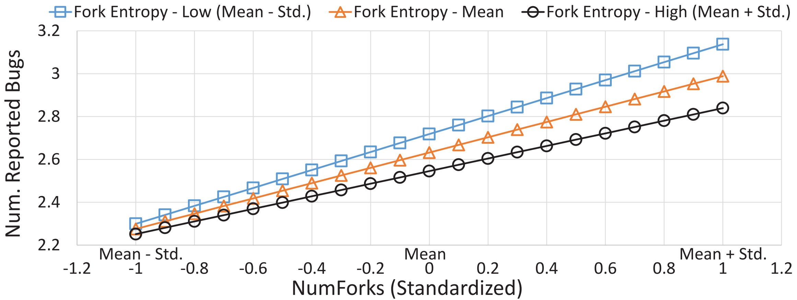

Liang Wang$$^{1,2}$$，Zhiwen Zheng$$^{1,2}$$，Xiangchen Wu$$^{1,2}$$，Baihui Sang$$^{1,2}$$，Jierui Zhang$$^{1,2}$$，Xianping Tao$$^{1,2}$$

$$^1$$Department of Computer Science and Technology, Nanjing University, State Key Laboratory for Novel Software Technology $$^2$$OSS Compass

### Abstract

This research focuses on project forks on open-source software (OSS) platforms, revolving around measuring and understanding the diversity of forks in open-source software projects. The paper accomplishes this by constructing a novel fork entropy based on Rao's second entropy and assessing this diversity based on modifications to project files. Empirical studies indicate a significant correlation between fork entropy in open-source projects and various key outcomes, including external productivity of the project (measured by the number of contributions from external contributors), acceptance rate of external contributors' pull requests, and the reported number of bugs. Additionally, we observe significant interactions between fork entropy and other factors, such as the quantity of forks. These findings suggest that fork entropy, as an effective metric, not only enhances the current available measurements of forks in open-source software projects but also deepens our understanding of the development process based on forked repositories. It holds the potential to support further research and applications.

<!--truncate-->

### 1. Introduction

In this research, we explored the relationship between fork diversity and the growth and health of open-source projects in the context of fork-based collaborative software development. Despite numerous studies focusing on the reasons for fork creation, communication among forks, and the characteristics and impacts of individual forks, there is currently a lack of quantitative metrics to concisely and deeply describe the fork development status of an open-source software project, beyond simple fork counts. Additionally, existing work around open-source projects predominantly concentrates on the main repositories, excluding a global perspective that includes fork repositories, which limits researchers and practitioners in gaining a comprehensive understanding of a project's current state and guiding its development.

Inspired by the biodiversity theory in ecology, which suggests that the more diverse the species in an ecosystem, the healthier it is, we endeavored to study the growth and health of open-source projects from the perspective of fork diversity. Specifically, in this study, we addressed the following three research questions:

- RQ1: How does fork diversity impact the external productivity of fork repositories contributing to the main repository?
- RQ2: What is the influence of fork diversity on the acceptance efficiency of the main repository towards contributions from fork repositories?
- RQ3: How is fork diversity related to the number of reported bugs in open-source software projects?

Details of the research methodology and empirical findings are described below.

### 2. Entropy-based Measurement Methods for Open Source Software

As shown in Figure 1, the metric calculation process proposed in this work includes three steps: data preprocessing, constructing the file modification matrix, and calculating the fork diversity.

  

Figure 1. Overview of the proposed approach.

  

All data in this study are derived from file modification records of open-source software (OSS) projects and their corresponding fork sets in OSS Compass and GHTorrent. Firstly, we performed data preprocessing on the raw records, which involved cleaning and partitioning based on forks. The data cleaning rules included ensuring that at least one external developer in the fork repository had created a non-empty commit, and non-empty commits indicated modifications or the creation of at least one file. The data partitioning process was based on time windows. In this study, our focus was primarily on measuring the diversity of commits created by forked repositories of open-source software within a one-month time span. The distribution of commits after data preprocessing is depicted in Figure 1 (a), where the shaded area represents a valid snapshot containing all valid forks and their corresponding commit sets during that period.

Secondly, we constructed the file modification matrix for each partitioned snapshot. Equation (1) represents the $$i^{th}$$ row of the file modification matrix, where the index $$i$$denotes the valid fork number, $$n$$ represents the index of all valid file modification sets across forks in that snapshot, and the corresponding component value $$c_{i1}$$ represents the modification count in the file at position $$1$$ for the $$i^{th}$$ fork. We stacked all modification vectors in this snapshot to form the matrix $$M_t$$, as illustrated in Figure 1(b). It is important to note that, due to the removal of file objects with a modification scale of 0 during data cleaning, the matrix $$M_t$$ does not have any rows or columns entirely filled with zeros.

$$\overrightarrow{\mathbf{c}}_i=\left\langle c_{i 1}, c_{i 2}, \cdots, c_{i j}, \cdots, c_{i n}\right\rangle^{\top}$$ (1)

Finally, for each file modification matrix Mt obtained above, we calculated the corresponding fork entropy. The calculation process is constructed as follows:

- Calculating Average Dissimilarity

  We computed the average dissimilarity of modifications to the file set by each fork in a snapshot based on Rao's Quadratic Entropy, as shown in Equation (2).

  

  $$\mathrm{QE}(M)=\frac{1}{m^2} \sum_{i=1}^m \sum_{j=1}^m \mathcal{D}\left(\overrightarrow{\mathbf{c}}_i, \overrightarrow{\mathbf{c}}_j\right)$$ (2)

  

Where$$EQ(M)$$represents Rao's Quadratic Entropy, estimating the expected difference between randomly selecting two forks from the fork collection. $$M$$ is the file modification matrix corresponding to the snapshot (time index $$t$$ is omitted), $$m$$ is the number of forks in a snapshot, $$\vec{c}_i$$ and $$\vec{c}_j$$ are the $$i^{th}$$ and $$j^{th}$$ rows in $$M$$, and $$\mathcal{D}(\cdot)$$ is a distance function measuring the difference between two vectors.

- Choosing Distance Function

  In this study, we represented the distance function using the Laplace kernel function, where $$||\cdot||_1$$ is the 1-norm, and $$\gamma$$ is a hyperparameter used to adjust the sensitivity of the function to differences. We chose the Laplace kernel function because it is a non-linear transformation sensitive to small changes, demonstrating excellent performance in various detection tasks such as character recognition. This choice is motivated by our practical examination of the studied objects. Through an analysis of the actual file modification processes in the fork collection, we observed that many forks made slight modifications to project files, with some even modifying only a single line in a file. Based on the Laplace kernel function's performance in actual scenarios and after comparative testing with various distance functions, we ultimately selected the distance function presented in Equation (3).

$$\mathcal{D}\left(\overrightarrow{\mathbf{c}}_i, \overrightarrow{\mathbf{c}}_j\right)=1-\exp \left(-\gamma\left\|\overrightarrow{\mathbf{c}}_i-\overrightarrow{\mathbf{c}}_j\right\|_1\right)$$ (3)

- Building Fork Entropy

By substituting Equation (3) into Equation (2), we obtained the formula for fork entropy presented in Equation (4)：

$$\mathcal{H}_{\text {fork }}(M)=\frac{1}{m^2} \sum_{i=1}^m \sum_{i=1}^m\left(1-\exp \left(-\gamma\left\|\overrightarrow{\mathbf{c}}_i-\overrightarrow{\mathbf{c}}_j\right\|_1\right)\right)$$ (4)

According to the above definition, it is clear that the value of$$\mathcal{H}_{fork}(M)$$lies in the range (0,1]. Consistent with most entropy properties, $$\mathcal{H}_{fork}(M)$$attains its minimum when the number of changes to files modified by different forks is identical. Through mathematical reasoning, it can be derived that the fork entropy obtained through the above process possesses the following fundamental properties:

- Symmetry: Fork entropy is independent of the organizational order of forks in the calculation process.
- Continuity: Fork entropy is a continuous function.
- Monotonicity: Adding a redundant (or independent) fork will decrease (or increase) fork entropy.

### 3. Empirical Study of Open Source Software Based on Fork Entropy

In this section, we utilized fork diversity as the independent variable and summarized key development indicators of selected projects as dependent variables. We also considered other significant factors influencing project development as control variables. Statistical analysis methods were applied to analyze the relationships among these variables. Specifically, we measured the development status of fork-based open-source software projects using three variables: external productivity (contribution of fork repositories to the main repository), acceptance efficiency (main repository's efficiency in accepting contributions from fork repositories), and the number of reported bugs in open-source projects.

For each defined research question, we employed mixed-effect regression models to analyze the impact of independent variables (including control variables) on dependent variables. We considered potential random effects among different projects. To address potential issues of multicollinearity, we checked the variance inflation factors between variables. The results indicated that all values were below 4, suggesting no significant multicollinearity among variables. Additionally, we performed a QQ plot to examine the residual distribution after model fitting, confirming its adherence to normal distribution. This further validates the reliability and robustness of our analytical results.

#### 3.1 RQ1: What is the impact of fork diversity on external productivity contributed by fork repositories to the main repository

In this context, we borrowed and refined the definition of external productivity, namely: the number of commits created by fork repositories within a unit time and merged by the main repository (NumAcceptedCommit). The unit time here is set to one month, consistent with the time length used to measure fork diversity.

  

Table 1. Fixed Effects of the External Productivity Model

  

As shown in Table 1, regression analysis reveals a significant positive correlation between fork entropy and external productivity in open-source software projects. Specifically, an increase in fork entropy is closely associated with an enhancement in external productivity. This implies that projects with a larger and more diverse fork population are more likely to attract external contributors, thereby facilitating an increase in external productivity. Additionally, the control factors in the model also exhibit a significant association with external productivity. According to Table 1, except for the project age, all control variables are positively correlated with the external productivity of open-source software projects. Thus, it suggests that open-source software projects with more forks and modified files, higher popularity, younger age, and a higher proportion of experienced external contributors typically correspond to higher external productivity.

  

Figure 2. Interaction Effects in the External Productivity Model.

  

Figure 2(a) illustrates the trend of external productivity with increasing fork count at low, medium, and high levels of fork entropy. Primarily, under various levels of fork entropy, external productivity increases with an increase in fork count. Moreover, the interaction term indicates that at higher levels of fork entropy, the growth rate of external productivity relative to fork count is lower. Similarly, Figure 2(b) demonstrates the interaction effect between fork entropy and project age. Initially, we observe a general decrease in external productivity with an increase in project age at various levels of fork entropy. However, with higher levels of fork entropy, the proportion of decrease in external productivity with increasing project age rises. A plausible explanation for this result is that young projects in an active development stage may be more willing to accept diverse contributions from external contributors, while older projects might have entered a stable maintenance phase or gradually declined due to a lack of capacity to handle diverse external contributions.

#### 3.2 RQ2：How does fork diversity affect the acceptance efficiency of contributions from fork repositories by the main repository?

In this subsection, we conducted an analysis using a mixed-effects logistic regression model, considering fork diversity and other factors, including fork count, modified file count, project age, star count, proportion of experienced contributors, ratio of pull requests containing tests, and ratio of pull requests touching popular files. The model also incorporates the interaction effects between fork diversity and each control variable.

  

Table 2: Fixed Effects in the External Pull Request Acceptance Rate Model

  

As shown in Table 2, despite the small estimated effect of fork diversity, there is a significant and positive correlation between fork diversity and the acceptance rate of external pull requests. Except for the ratio of pull requests touching popular files, other four control variables show a positive correlation with the acceptance rate of external pull requests.

  

Figure 3. Interactions in the Acceptance Rate Model

  

Regarding the interaction terms in the model, only the interaction between fork diversity and the ratio of pull requests touching popular files exhibits a significant and positive correlation. The remaining interaction terms show a significant and negative correlation between them and the response. As depicted in Figure 3, when fork entropy is at a median or low level, the acceptance rate decreases with a decrease in the ratio of pull requests touching popular files, while it increases when fork entropy is high. A possible explanation here is that when fork entropy is at a median or low level, pull requests are likely to touch the same or similar set of popular files, leading to conflicts and redundancies that reduce the acceptance rate. In contrast, when fork entropy is high, pull requests may touch different and less overlapping popular files. Therefore, an increase in the ratio of pull requests touching popular files also brings about an increase in the acceptance rate.

#### 3.2 RQ3: What is the relationship between fork diversity and the number of reported bugs in open-source software projects?

As shown in Table 3, fork entropy has a significant negative correlation with the number of reported defects in open-source software projects. Specifically, we found that projects with higher levels of fork entropy typically report fewer issues, contrasting with factors such as fork count and project age. This suggests that in projects with more and diverse forks, there is a relatively lower number of reported issues, with an estimated coefficient of -0.086. Furthermore, the results indicate a significant negative correlation between the number of modified files and the number of reported defects, while other controlled factors show a significant positive correlation with the response. All interaction terms exhibit significance, with the interaction between fork entropy and fork count showing a negative correlation with the response.

  

Table 3. Fixed Effects in the Reported Bug Count Model

  

Figure 4 illustrates the interaction between fork entropy and NumForks. We observed that, at various levels of fork entropy, the number of reported bugs increases with an increase in fork count. When fork entropy is at a higher level, the growth rate of reported defects slows down with an increase in fork count. Combining the experimental results of RQ1 and RQ2, a possible explanation for these results is that, before potential defect reports, an increased fork entropy may be associated with more commits and pull requests, including those addressing bugs. Based on these results, under the assumption that fewer reported bugs indicate higher software quality, we can conclude that higher levels of fork entropy are positively correlated with improved software quality.

  

Figure 4. Interaction between Fork Entropy and NumForks

  

### 4. Conclusion:

In this study, we introduced a novel metric called "fork entropy" based on the open-source software (OSS) development process and applied it to measure the diversity of fork populations around OSS projects. Through empirical research, we found significant correlations between fork entropy and the external productivity, acceptance rate of external pull requests, and the number of reported defects in these projects. Furthermore, we identified significant interactions between fork entropy and other factors previously known to be related to productivity and quality in OSS projects, such as fork count, project age, and the ratio of pull requests involving popular files. Finally, the proposed metric of fork entropy not only enriches the current set of available metrics for understanding forks in OSS projects but also provides support for further research into pull request-based open-source software processes.

### Related Publication

Liang Wang, Zhiwen Zheng, Xiangchen Wu, Baihui Sang, Jierui Zhang and Xianping Tao, "Fork Entropy: Assessing the Diversity of Open Source Software Projects' Forks," 2023 38th IEEE/ACM International Conference on Automated Software Engineering (ASE), Luxembourg, Luxembourg, 2023, pp. 204-216, doi: 10.1109/ASE56229.2023.00168.

### Acknowledgments

Thanks to the OSS Compass community and platform, with special appreciation for the invaluable support provided by Yehui Wang from Huawei Technologies Limited throughout the course of this research. This study has been made possible through funding from the National Natural Science Foundation of China (Grant No. 62172203), collaborative efforts with Huawei Technologies in the project titled "Open Source Ecosystem Evaluation Technical Collaboration," and the generous support from the Software New Technology and Industrialization Collaborative Innovation Center at Nanjing University.
