<!--truncate-->

Hi, open source adventurers! Today, I'm here to introduce the latest marvel from the open source realm – the new darling of the OSS Compass (hereinafter referred to as "Compass") world! Yes, you heard it right. It's our new SaaS service – Compass Lab! Wait, you haven't heard about it yet? Don't worry, let me explain it all to you step by step. I promise it will leave you dazzled and excited!

In the world of open source, countless projects emerge every day. However, accurately measuring the health of an open source project remains a vexing challenge. Luckily, we have Compass, which is like a health check doctor for open source projects. And recently, a new member has joined – Compass Lab!

### 01.What is Compass Lab?

Compass Lab is an incubator for open source community evaluation metric models. It might sound sophisticated, but actually it's essentially a "health evaluation center" that provides a comprehensive checkup for open source projects. This evaluation center not only offers data but also serves as a platform filled with fun and creativity.

Compass Lab gathers an enormous amount of data from over 20,000 open source projects, offering more than 200 project categories and over 100 evaluation metrics. This means you can conduct an all-encompassing health assessment for a project – the possibilities are endless! You can select different evaluation metrics and datasets based on your needs, making it a paradise for assessment enthusiasts!

### 02.How to "play" with Compass Lab?

It's actually quite simple! First, you need to approach it with a curious mindset. Then, register and log in to the SaaS service platform of Compass Lab, where you'll discover a fascinating world. You can choose existing evaluation models or customize one based on your interests.

#### General Steps to Create a Model

##### 1. Open the model creation page:

On the Compass official website, locate the model creation area on the right side of the Lab page and click “Create a model now”or use the button “Create a model”at the top.

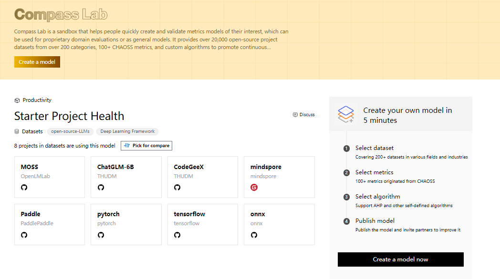

##### 2. Fill in basic information:

Provide basic model information, such as ecosystem dimension, model name, applicable industry, and whether it's public or private.

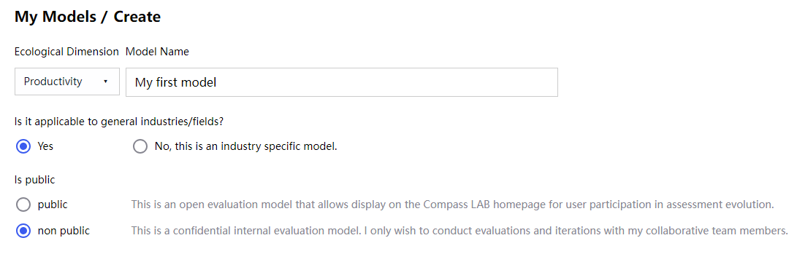

##### 3. Select datasets:

Choose a dataset from the 200+ datasets that suits your needs, offering flexibility for various domains.

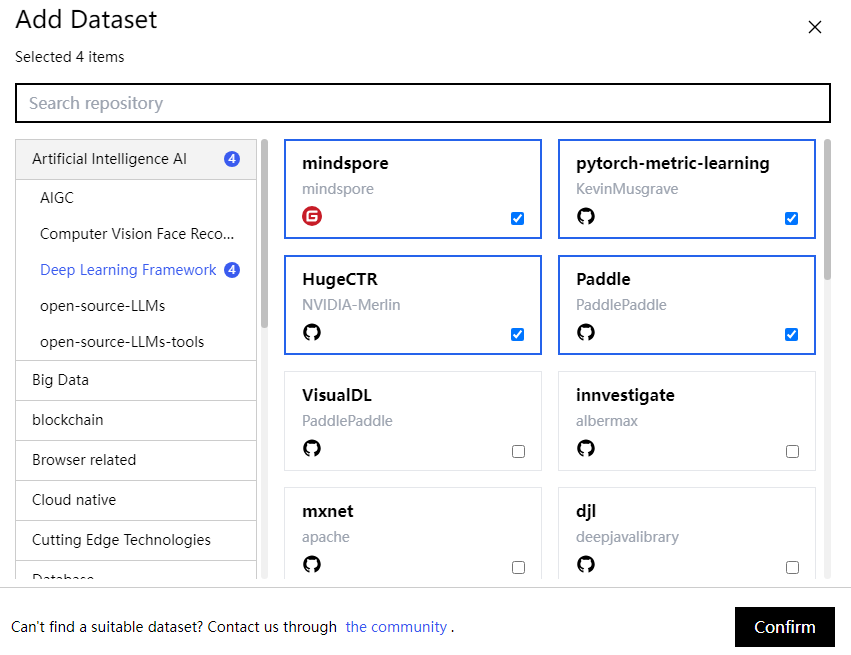

##### 4. Choose evaluation metrics:

Select the metrics you care about from the 100+ metrics provided by CHAOSS and Compass, categorized by code, issues, pull requests, repositories, contributors, etc. And confirm your selection.

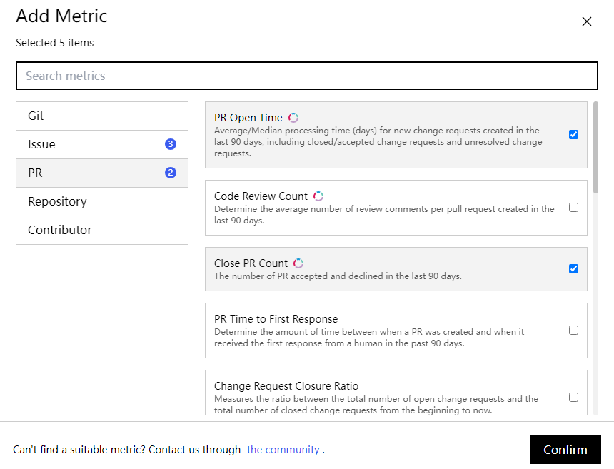

##### 5. Adjust weights and thresholds:

Next, modify weight values in the percentage input box or drag the slider to adjust weights (default is rightward only). Revise thresholds in the right input box (ensuring the values stay within the provided range). This process is similar to customizing your own pizza, adding toppings according to your taste!

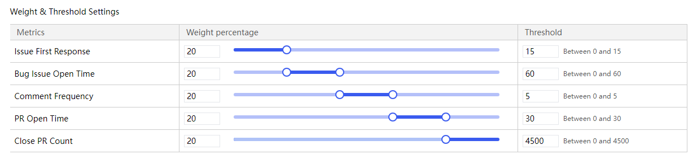

##### 6. Choose algorithms:

Currently, we only support the default algorithm (as shown below), but don't worry, it's a remarkable algorithm crafted by the expert Rob Pike himself! For an in-depth understanding of this algorithm, refer to our previously released article "OSS Compass Scoring System Switch：Watch Algorithms Transforming into Magic!" If you have more thoughts on algorithms, join the Compass Slack channel to discuss with fellow open source adventurers.

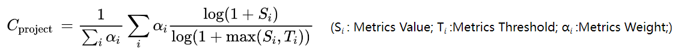

##### 7. Publish the model:

After confirming all the information, click “save” to publish the model.

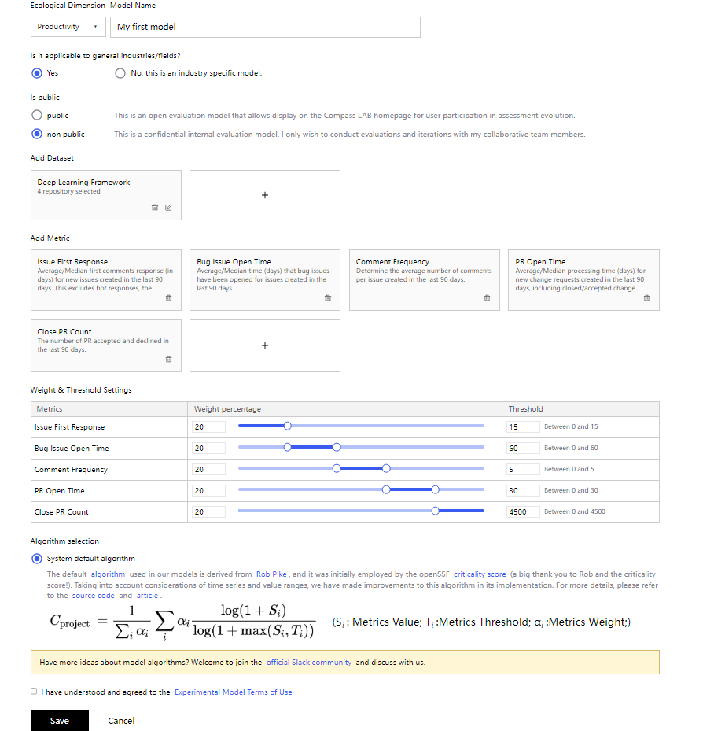

Next, let data and creativity collide here to create your own project health model!

### 03. Your creativity finds a home here: creating a LLMs projects evaluation model!

Compass Lab not only offers general project evaluation models but also provides a special space for developers with unique ideas. If you have an extraordinary open source project and want to assign it a health score, this is the place for you! Here, you can customize an evaluation model for your project, allowing your creativity to soar!

For example, if you're interested in open source LLMs projects or have your own open source LLMs project, you can create an evaluation model for it:

#### Steps for creating an LLMs projects evaluation model

##### 1. Give your model a catchy name:

Besides naming, remember to choose whether it's for a general or specific domain and whether you're willing to make the model public.

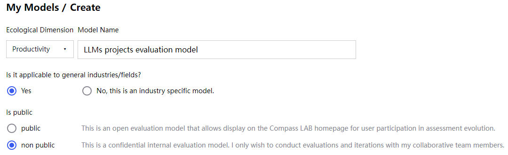

##### 2. Select datasets:

Choose projects under the categories of open source LLMs and open source LLMs tools to facilitate cross-category comparisons. (Our dataset is continuously expanding!)

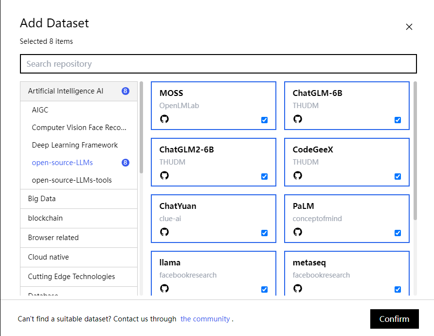

##### 3. Choose metrics and adjust weights and thresholds:

Select appropriate metrics based on the characteristics of open source LLMs projects, such as organization count, code commit frequency, ongoing contributions, etc.

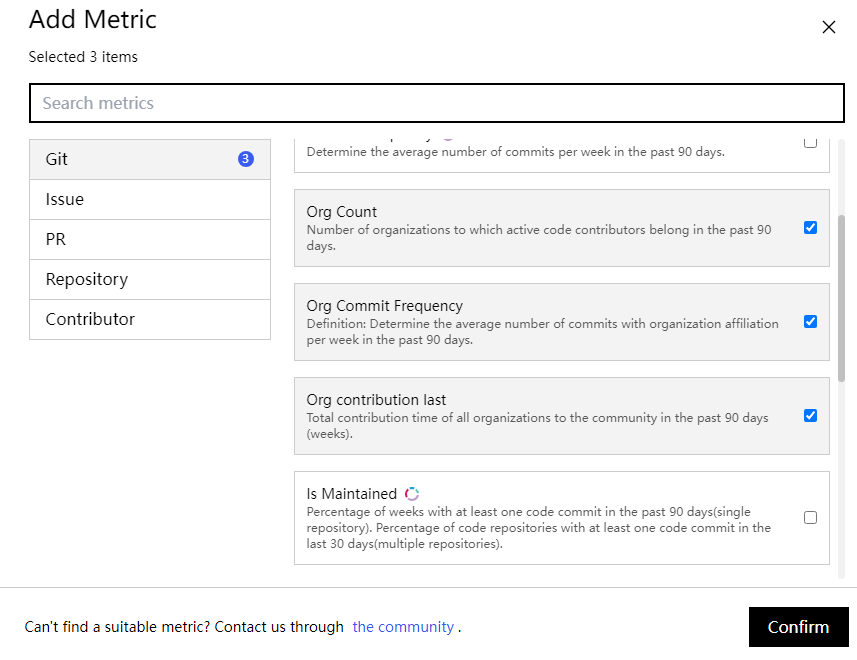

Adjust weights and thresholds for each metric following the previously demonstrated steps.

Then, click “save” and the model is created.

##### 4. Analyze and view assessment results:

Click "Analyze" and wait for it to complete – then you can view the assessment report.

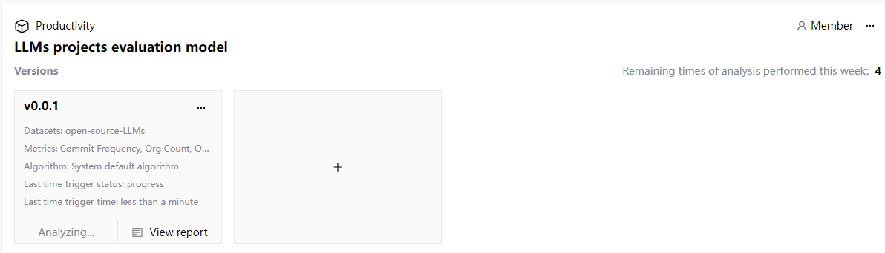

##### 5. Add comments:

In addition, we've added a comment feature to the dashboard page. Click the comment button in the upper right corner to share your thoughts.

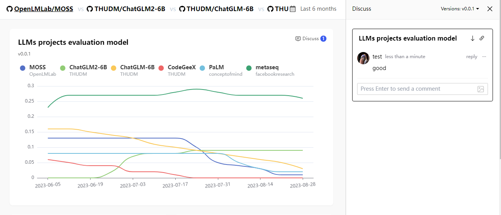

##### 6. Invite friends to collaborate:

You can also invite friends to collaborate and help you create a more perfect model. Just click "Member" on the model page, set collaboration permissions, and send invitations!

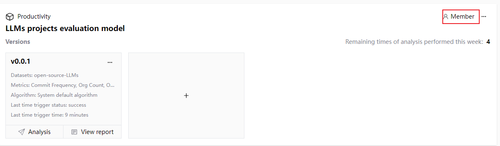
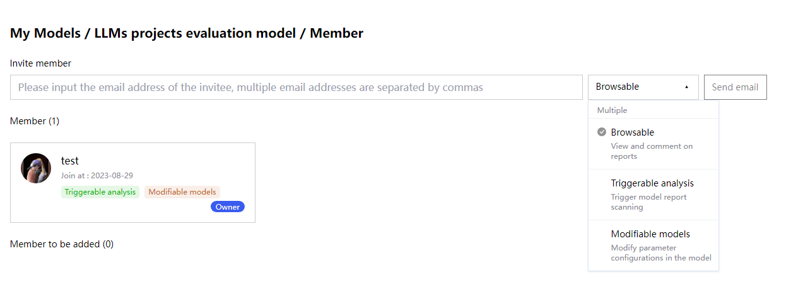

### 04. Explore limitless fun in the open source world, all in Compass!

Through today's introduction, I believe you now have a deeper understanding of Compass Lab. Here, you can not only explore various dimensions of open source projects but also customize evaluation models for your own ideas, combining creativity and data. This "evaluation playground" in the open source world awaits your participation!

If you haven't experienced Compass Lab yet, take action now! Refer to below operation demonstration and create your evaluation model! Let's explore the boundless fun of the open source world together, and unravel the mysteries of data!

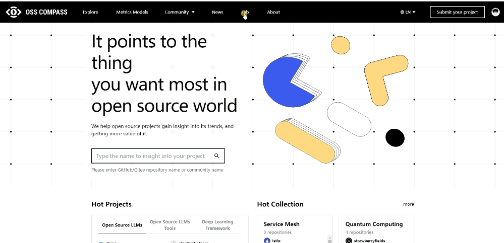

Remember to stay tuned for more interesting tech news and creative activities. Until next time, let's embark on an infinite journey of open source creativity together!
