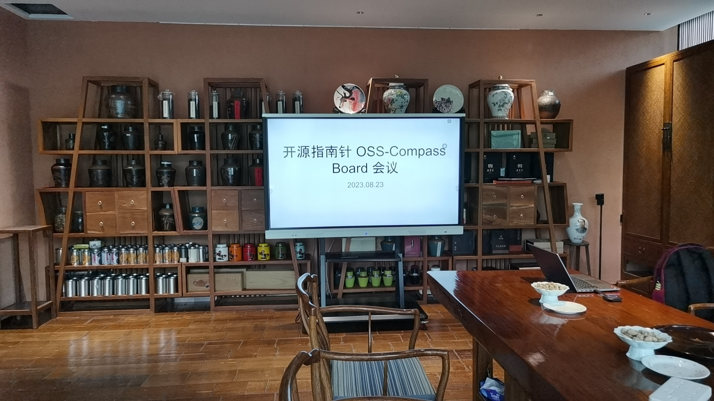
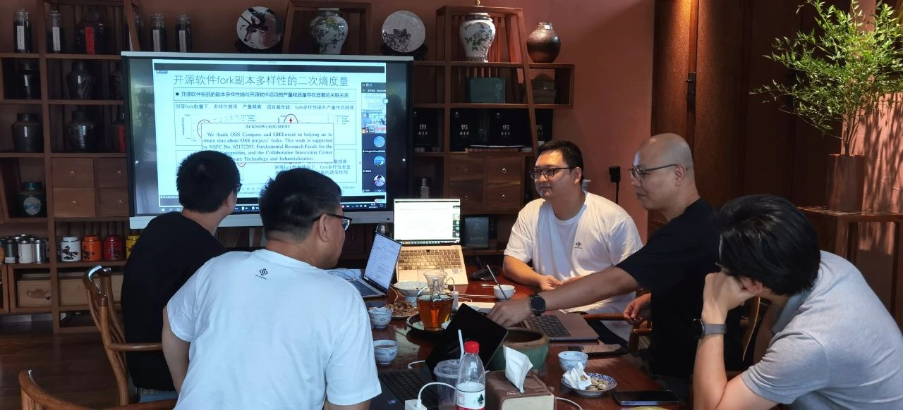
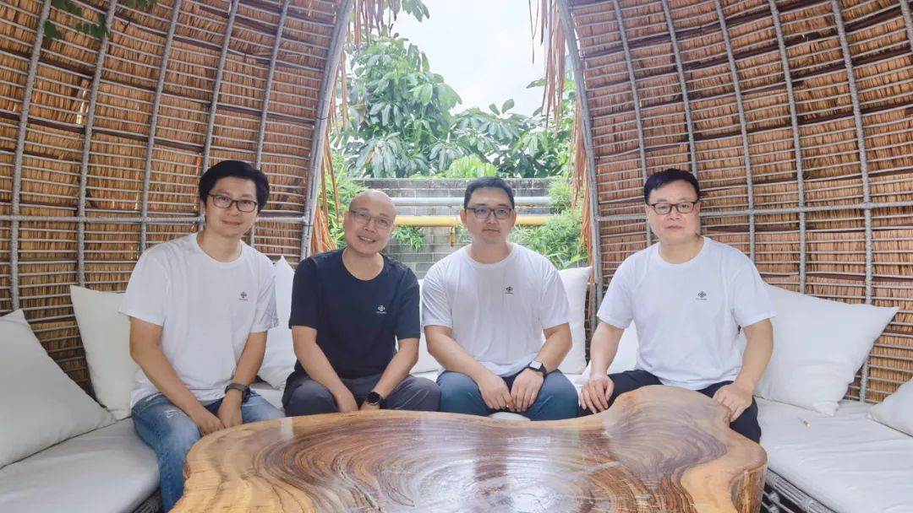
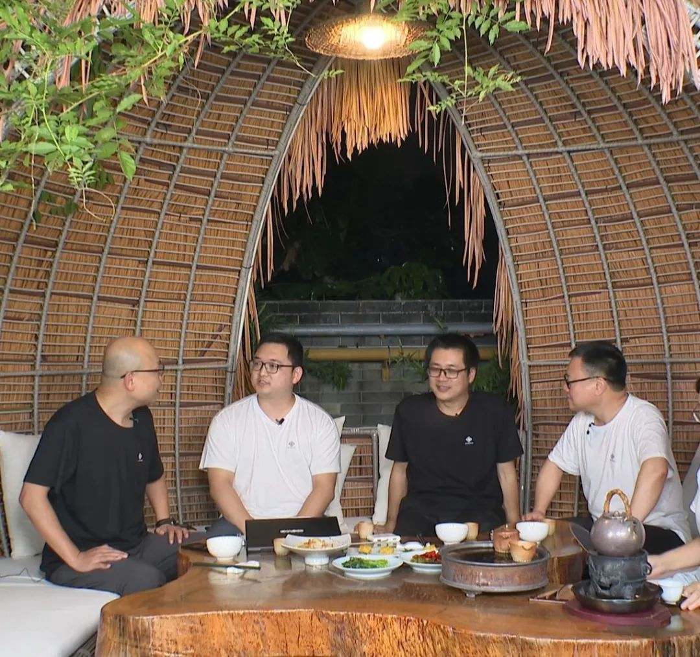

<!--truncate-->

On the afternoon of August 23, 2023, the OSS Compass (hereinafter referred to as "Compass") Community Governing Board held its first meeting of the year smoothly. All members of Compass Community Governing Board attended the meeting except three who were absent for unavoidable reasons. Among them, Open Source China's Hongshu, Huawei's Kun Gao and Yehui Wang, Tencent's Zhihao Shan, and Checode's Wenxuan Long participated in person, while Nanjing University's Xianping Tao, the National Industrial Information Security Development Research Center's Junsong Zhou, Peking University's Minghui Zhou, Nanjing University's Liang Wang, and Open Source China's Shengxiang Zhang attended the meeting online. Besides, Liu Qiangjun, the representative of the National Financial Technology Evaluation Center also attended online.

During the meeting, Yehui Wang, the Governing Board member and Technical Committee co-chairman of Compass Community, reported the progress of Compass Community's work and demonstrated the new SaaS service of Compass, Compass Lab. The board members engaged in a vigorous discussion about the value and use cases of Compass Lab. They unanimously agreed that software selection scenario is a good start for realizing the value of Compass Lab. The academic research achievements of Professor Minghui Zhou and Professor Liang Wang should be explored for engineering implementation on the basis of existing evaluation metrics models within the Compass Community.

Professor Liang Wang shared his CCF-A conference paper, which is based on information theory and entropy. The article models and measures the evolution behavior of open source community population from the perspectives of people and software products, concluding with special thanks to Compass.

  

Professor Liang Wang is sharing his paper

  

In addition, the meeting passed a resolution to make Checode a platinum member of Compass Community and appoint Wenxuan Long, the deputy general manager of Checode, as a representative member of Compass Community Governing Board. In the future, Wenxuan Long will participate in community management affairs alongside other board members and continue to contribute to the community's development.

Yehui Wang stated that over the past six months, Wenxuan Long and his team, representing Checode, have been focused on the classification of open source software within the Compass community. They have submitted nearly 100 PRs and over 260 commits, completed over 20 primary classifications, and over 260 secondary classifications. They have also added over a thousand open source components to management.

Based on the classification methods of national standards for software and large open source communities, Wenxuan Long and his team have improved the existing software classification into two levels while considering various fundamental software and hot topics in the open source domain. With the improved software classification, Compass community users can quickly and efficiently search for and evaluate the open source components they need. Additionally, the improved classification makes open source software selection more convenient. Furthermore, with the recent release of the new Compass SaaS service, Compass Lab, the improved software classification can help users rapidly select suitable datasets for creating and validating metrics models.

Wenxuan Long emphasized that open source software classification is important and requires continuous effort. By collaborating with Compass, the classification work of Checode will be helpful to discover the contributions of open source contributors, harness their wisdom and power, select good open source projects, improve the open source softwares management for organizations and their users, and promote the reliability and security of software development.

After joining Compass community, Checode will continue to advance the classification work of open source softwares, continuously optimizing the secondary classification of software within Compass Lab's datasets. They will also undertake other technical work as required by the community's development. Checode is willing to work hand in hand with Compass community to promote the development of open source software evaluation, creating greater value for the open source evaluation ecosystem in China and globally.

  

From left to right: Zhihao Shan from Tencent, Hongshu from Open Source China, Yehui Wang from Huawei, Wenxuan Long from Checode.

  

  

From left to right: Hongshu from Open Source China, Yehui Wang from Huawei, Kun Gao from Huawei, Wenxuan Long from Checode.

  

### 🌟 About Checode

Checode is a high-tech enterprise specializing in open source code compliance and security testing. The company is committed to researching open source software testing technology and has developed products such as Checode Open Source Assistant/SCA/CHS/V-Hunter with fully independent intellectual property rights. These products have achieved international leadership in functionality, testing accuracy, and detection speed. Checode possesses strong capabilities in open source code detection and provides more effective information security protection for domestic users, avoiding the risks of information leakage associated with using foreign testing tools. The company has a complete research and development team, led by senior experts in the field of open source testing in China and top algorithm scientists who have returned from North America.
