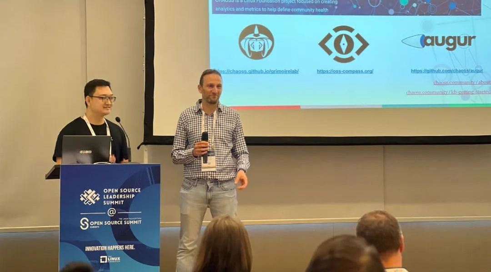
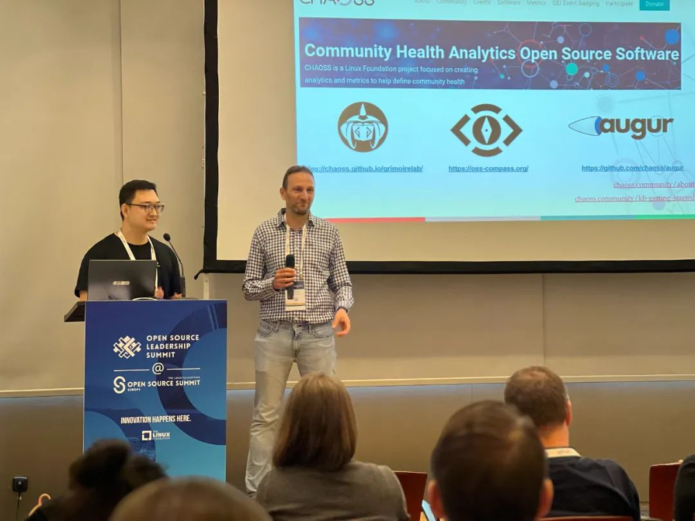
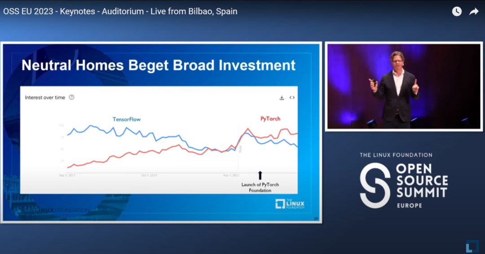
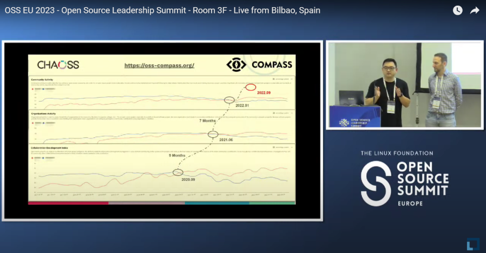

<!--truncate-->

<embed
  height={398}
  width={'100%'}
  src={'https://www.youtube.com/embed/cgb0Hzrym8g'}
  sandbox={''}
></embed>

  

This video was taken from the live review of OSS EU 2023, and the original video address is: https://www.youtube.com/watch?v=FNK3--dtR_4

  

Hello, everyone! Today let's review a groundbreaking presentation titled with "Building SaaS Services with CHAOSS Technology to Evaluate Community Health and Sustainability" at Linux Foundation's OSS EU 2023 (Open Source Summit Europe 2023), given by Yehui Wang, LF CHAOSS Governing Board member and OSS Compass Co-Founder & TC Co-Chair, and Daniel Izquierdo, LF CHAOSS Governing Board member and Bitergia CEO.

### 01 🌟CHAOSS Technology and Community Health

CHAOSS, an acronym for "Community Health Analytics for Open Source Software," focuses on evaluating community health metrics for open source projects. Yehui and Daniel introduced the 16-year history of CHAOSS development and emphasized that community health metrics are crucial for individual contributors, community managers, maintainers, companies, and even researchers and startups looking to employ or invest open source projects.

CHAOSS aims to define metrics and metrics models to measure open source health. In the first release of CHAOSS metrics in 2019 there were only 30 metrics released, but right now there have been almost 100 metrics and plus 11 metrics model released. These metrics cover various domains, such as diversity and inclusion, risk, governance, leadership and so on. The CHAOSS community collaboratively defines these metrics, fostering innovation and collaboration of the metrics application. Applications of these metrics include various technical tools such as Augur, Bitergia Analytics, GrimoireLab, OSS Compass, and others.

### 02 🌟OSS Compass and the CHAOSS Ecosystem

Yehui introduced OSS Compass as an open source service built on CHAOSS technology. It provides two key components: the SaaS Platform and the OSS Ecosystem Evaluation System. OSS Compass focuses on evaluating open source ecosystems using metrics models, within three primary dimensions: productivity, robustness, and niche creation.

The platform offers SaaS service of Compass Lab for open source projects and communities to choose different metrics and define their own evaluation models, making it a valuable resource for project managers, contributors, and researchers. Yehui highlighted the collaboration between OSS Compass and CHAOSS, emphasizing their shared goal of enhancing the open source ecosystem.

### 03 🌟Analyzing Open Source Projects: TensorFlow vs. PyTorch

Yehui and Daniel presented a case study comparing the growth and collaboration of two popular open source projects: TensorFlow and PyTorch. Using CHAOSS and OSS Compass metrics models, they demonstrated how these projects evolved over time, including insights into community activity, organization collaborations, and collaboration development.

What's interesting is the previous keynote speech "State of the Foundation" given by Jim Zemlin, Executive Director of Linux Foundation, also mentioned the investment in Pytorch surpass Tensorflow as time of the establishment of Pytorch Foundation in September, 2022. But according to OSS Compass's observation, the trend could be catched much earlier.

  

This picture was taken from the live review of OSS EU 2023, and the original video address is: https://www.youtube.com/watch?v=Ha77rpusEDM

  

Yehui explained that PyTorch had surpassed TensorFlow in various metrics within different time periods. From the perspective of the comprehensive indicators of activity, Pytorch surpassed Tensorflow at the beginning of 2022, but seven months earlier than that, Pytorch was already ahead of Tensorflow in the organizational activity of North-South ecology. If we push back the time by nine months, CDI (Collaboration Development Index) expected this result earlier. This case study showcased the power of metrics in understanding open source project dynamics and the importance of timely insights for project managers and stakeholders.

  

This picture was taken from the live review of OSS EU 2023, and the original video address is: https://whttps://ww.youtube.com/watch?v=FNK3--dtR_4

  

### 04 🌟Getting Started with CHAOSS and OSS Compass Metrics

During the Q&A session, an audience member inquired about the time investment required to start using CHAOSS and OSS Compass metrics for open source evaluation. The presenters explained that the time needed depends on the complexity of the metrics and the size of the community. For a basic setup, it could take less than a month. However, the deployment time may vary based on the number of projects and the data sources involved. They recommended exploring existing services like Bitergia Analytics and OSS Compass to expedite the process and focus on data gathering.

### 05 🌟Conclusion

OSS Compass is poised to revolutionize the method about how to measure open source communities and projects and provide insights for improving the projects' health and performance. By leveraging CHAOSS technology and its own metrics models, OSS Compass offers valuable insights and collaboration opportunities for project managers and stakeholders across the open source ecosystem. This innovative approach promises to enhance the sustainability and success of open source projects worldwide. Let's wait and see.

Yehui Wang and other CHAOSS Boards in Spain. See more details in below article by https://chaoss.community/author/dawn-foster/   https://chaoss.community/chaoss-at-open-source-summit-europe/

