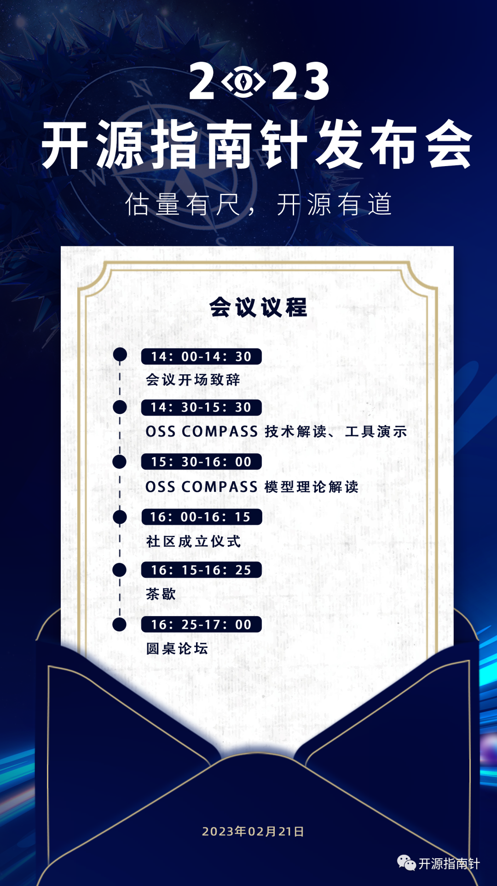
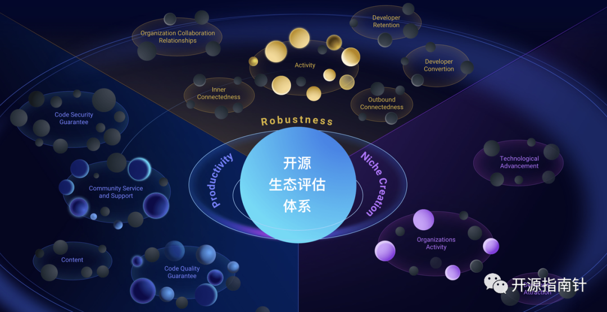

On February 21st, the "OSS Compass" launch event will officially commence. Welcome to join us.

> Venue: Blue Note Beijing (23 Qianmen East Street)  
> Live Stream: https://shangzhibo.tv/watch/10935779

<!--truncate-->

OSS Compass is a platform for assessing the health of open source ecosystems, open to all open source projects hosted on platforms like GitHub and Gitee. The assessment of open source ecosystem health has always been a major challenge in the industry. This launch event will comprehensively introduce the theoretical research and practical achievements behind OSS Compass, while also announcing the OSS Compass open source community governance structure, assessment tools, and the first open source project evaluation white paper.

Open source ecosystem assessment is a complex and large-scale engineering project that often involves multiple stakeholders in practical operations, with results that have profound impacts on open source project development. Therefore, the vision of OSS Compass is:

- Through OSS Compass, we help people who need to conduct data analysis on communities. This includes but is not limited to OSPOs, community managers, academic researchers, project owners, maintainers, developers, etc.

- By analyzing actual data from a large number of open source projects and referencing industry best practices and academic research results, we create an open source community ecosystem assessment system that is continuously improved and optimized, and give back to the open source community through OSS Compass.

The launch event agenda is as follows:

The launch event will invite industry experts to share comprehensive insights about OSS Compass, including its origin overview, community profile, governance structure, and assessment models. Professors and scholars from Nanjing University will provide in-depth interpretation of the project model foundations, analyzing the internal logic of the open source ecosystem assessment system. Multiple distinguished guests will engage in roundtable discussions, exploring the principles of open source operations and governance.

Measured standards, open source excellence. On February 21st, we look forward to your presence at the OSS Compass launch event!

Offline launch event venue: Blue Note Beijing (23 Qianmen East Street)

Online audience can watch the live broadcast by scanning the QR code or clicking the original link
