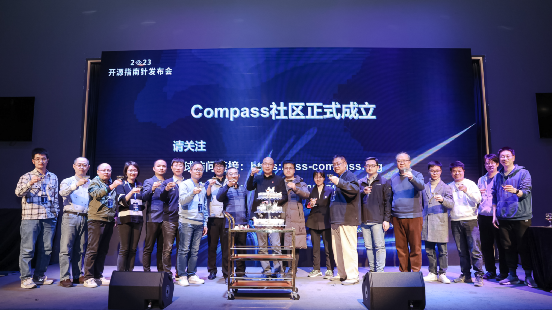
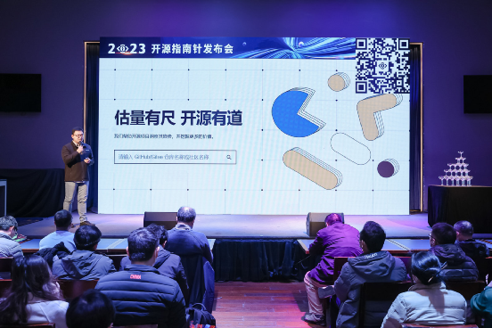
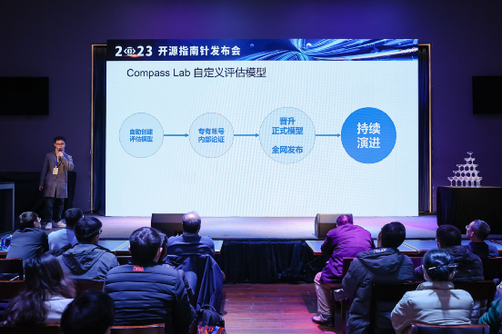
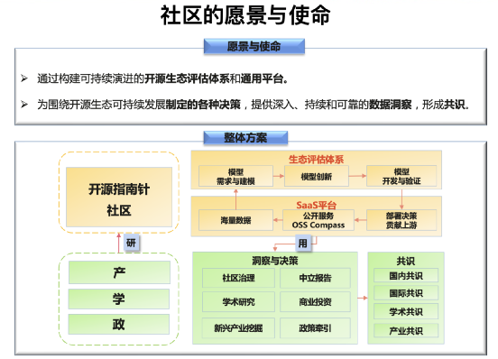
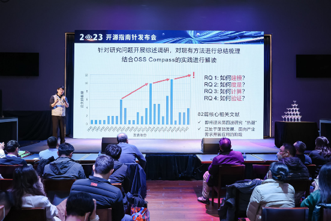
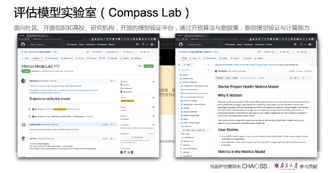
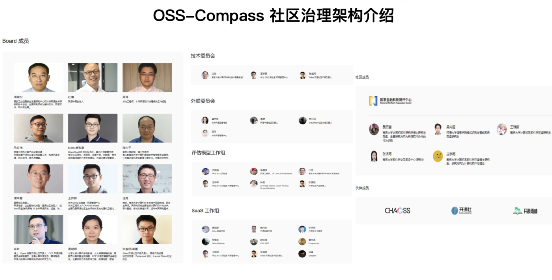

Measured standards, open source excellence. On February 21st, the OSS Compass launch event was successfully held in Beijing. The release of OSS Compass marks the official birth of China's first open source ecosystem health assessment platform. The launch event introduced the theoretical research and practical achievements of OSS Compass, announced the OSS Compass open source community governance architecture, assessment models, and development roadmap.

<!--truncate-->

OSS Compass is a platform for assessing the health of open source ecosystems, open to all open source projects on platforms like GitHub and Gitee. Academician Lv Jian of the Chinese Academy of Sciences, Meng Guangbin, Chairman of Huawei's Open Source Software Management Committee, and Ma Yue, CEO of OSCHINA, attended and delivered speeches. Representatives from open source communities including the Linux Foundation CHAOSS community, Open Source Rainforest, Star Strategy Community, TGO Kunpeng Club, as well as corporate representatives from Huawei, Baidu, Tencent, and others attended the event.

Academician Lv Jian of the Chinese Academy of Sciences stated that we are in the information era where software defines everything, and open source software is an indispensable and important component of the current software industry. Open source innovation has become a major national development strategy, and open source innovation highly depends on open source ecosystems. Building sustainable open source ecosystems is receiving increasing attention. The OSS Compass platform brings together core forces from industry and academia including Huawei, Peking University, Nanjing University, and OSCHINA to jointly conduct academic research and technical development. The OSS Compass platform is based on open source and focuses on measuring and analyzing the health of open source ecosystems, which is expected to provide support for building sustainable and healthy open source ecosystems. This is a positive and important attempt. I hope all collaborating parties will work together to contribute new and greater strength to promoting the healthy development of open source software ecosystems in China and around the world, and to achieving technological self-reliance and self-strengthening in China.

Meng Guangbin, Chairman of Huawei's Open Source Software Management Committee, pointed out that the open source industry is developing at high speed. How to efficiently and accurately evaluate the value and potential of an open source community, an open source project, or an open source ecosystem, and enable users to quickly find the most suitable projects among millions of projects, is actually a huge challenge. Although there are many measurement systems currently available, there are still shortcomings in terms of systematization, universality, and applicability. Simple, efficient, and cloud-based open source ecosystem measurement solutions like OSS Compass are very valuable.

Ma Yue, CEO of OSCHINA, stated that in China, comprehensive communities and vertical communities related to open source have exceeded 270. "Community of communities" may be OSCHINA's next mission, hoping to serve more open source communities in the future. Previously, OSCHINA released the China Open Source Community landscape panorama, and later initiated the establishment of an open source business community, hoping that excellent open source projects can achieve commercial success. Today's release of OSS Compass brings together forces from the overseas CHAOSS community, as well as Nanjing University, Peking University, OSCHINA, Huawei, and other parties, hoping to better quantify the value of open source.

"For those who need to analyze open source community data, such as OSPOs, community managers, academic researchers, project owners, maintainers, developers, etc., OSS Compass is undoubtedly a convenient, efficient, scientific, and precise assessment platform." Wang Yehui, CHAOSS community board member and Huawei engineer, and Zhang Shengxiang, Gitee open source community product manager and senior product manager, provided detailed introductions to OSS Compass.

Currently, the assessment of open source ecosystem health is a major challenge in the industry. On one hand, existing open source project assessment indicators are scattered and cannot form systematic evaluations. On the other hand, some tools/platforms can only be used locally or are specialized for specific domains, and cannot be universally applied on platforms like GitHub or Gitee.

Also being an open source ecosystem health assessment platform, OSS Compass provides public SaaS services. Users simply need to input repository names or community names hosted on GitHub or Gitee platforms to comprehensively display the health status of the repository or project. It is simple to use, efficient, and convenient.

Nanjing University provides theoretical support for OSS Compass's assessment models. Wang Liang, Associate Professor at Nanjing University, when interpreting the OSS Compass open source ecosystem health model theory, stated that with solid theoretical and model foundations, it is possible to scientifically and completely characterize the relevant attributes and associations of open source project and ecosystem health. He also demonstrated the trustworthiness and usability of OSS Compass from four aspects: theoretical and conceptual models, metric indicator systems, computational models, and validation assessment.

According to the introduction, OSS Compass has currently built an open source ecosystem assessment system that includes three dimensions - productivity, robustness, and innovation - covering 14 indicator models.

Taking productivity as an example, productivity refers to an open source ecosystem's ability to transform inputs into outputs, including five assessment models: collaborative development index, community services and support, code compliance assurance, code security assurance, and documentation. Each model contains multiple indicators, such as the collaborative development index including the number of code contributors, code commit frequency, maintenance status, ratio of code commits associated with PRs, ratio of PRs associated with issues, and other indicators.

OSS Compass is jointly initiated and collaboratively developed by the National Industrial Information Security Development Research Center, OSCHINA, Nanjing University, Huawei, Peking University, OpenI (New Generation Artificial Intelligence Open Source Platform), Baidu, and Tencent Open Source, while also receiving support from multiple open source communities and enterprises. This is an organic integration practice of industry, academia, research, and application in open source.

At the same time, OSS Compass itself is an open source project that brings together the wisdom of many developers and has formed an open source community around the project. The launch event publicly announced the OSS Compass open source community governance architecture, including Board members, Technical Committee, Outreach Committee, Assessment Model Working Group, SaaS Working Group, Community Members, and Partner Members.

From the beginning of the project, OSS Compass has been committed to becoming an international open source ecosystem health assessment platform. On one hand, OSS Compass follows CHAOSS project best practices, including measurement models and measurement standards, with some backend components initially derived from Grimoirebs. On the other hand, OSS Compass is open to all open source projects on hosting platforms like GitHub and Gitee.

LF CHAOSS community manager Elizabeth Barron sent congratulations. She stated that some software projects of CHAOSS can extract data from GitHub, GitLab, or Gitee platforms, but that's about it. "We don't have the capability to test our metrics and assessment models on a large scale, and this is where OSS Compass comes in. OSS Compass can implement our assessment models and test their accuracy."

The launch event also invited OSCHINA CTO Hongshu, Open Source Rainforest founder and Huawei engineer Gao Kun, Huawei industry development expert Ma Quanyi, Star Strategy Community founder Tan Zhongyi, Baidu Open Source Office product operations manager Ma Hongwei, and TGO Kunpeng Club general manager Yang Pan for a roundtable discussion on current open source community assessment and measurement topics.

At the end of 2022, the Ministry of Industry and Information Technology issued the "Management Measures for China Software Famous Cities" and "Management Measures for China Software Famous Parks" to standardize and strengthen the management of China's software famous cities and parks, demonstrate and drive development, and promote high-quality development of China's software and information technology service industry. Open source was listed as an important measurement factor. OSS Compass aims to help open source ecosystems develop in a healthier direction. I believe the emergence of OSS Compass will play a very positive role in promoting the development of China's open source and software industries; at the same time, I believe it will contribute important strength to promoting international technical exchange and cooperation, as well as enhancing China's international influence.
