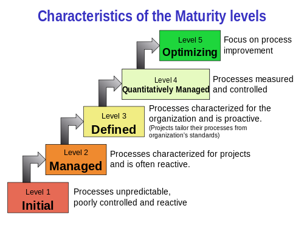
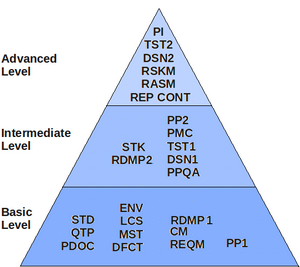
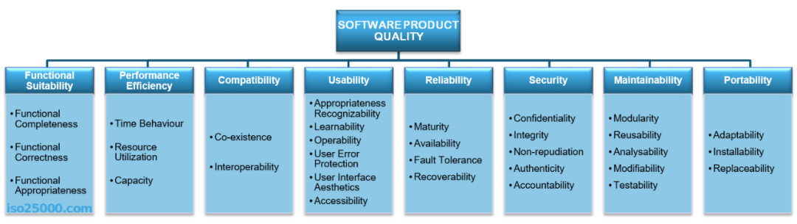
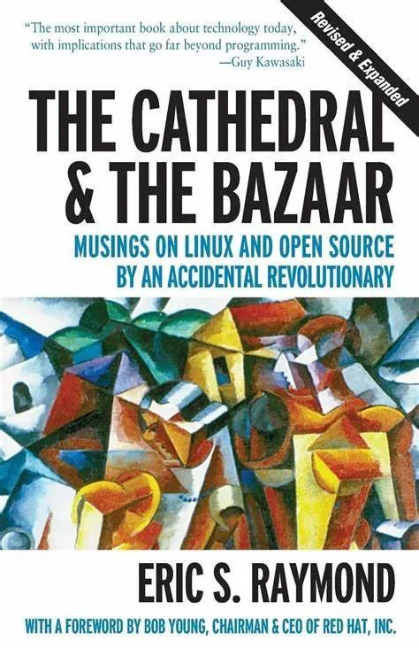
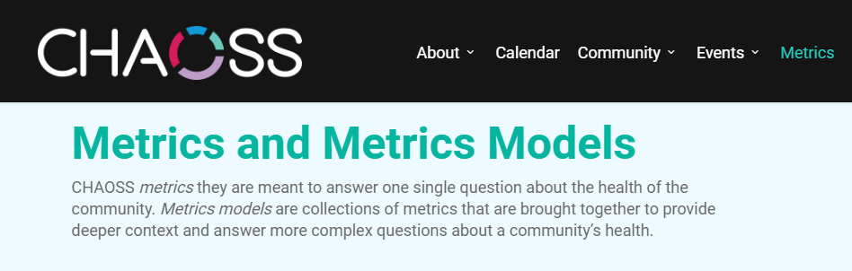
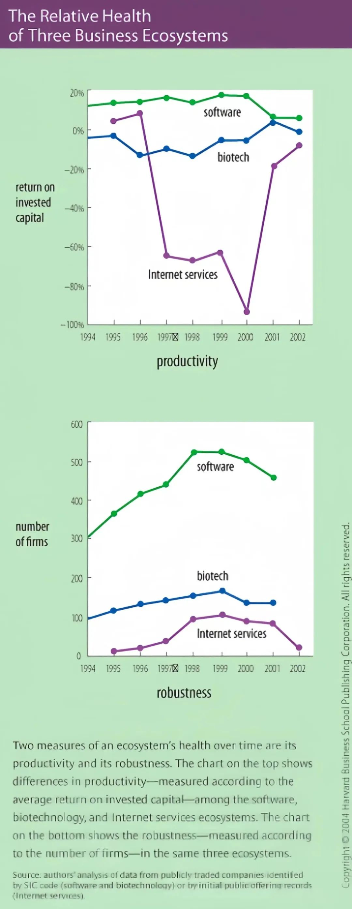

In recent years, I have been engaged in work related to the evaluation of open source ecosystems. This series of articles aims to summarize my work experience, and organize the thoughts for upcoming work. Meanwhile, I'm looking forward to exchanging ideas with everyone.

Through the observation of the academic and open source industry development in the past thirty years, we can find that the evaluation and measurement of the open source community mainly focus on three mainstream directions: open source software, open source projects, and open source ecosystems. The emergence of these directions is closely related to the era, and with the development of open source, their boundaries gradually blur, showing a trend of mutual inclusion. Due to the different focuses of various markets and user concerns, they develop somewhat independently.

<!--truncate-->

### 01 Three Mainstream Directions

#### Open Source Software (1990s ~ Present)

In the 1990s, attention was drawn to the quality of software developed and distributed in open source form. This direction has always been a focus of the industry because software, as a product oriented towards users, is a concrete manifestation of open source value. In this direction, the construction of evaluation metrics and dimensions is mostly influenced by the Capability Maturity Model Integration (CMMI). Therefore, we see many evaluation frameworks with keywords like "open source" and "maturity," such as the Open Source Maturity Model, used to assess software based on different maturity levels.

  

CMMI（Capability Maturity Model Integration）

  

  

OpenSource Maturity Model

  

At the same time, the content of this direction can be divided into two parts. The first part focuses on software quality, which is not strongly related to whether the software is open source or not; it focuses on the quality of the software itself. This is very similar to the ISO/IEC 25010 (formerly ISO/IEC 9126) software quality model, including eight attributes such as functionality, compatibility, security, reliability, usability, efficiency, maintainability, and portability. The second part involves some aspects specific to open source software, such as open source security vulnerabilities, legal compliance, and open source supply chain management. With the increasing reliance on open source software in various industries, these aspects have become a widespread focus in recent years.

  

ISO/IEC25010

  

Overall, the core of this direction is still on the keyword — "open source software".

#### Open Source Projects (2000s ~ Present)

In the early 21st century, the academic community shifted its focus from open source software itself to open source projects and established various metrics to assess the value of open source collaboration and communities. It primarily focuses on two aspects: the role of developers in open source projects, including profiling developers, developer retention and diversity, and using the Pareto principle to measure the contribution ratio of different developers to the communities. The other aspect is the sustainable development of projects, building evaluation models through project activity, community service quality, and community transparency.

In this mainstream direction, Eric S. Raymond's "The Cathedral and the Bazaar" published in 1999 had a profound impact, and works like Jono Bacon's "The Art of Community" provided important practical guidance for the assessment of open source projects. Some metrics of open source software were also considered in the evaluation of open source projects, and a representative example is the Apache Project Maturity Model of the Apache Foundation. However, overall, the focus of this direction is on the development of open source projects themselves.

  

The Cathedral and the Bazaar

  

#### Open Source Ecosystems (2010s ~ Present)

With the flourishing development of open source software and projects, people's attention shifted to the health and sustainability of the entire open source ecosystem. Evaluation and measurement of open source ecosystems are relatively young compared to the other two directions, starting to gain attention in top-tier journal papers in the 2010s. For example, Slinger Jansen's paper "Measuring the health of open source software ecosystems: Beyond the scope of project health" published in 2014 proposed the first model for measuring the health of open source ecosystems, evaluating them in terms of productivity, robustness, and niche creation. Some organizations and institutions have begun exploring metrics and methods for assessing open source ecosystems, such as the CHAOSS community of the Linux Foundation.

  

CHAOSS

  

However, the rise of open source ecosystem evaluation is not accidental. In the past 20 years, building industries such as mobile internet, big data, cloud computing, and artificial intelligence using open source ecosystems has become a business strategy trend. This is evident from statements like Microsoft's former CEO Steve Ballmer's "Linux is a cancer that attaches itself in an intellectual property sense to everything it touches" in 2001 to Microsoft's acquisition of the world's largest code hosting platform GitHub for $7.5 billion in 2018. This demonstrates the close integration of the open source ecosystem with business strategy.

The concept of measuring open source ecosystems originated from the measurement methods of business ecosystems. In 1993, James F. Moore published an article titled "Predators and Prey: A New Ecology of Competition" in the Harvard Business Review, defining the concept of "Business Ecosystem" for the first time and promoting the widespread dissemination of related business ecosystem theories and applications. In 2004, Iansiti and Levien published "Strategy as Ecology" in the Harvard Business Review, proposing the idea of evaluating business ecosystems in terms of productivity, robustness, and niche creation for the first time. From the context of business ecosystems, it can be seen that the dimensions of measuring open source ecosystems (as mentioned by Slinger Jansen) draw inspiration from the thinking of business ecosystems.

  

Strategy as Ecology

  

Specifically, the three measurement dimensions of open source ecosystems represent different meanings:

- Productivity: The ability of open source ecosystem to reduce the cost of original niche creation and transform it into new products and features.
- Niche Creation: The capability of the open source ecosystem to continuously increase meaningful participants and diversity over time.
- Robustness: The ability of open source ecosystem to self-regulate and recover in the face of shocks, disturbances, and interruptions.

These definitions stem from academic research. In my understanding, productivity reflects the ability of open source projects to continuously produce high-quality software artifacts; niche creation embodies the collaborative and evolving dynamics of open source projects with upstream and downstream partners; and robustness indicates that open source projects have resilience, self-adjustment, and recovery capabilities to address internal challenges such as security vulnerabilities and open source governance, as well as competition from external ecosystem systems.

### 02 Ramblings on LLMs

At the end of 2022, after the launch of ChatGPT, I gradually calmed down from the initial surprise and began to rethink the entire work approach. In simple terms, two trains of thought emerged: What is the impact of LLMs on the evaluation and measurement of communities, and conversely, what can evaluation and measurement do in the field of LLMs?

For the former, over the past few months, we have collaborated with the research team of Nanjing University, using the outstanding capabilities of LLMs in natural language processing for some practical experiments, and have achieved positive results. Without giving away too much, at the right opportunity, I hope to provide the results through OSS-Compass as a service for everyone.

For the latter, it's a completely new area. Based on the question "What are the typical paradigms of open source in the era of LLMs?" we have also conducted corresponding explorations. I hope to discuss and collaborate more deeply with everyone next year on this part.

### 03 Follow-up

In the next article, I will introduce how to build a complete open source ecosystem evaluation system.

This series of original articles is published under a Creative Commons license CC-BY-NC-SA 4.0. Please contact the original author yehui.wang.mdh@gmail.com for reprinting or use.
