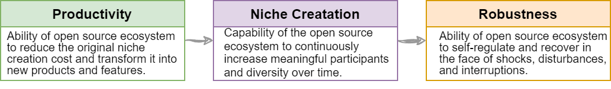
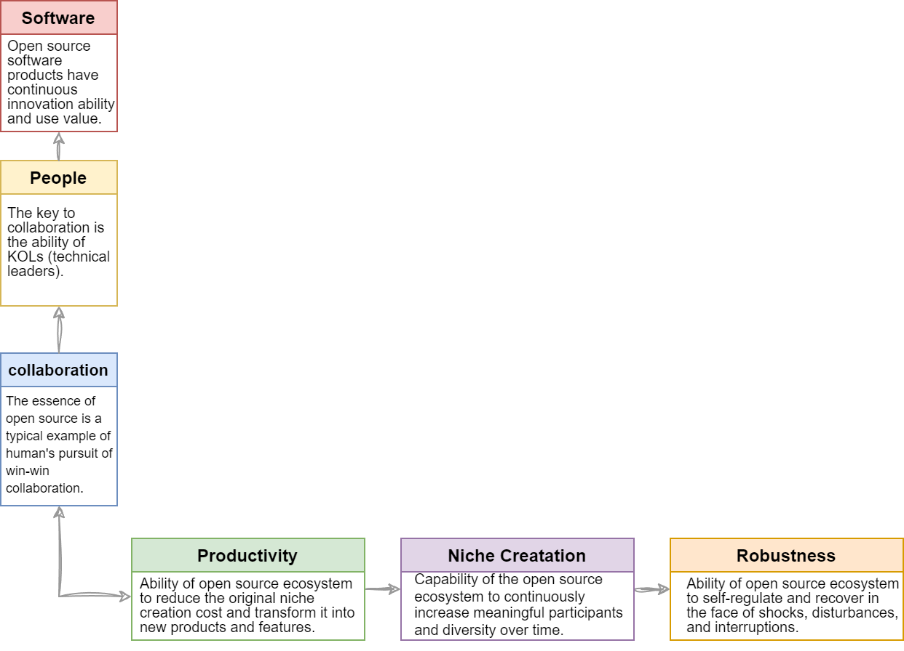
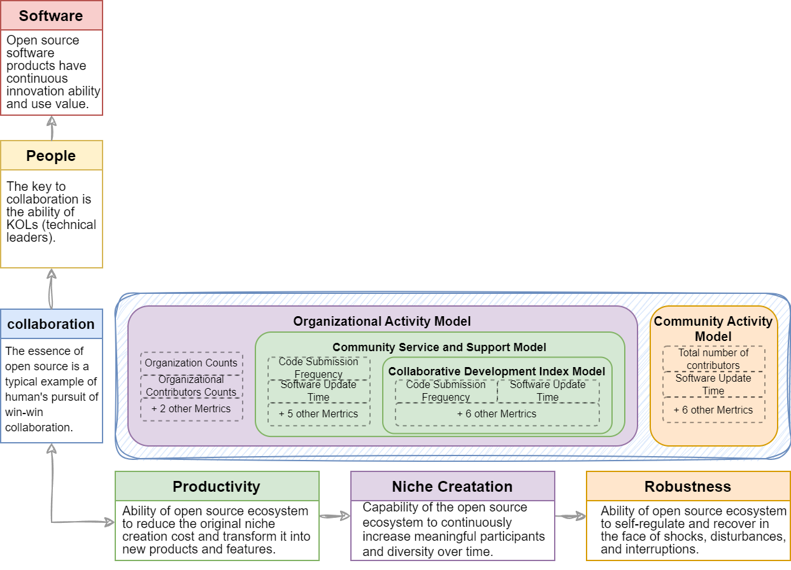
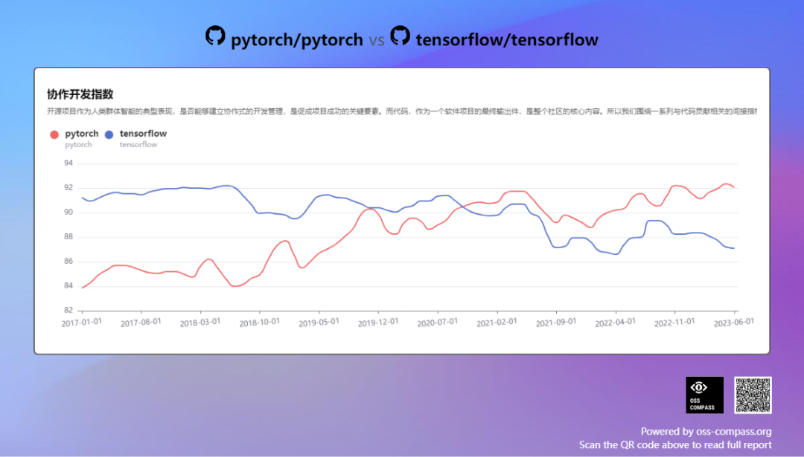
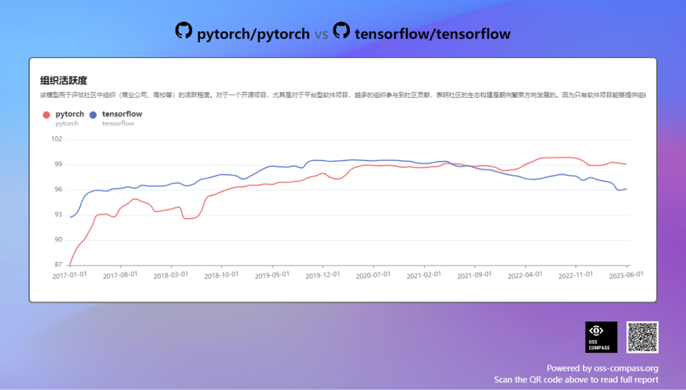

In my previous article, "Reflections on the Evaluation and Measurement of Open Source Ecosystem (1) - Evolution and Trends", I summarized three main directions for evaluating and measuring open source communities: open source software, open source projects, and open source ecosystems. However, for the purpose of technical insight work, this is just the first step in a long journey.

As an engineer, I hope to see the emergence of a practical and feasible evaluation system with the following characteristics: the ability to help open source communities identify specific problems, assist people in discovering valuable open source communities, and predict industry trends.

In summary, this evaluation system should be practical, providing tangible value rather than being just an elusive idea.

<!--truncate-->

### 01 Reflection on the Essence of Open Source

However, in the process of building an evaluation system, we must first answer a fundamental question: "What is the essence of open source?" The answer to this question is crucial.

My answer is that the essence of open source is collaboration. Furthermore, the essence of open source is a typical example of the natural social attribute of human collaboration in the software development process.

In exploring the answer to this question, I was inspired by the works of the two founding figures of complexity economics, Brian Arthur and Eric Beinhocker, in their books "The Nature of Technology: What It Is and How It Evolves" and "The Origin of Wealth: The Radical Remaking of Economics and What it Means for Business and Society". Although there are still some mysteries in complexity economics, some of their points have been widely recognized. For example:

"Human beings are 'conditional cooperators.' As long as the other party is generous, they will be generous too. At the same time, humans are 'altruistic punishers'. People will retaliate against those who behave unfairly, even at the cost of their own immediate interests."

Open source software provides people with the freedom to use it by offering conditional (licensed) source code. Through an open and transparent development process, it further stimulates people's natural collaborative attributes, encouraging collective contributions and promoting the prosperity of the open source ecosystem.

However, the existence of forks and licenses is like the sword of Damocles, constantly reminding people to evoke the "altruistic punisher" characteristics, leading to community splits and divergences in the paths of cooperation and business.

Therefore, in the process of building the entire open source evaluation system, I take "the essence of open source is collaboration" as a guiding principle. This principle ensures that I do not lose direction among numerous metrics and data and contributes to the accuracy and effectiveness of the evaluation system design.

### 02 Multidimensional Space of the Evaluation System

Building an open source evaluation system is a complex task. Using a single metric or dimension is insufficient to comprehensively measure the essence of open source. However, people tend to use simple indicators to summarize objects, which is why "stars" come into play.

Over-reliance on intuitive and sensory information can obscure rational thinking, making it difficult to address the restlessness in the open source world. However, we should not condemn "stars" but instead acknowledge and recognize their value, providing our own insights. I have constructed a three-dimensional space for the evaluation system, including the open source ecosystem, "collaboration, people, software" and evaluation models.

#### First Dimension: Open Source Ecosystem

Firstly, one of the three main directions of open source evaluation, "open source ecosystem", derived from the business ecosystem, where the collaboration between business and open source is the current mainstream trend.

In the open source ecosystem, we evaluate the ability of open source projects to produce software products and the open source value through Productivity.

Open source projects need to attract diverse members as a platform or ecosystem, and these members can come from upstream driving software or downstream applying software. We refer to this ability as Niche Creatation.

Simultaneously, as an ecosystem, it must have Robustness, the ability to resist internal and external interference, and self-recovery.

  

Figure 1

  

#### Second Dimension: "Collaboration, People, and Software"

The second dimension includes three core elements: collaboration, people, and software, aligning with the reflection on the essence of open source.

Firstly, we explore the dimensions of open source collaboration, representing the degree and depth of collaboration in open source development activities.

Secondly, we focus on people, specifically Key Opinion Leaders (KOL) in open source projects; however, it has many other pronouns such as core developers, key developers, Maintainers, and so on. This dimension observes the influence of KOLs in open source projects and evaluates the projects from the perspective of users and developers. It refers to the idea of "open source project", one of the mainstream directions of open source evaluation, but puts the focus on the keyword of People.

Lastly, we focus on software, as the final value output of an open source project exists in the form of software products, also the ultimate destination for us to study the value of a project. It represents the specific manifestation of "open source software", one of the oldest mainstream directions of open source evaluation.

The diagram below shows the relationship between the two dimensions introduced so far.

  

Figure 2

  

#### Third Dimension: Evaluation Models

As the third dimension, evaluation models are located at the intersection of the two dimensions. Each evaluation model possesses attributes from both the open source ecosystem and "collaboration, people, software" dimensions, and there are logical relationships between evaluation models that can independently constitute a dimension. The concept of evaluation models is based on this setting.

#### 1. Concept of Evaluation Models

The concept of evaluation models is the first thing we need to introduce.

a Composition Criteria for Models

Evaluation models are designed to achieve specific evaluation goals. In the field of data analysis, we are familiar with the principle: "without goals, metrics are meaningless", which is also applicable to open source evaluation. For example, if my goal is to find the core developers of an open source project, I would first define the characteristics of core developers based on the goal, then establish a developer persona model and proxy metrics, and finally use relevant data to evaluate and identify core developers. Each evaluation model consists of multiple measurement metrics, which are the smallest atomic units of the evaluation system.

To achieve specific evaluation goals, we need to find a set of quantifiable metrics, i.e., features, directly or indirectly related to that goal. These metrics should meet the following conditions:

- Quantifiable: Can be measured.
- Time attribute: Observable over time.
- Avoid using direct count metrics; consider ratios more.
- Weak correlation: Avoid redundant information.
- As comprehensive as possible (i.e., multiple data sources) to reduce bias and misdirection.

b Calculation Methods for Models

In terms of the calculation methods for evaluation models, we mainly focus on how to quantify the evaluation model and calculate metrics weights. The method we use is to calculate through a normalization formula. This formula takes multiple atomic measurement metrics as input, uses the Analytic Hierarchy Process (AHP) algorithm to determine the weight of each metric, and finally outputs a normalized score between 0 and 1. This score is observed over time to identify trends.

The default algorithm (as shown in Figure 3) used in OSS-Compass is based onRob Pike's method, initially adopted by the openSSF criticality score (many thanks to Rob and critiality score!). We have made improvements to this algorithm in terms of implementation based on time series and value range considerations. For specific details, please refer to the source code and the article.

  

Figure 3

  

It should be noted that the calculation methods for models are not limited to this approach; the industry has many excellent algorithms, such as algorithms based on machine learning. We encourage the emergence of more outstanding algorithms and their application in OSS-Compass.

#### 2.Evaluation Models for "Open Source Ecology" and "Collaboration"

As mentioned earlier, the evaluation models are the intersection points in the two-dimensional space of "Open Source Ecology" and "Collaboration, People, Software". In the intertwined space of "Open Source Ecology" and "Collaboration", we have four models (as shown in Figure 4): the Collaborative Development Index Model, Community Service and Support Model, Organizational Activity Model, and Community Activity Model.

These four models aim to understand the collaboration processes in open source projects. Among them, the Collaborative Development Index Model is used to observe collaboration in the open source development process. We believe that collaboration in open source software mainly occurs during the code development phase, so this model has the productivity attribute in the dimension of open source ecology, represented by the color green.

The Community Service and Support Model represent the services and support capabilities the community provides to ensure the smoothness progress of open source development, serving as a support for productivity.

The Organizational Activity Model reflects the community's ability to attract upstream and downstream partners for collaboration, thus possessing the niche creation attribute in the dimension of open source ecology, represented by the color purple.

The Community Activity Model describes the overall activity level of the community, observing the smoothness of collaboration from a robustness perspective, represented by the color orange.

  

Figure 4

  

- Example of Pytorch vs. Tensorflow: Logic Relationships Between Models

The four models: Collaborative Development Index Model, Community Service and Support Model, Organizational Activity Model, and Community Activity Model have already been successfully deployed on the OSS-Compass 11 platform.

By comparing two excellent open source projects, Pytorch and Tensorflow, within the field of deep learning frameworks, we can briefly introduce the collaboration relationships between these models (as shown in the figure below, or directly by clicking the OSS-Compass link). It is important to note that this comparison is intended to illustrate the logical relationships between the models only and is unrelated to the projects themselves.

Firstly, based on the observations from the Collaborative Development Index Model (Figure 5), in September 2020, Pytorch surpassed Tensorflow. This was the earliest instance of such overtaking among the three models. This aligns with our expectations because collaboration in open source software is the driving force of the entire open source ecology. Whether an advantage or a disadvantage, such collaboration will manifest earliest in the Collaborative Development Index Model.

  

Figure 5

  

Next, looking at the observations from the Organizational Activity Model (Figure 6) after another 9 months, i.e., in June 2021, we again observed Pytorch surpassing Tensorflow. This indicates that the issues of development collaboration have propagated to upstream and downstream collaborations, affecting organizational activity.

  

Figure 6

  

Moving the timeline 7 months forward to January 2022, we found in the Community Activity Model (Figure 7) that Pytorch had surpassed Tensorflow. Because the Community Activity Model observes the overall community activity level, reflecting the final performance of community development collaboration and ecological collaboration, it has a certain lag.

  

Figure 7

  

Through this example, we can observe the logical relationships between these models, and these relationships can help people make timely decisions. It's important to mention that I will specifically introduce how to gain insights into the value of open source projects through the evaluation system in future articles.

#### 3. Evaluation Models for "Open Source Ecology" and "People"

The intersection between "Open Source Ecology" and "People" has produced three important evaluation models: Contributor Persona Model, Contributor Milestone Model, and Reputation Model. Among them, the Contributor Persona Model and Reputation Model each include multiple sub-models (as shown in Figure 8). Currently, these models are about to be deployed on the OSS-Compass platform, and I will write a series of articles to introduce them in details.

  

Figure 8

  

The Contributor Persona Model aims to depict the characteristics and attributes of contributors in open source projects. It helps us understand information about contributors' backgrounds, skills, interests, etc., allowing a better understanding of their roles and value in the open source ecology.

The Contributor Milestone Model focuses on the growth process of contributors in the open source community. By tracking contributors' participation experiences and accumulated knowledge, we can understand their needs, motivations, and challenges at different stages, providing targeted support and guidance to promote their growth and development.

The Reputation Model focuses on the reputation and influence of open source projects in the community. It includes multiple sub-models used to assess the credibility, user satisfaction, popularity, and other metrics of a project. Through the analysis of the Reputation Model, we can understand how the open source project is perceived in the community and its attractiveness and value to external stakeholders.

The deployment of these evaluation models will provide us with the capability to gain in-depth insights into the interaction between the open source ecology and people. I will focus on writing a series of articles detailing the principles, applications, and practices of these models to help communities and organizations obtain valuable insights and decision support.

#### 4. Evaluation Models for "Open Source Ecology" and "Software"

The intertwining of software and open source ecology has resulted in seven important evaluation models: Software Quality Models with productivity attributes, Software Usability Model, and Documentation Quality Model; Northbound Adoption Model and Southbound Adaptation Model with niche creation attributes; as well as Security Model and Compliance Model with robustness attributes, as shown in Figure 9.

  

Figure 9

  

The Software Quality Model aims to assess the level of software quality in open source projects. By considering metrics such as code reliability, stability, and performance, we can objectively evaluate the quality of the software. The Software Usability Model focuses on user experience and functionality, helping us understand user satisfaction and experience in practice by evaluating metrics such as user interface, usability, and feature completeness.

The Documentation Quality Model focuses on the quality of documentation materials for open source projects. Good documentation quality is crucial for users to understand and use open source software effectively. This model evaluates metrics such as accuracy, completeness, and readability to judge the quality of documentation.

The Northbound Adoption Model and Southbound Adaptation Model focus on the integration between open source projects and upstream and downstream technical environments. The Northbound Adoption Model assesses the project's popularity and applicability in upstream technical environments, while the Southbound Adaptation Model evaluates its compatibility and adaptability in downstream technical environments. These models help us understand the interaction of open source projects in the technical ecosystem.

The Security Model and Compliance Model focus on the security and compliance of open source projects. The Security Model assesses the security features and potential risks of open source software, while the Compliance Model evaluates whether it complies with relevant regulations and standards. These models are essential for assessing the credibility and legality of open source projects.

These models are also about to be deployed on the OSS-Compass platform, providing us with the capability to gain in-depth insights into the relationship between open source ecology and software. I will focus on writing a series of articles detailing the principles, applications, and practices of these models to help communities and organizations obtain valuable insights and decision support.

### 03 Summary

In summary, I have provided an introduction to the three dimensions of the entire evaluation system. However, there are still two homework assignments to complete, which are the evaluation models for the people and software dimensions. I will write a series of detailed articles to introduce them. Additionally, I want to emphasize that the construction of the evaluation system is a systematic engineering task and should not be a static system. Instead, it should evolve and refine itself continuously with open source trends and people's perceptions of open source change.

### 04 Follow-up

In the upcoming articles, I plan to utilize the evaluation system for analyzing and gaining insights into several open source industry domains as a basis.

This series of original articles is published under a Creative Commons license CC-BY-NC-SA 4.0. Please contact the original author yehui.wang.mdh@gmail.com for reprinting or use.
