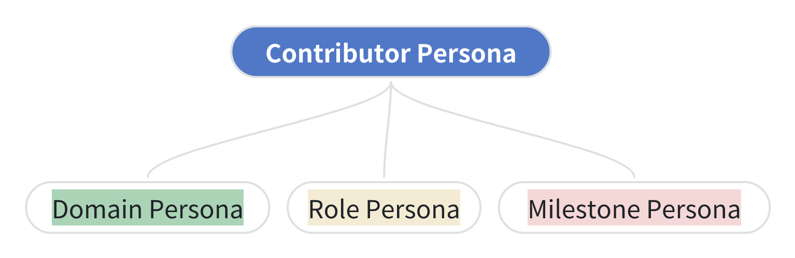
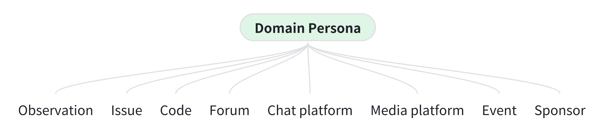
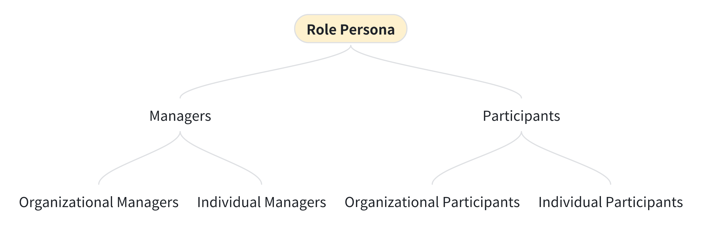
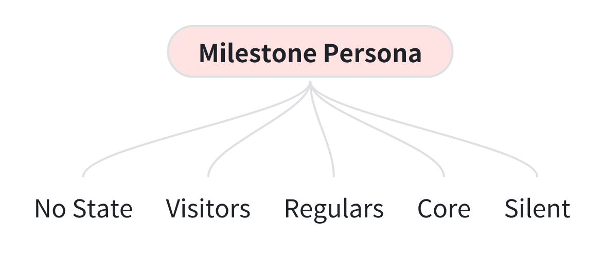
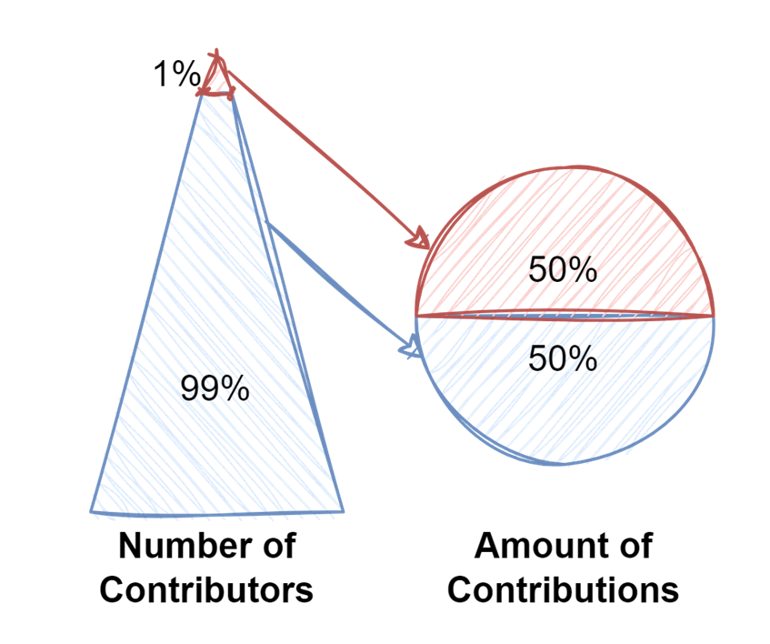
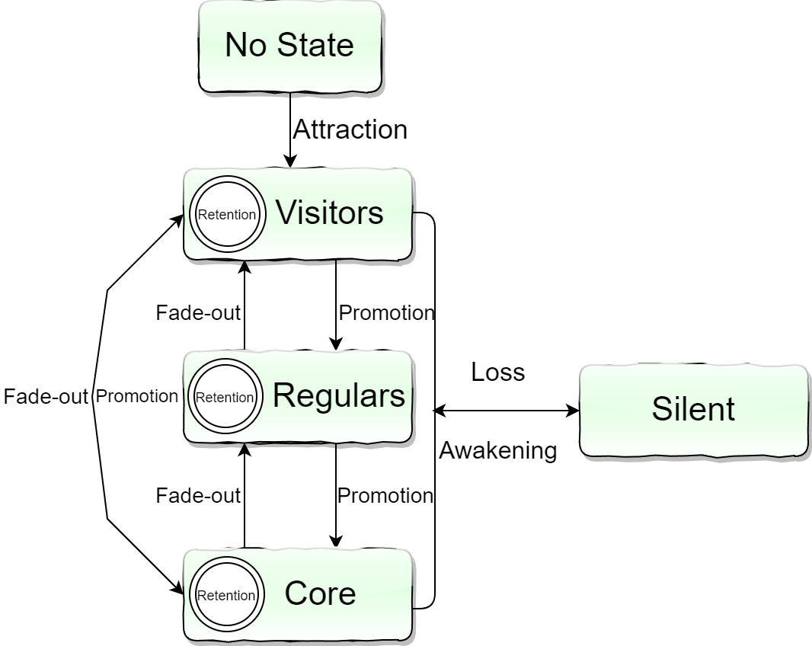
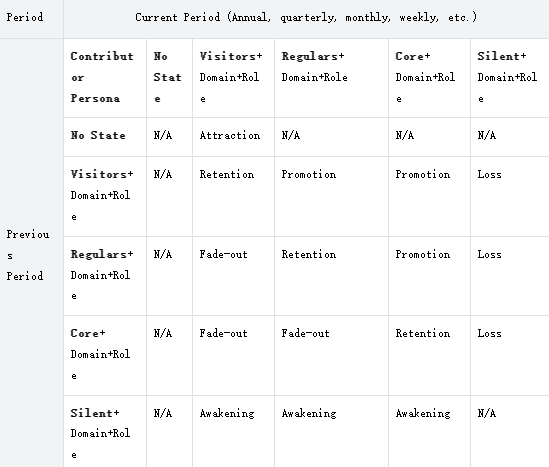

In the previous two articles, "Reflections on the Evaluation and Measurement of Open Source Ecosystem (1) - Evolution and Trends" and "Reflections on the Evaluation and Measurement of Open Source Ecosystem (2) - The Multidimensional Space of Evaluation Systems", I summarized three main directions of open source community evaluation and measurement: open source softwares, open source projects, and open source ecosystems. I also introduced a three-dimensional space of evaluation systems (Figure 1) and discussed four evaluation models in the intertwined space of "open source ecosystem" and "collaboration": Collaboration Development Index Model, Community Service and Support Model, Organizational Activity Model, and Community Activity Model (deployed in OSS-Compass). I used the example of PyTorch vs. TensorFlow to demonstrate the logical relationships between these models.

In this article, we will primarily focus on the intertwining between "open source ecosystem" and "people" that gave rise to two important evaluation models: Contributor Persona Model and Contributor Milestone Model. These two models are the results of collaborative research with Professor Liang Wang and his team of Nanjing University, and I sincerely appreciate the efforts they have put into this.

<!--truncate-->

  

Figure 1

  

### Why Build These Two Models

Contributors, as the driving force of innovation in open source communities, have always been a key topic in the field of research on the sustainable development of communities. Questions such as who contributors are, how their contributions and trajectories in the community are described, and how the positive or negative impacts resulting from these contributions are perceived and assessed have been enduring topics. After six months of organization and summarization, we identified three research questions with dependencies and used an engineering approach to address them, ensuring practical operability and practical significance for specific issues.

First, let's introduce these three questions:

#### 1. How to depict contributor personas?

Given the premise of not violating personal privacy, what dimensions should contributor personas include? By collecting which data, can we orthogonalize and atomize persona information as much as possible, preparing for various contributor-related research in the future?

#### 2. How to describe contributors' journeys within (and across) communities?

studying contributors, we often use familiar terms such as activity, retention rate, promotion, and loss, which are commonly used to describe contributors' behavioral trajectories in the community. However, we need to delve into understanding the typical actions contributors take in the community and explore whether these trajectories are interconnected. Through cross-community trajectory tracking, we can even observe industry and trend patterns.

#### 3. What is the value of these two models?

This question aligns with our ultimate goal of studying contributors, consistent with the overall goal of building an open source evaluation system. The application of these models will contribute to community governance, discovering high-value communities, predicting industry trends, and more. In the following articles, we will gradually introduce how to use these models to achieve these goals.

We will address the first two questions by building the models, and the third question will be addressed based on the results of model construction and engineering implementation, combined with our insights for comprehensive analysis and summary. The focus of this article will be on the first two questions, namely the Contributor Persona Model and Contributor Milestone Model.

### Contributor Persona Model

The Contributor Persona Model aims to describe individuals contributing to various aspects of open source communities. Here, we prefer to use the term "contributor" to encompass the entire range of participants, not just software engineers contributing to code.

We characterize contributor personas through three dimensions (Figure 2): Domain Persona, Role Persona, and Milestone Persona, to achieve orthogonal relationships between these dimensions. This way, we can form a comprehensive description, for example: "Ah Qiang is a contributor who participates in community contributions as a personal manager (Role Persona), primarily contributing to code and forum-related contributions (Domain Persona). Currently, he is a core contributor to the community (Milestone Persona)."

  

Figure 2

  

#### Domain Persona Model

In the Domain Persona Model (Figure 3), we first categorize the contributions made by contributors to the community by domain or type. We strive to atomize the contribution domains more finely, matching our current engineering capabilities. However, this categorization process is an ongoing evolution, and as our engineering capabilities improve, we will be able to achieve more granular domain divisions.

For observation-type contributions, issue-type contributions, and code-type contributions, we can use insights provided by code hosting platforms (such as GitHub, Gitee, etc.). For other types of contributions, due to differences in community usage and extent, currently we can only provide limited data sources as references. However, as our engineering capabilities gradually improve, we may provide more solutions.

  

Figure 3

  

- Observation-type contributions: Contributors express interest and attention to a project through actions like star, fork, and watch, which can enhance and showcase the project's level of attention but do not directly contribute to the project.
- Issue-type contributions: Contributions related to issues can be categorized based on the type of issues, such as usage inquiries, bug reports, task planning, etc. However, we currently lack a universal solution to identify issue types. Therefore, we classify contributions into two types based on contributor behavior in issues: regular contributions and management contributions.
  - Regular Issue contributions: Issue creation and comments.
  - Management Issue contributions: Eight types of management actions, including labeling, closing, reopening, assigning responsibility, marking as duplicate, migrating, milestones, and locking comments. While these contributions are often overlooked, they are crucial for community managers to ensure smooth issue handling, and thus, we should include them in the observation scope.
- Code-type contributions: Similar to Issue-type contributions, we categorize code contributions into regular and management contributions:
  - Regular Code contributions: Code development, Pull Request creation, and Code Review.
  - Management Code contributions: Code direct submissions, along with ten types of Pull Request management actions, including labeling, closing, reopening, assigning responsibility, marking as duplicate, migrating, milestones, locking comments, merging, and reviewing, and so on. Similar to Issue management contributions, these management actions require significant effort from community managers to ensure smooth code integration.
- Forum-type contributions: If an open source community builds forum services based on frameworks that provide publicly accessible data channels, such as Discourse, we can observe contributions to the forum, such as creating topics and comments.
- Chat platform-type contributions: We support data inspection methods based on chat platforms like Slack, Discord, etc.
- Media platform-type contributions: Currently, our data mainly comes from Twitter.
- Event-type contributions: Our data currently depends on manual input, including online and offline events.
- Sponsor: Cash donations.

#### Role Persona Model

The initiation of open source projects is usually carried out by a team or an individual, initiating and establishing in their personal or organizational capacity. In the evolutionary process, new individuals or organizations are continuously brought in to make contributions. Whether they are initiators or later joiners, through establishing mutually beneficial cooperation with the community and making prominent and sustained contributions, they gain roles of community managers. This role can usually be demonstrated by performing certain management actions on code hosting platforms. We also use this type of event behaviors to identify whether contributors have a managerial role. Contributors who are not perceived to have managing behaviors are called Participants.

We use the term Managers to describe contributors in the community who have management privileges. Typically, they are also technical leaders of the projects. However, technical leadership does not necessarily equate to management actions, so we use the more specific term "manager" for clarity.

Determining whether a contributor is a manager is based on whether they have made contributions in issue management or code management categories. Of course, a contributor may not be a manager when initially participating in community contributions, so we introduce timestamps to mark the change in this role. In the two contribution categories mentioned above, if contributors declare their organizational identities, such as by forcefully submitting code through a public organizational email, we refer to them as organizational managers; otherwise, they are considered individual managers (see Figure 4).

  

Figure 4

  

- Managers:
  - Organizational Managers
  - Individual Managers
- Participants:
  - Organizational Participants
  - Individual Participants

#### Milestone Persona Model:

Contributors may resonate with open source projects based on upstream or downstream ecological interests, personal development, etc., and engage in community contributions. They may stay in the community for a long time, gradually fade away, or even be reawakened. Based on these scenarios, we define various states of contributors in the community, forming the Milestone Persona Model. This model is inspired by a state machine, where contributors can transition between states, but they can only be in one state at a time. This ensures decoupling of behavior and is more conducive to observing contributors' actions in the community.

  

Figure 5

  

Based on contributors' contribution amount, contribution frequency, contribution type, and their states in the community, and considering the time period of contributors' milestones, we divide contributors' milestones into the above 5 states (Figure 5): no state, visitors, regulars, core, and silent. Taking the annual period as an example, here are the definitions of the five states:

- Core: Refers to contributors who complete 50% of all domain contributions in the current year (excluding observer-type contributions such as stars, forks, and watches). These contributions are completed by at least one group of people, referred to as core contributors. All domain contributions are not weighted, only the count is considered.
- Regulars: After excluding the 50% contributions made by core contributors, the next 30% contributions (excluding observer-type contributions such as stars, forks, and watches), completed by at least one group of people. These contributors have been involved in contributions for at least 9 months in the current year and are referred to as regular contributors.
- Visitors: After excluding core and regular contributions, contributors involved in the remaining community contributions (including observer-type contributions, i.e., stars, forks, and watches) are referred to as visitors.
- Silent: Contributors who were active as core, regular, or visitors in the previous year but have made no contributions in the current year.
- No State: People who have never made contributions in the community.

#### Consideration of the Pareto Principle: 1% and 99%

In the Milestone Persona Model, we mainly use Pareto Principle (Note: The Pareto Principle here is not a specific 80/20 ratio but rather the idea that a small number of contributors make the majority of contributions) as a metric with the following advantages:

- Objectivity and measurability: The contribution percentage is an objective and measurable metric that can be directly obtained from the data.
- Empirical verification: Through years of observation of data from large open source communities, we have found that the number of contributions follows the Pareto Principle, where a small number of people make the majority of contributions. This confirms that the number of contributions is an effective way to measure the importance of contributors.
- We introduce the time period dimension to avoid contributors who have been contributing to the community for a long time having an advantage in accumulated contribution counts over newly joined contributors. This could potentially overlook some promising contributors.

The definition of core contributors uses the 50% proportion, based on observations of data from various large open source communities over the past decade. Undoubtedly, all these communities follow the Pareto Principle, where a very small number of people make the vast majority of contributions. According to our observations of data from representative open source communities over more than five years, as shown in Figure 6, 1% of people make 50% of contributions. More detailed information will be provided in subsequent articles.

However, we also realize that using the Pareto Principle cannot completely measure the value of contributors. We encourage considering other factors such as code quality, problem-solving ability, influence on community culture, etc., for a more comprehensive and accurate assessment. By continuously optimizing and improving our evaluation system, we can better understand and leverage the value of different participants in the open source ecosystem, promoting sustainable development and innovation.

  

Figure 6

  

### Contributor Milestone Model

#### From Static to Dynamic

Let's review a typical scenario described by the Contributor Persona Model: Ah Qiang, participating in community contributions in the role of an individual manager, mainly contributing to code and forum-related areas, is currently a core contributor in the community (milestone). However, this is just his current status in the community. Nevertheless, we should consider whether Ah Qiang was initially an individual manager. Perhaps he was initially just an ordinary contributor, but due to long-term continuous contributions, the community provided him with a promotion channel and recognized his value, making him a manager.

We also need to consider whether core contributors will churn and the impact and possible reasons for this on the community. Churn could be caused by various factors, such as a lack of motivation, time pressure, a decline in a sense of involvement, or being attracted to other similar communities. When core contributors churn, the community may face challenges such as knowledge loss, slow project progress, and a decrease in activity.

Next, we shift our focus to organizational identity. When an organization joins the community, we need to consider when it assigns employees to participate, the main areas of contribution, and its needs from the community. Additionally, we need to understand when the organization increases its investment in the community and when it gradually reduces its investment. This reduction may occur because more valuable similar communities emerge, or there are alternatives in the entire ecosystem.

In summary, the above descriptions constitute a dynamic process. We need to combine contributor persona, behavior characteristics, and the time dimension to depict the Contributor Milestone Model. Through this model, we can gradually understand the changing trends of individuals and organizations in a community, as well as the overall trajectory changes of the community. Such analysis can help us better assess the open source ecosystem and gain insights to promote sustainable development and innovation.

#### Relationship between Persona and Milestone Models

We use the milestone to characterize the transformation status or trajectory of an individual or organization in a community. It is closely related to the milestone model in the persona model. For example, if a contributor, after a year of contributions, reaches the contribution level of an annual core contributor, he is promoted from a previous milestone state to a core contributor. Here, we use Figure 7 to illustrate this, where each arrow index actually represents a change type in the contributor's milestone.

However, the evaluation of contributors cannot only be based on contribution quantity or frequency. It also needs to consider other identity factors (personas). For example, we need to understand which areas contributors mainly contribute to in the community (such as code, forums, etc.) and whether their role as a core contributor represents an individual or an organization, and whether they have community manager permissions. We can illustrate these identity factors through Figure 8.

  

Figure 7 Milestone Persona Model + Journey Model

  

However, the evaluation of contributors cannot only be based on contribution quantity or frequency. It also needs to consider other identity factors (personas). For example, we need to understand which areas contributors mainly contribute to in the community (such as code, forums, etc.) and whether their role as a core contributor represents an individual or an organization, and whether they have community manager permissions. We can illustrate these identity factors through Figure 8.

  

Figure 8 Persona Model + Journey Model

  

#### Seven States

In the definition of the contributor milestone state transitions, we use a table to specifically describe the state transitions between different periods. These state transitions are primarily based on the contributor's persona model, with additional considerations for domain and role personas. Please note that, based on specific needs, other major personas may be chosen for description, but this article will focus on the milestone persona.

  

Table 1 Contributor journey status definition

  

- Attraction: Contributors transition from the "No State" in the previous period to "Visitors" in the current period; this state transition is referred to as attraction.
- Retention: Contributors maintain the same active persona states (Visitors, Regulars, or Core) from the previous period to the current period; this state transition is referred to as retention.
- Promotion: Contributors transition from an active persona state (Visitors or Regulars) in the previous period to Regulars or Core in the current period due to an increase in contribution quantity or frequency; this state transition is referred to as promotion. Is our promotion pathway smooth? Are more contributors establishing mutually beneficial value connections with the community?
- Fade-out: Contributors transition from an active persona state (Core or Regulars) in the previous period to Regulars or Visitors in the current period due to a decrease in contribution quantity or frequency; this state transition is referred to as fade-out.
- Loss: Contributors who were active as Visitors, Regulars, or Core in the previous period are no longer active in the current period, transitioning to the "Silent" state; this state transition is referred to as loss.
- Awakening: Contributors transition from the "Silent" state in the previous period to an active state (Visitors, Regulars, or Core) again in the current period; this state transition is referred to as awakening.
- Active: In the current period, contributors enter the states of Visitors, Regulars, and Core through attraction, retention, promotion, fade-out, and awakening, collectively referred to as active.

These seven states constitute the key elements of the contributor milestone. However, it is not recommended to immediately focus on all states; adaptability is crucial. For example, at the inception of a community, emphasis may be placed on attracting contributors. As the community progresses, establishing mutually beneficial relationships with core contributors becomes a top priority. At this stage, the retention and loss of core developers are key areas of focus.

### Conclusion and Future Work

Through the exploration of "Reflections on the Evaluation and Measurement of Open Source Ecosystem (2) - The Multidimensional Space of Evaluation Systems" and this article, we have completed four models intertwining "Open Source Ecosystem" and "Collaboration" (Collaborative Development Index Model, Community Service and Support Model, Organization Activity Model, and Community Activity Model), along with two models intertwining "Open Source Ecosystem" and "People" (Contributor Portrait Model and Contributor Milestone). The explanation of these six models has laid a solid foundation for us.

The introduction to the models comes to a temporary conclusion. In the upcoming series of articles, I will leverage the evaluation system to conduct in-depth analyses and insights into several open source industry domains.

This series of original articles is published under a Creative Commons license CC-BY-NC-SA 4.0. Please contact the original author yehui.wang.mdh@gmail.com for reprinting or use.
