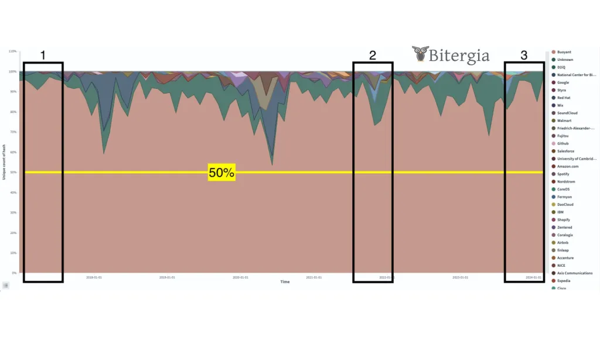
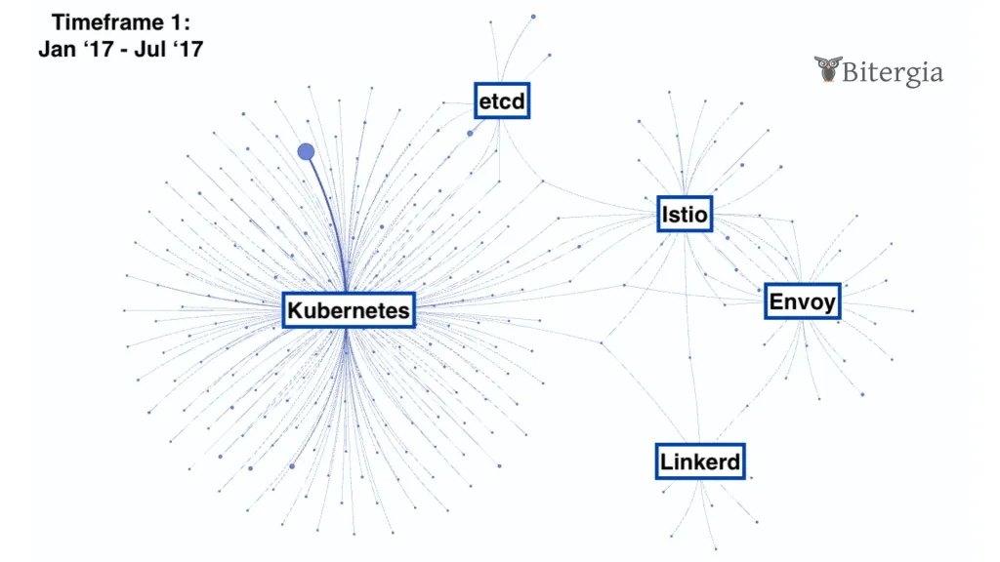
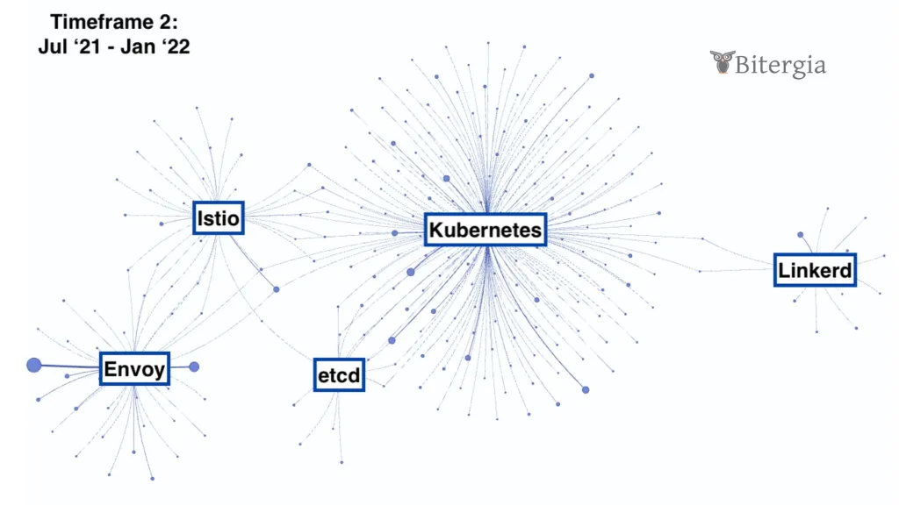
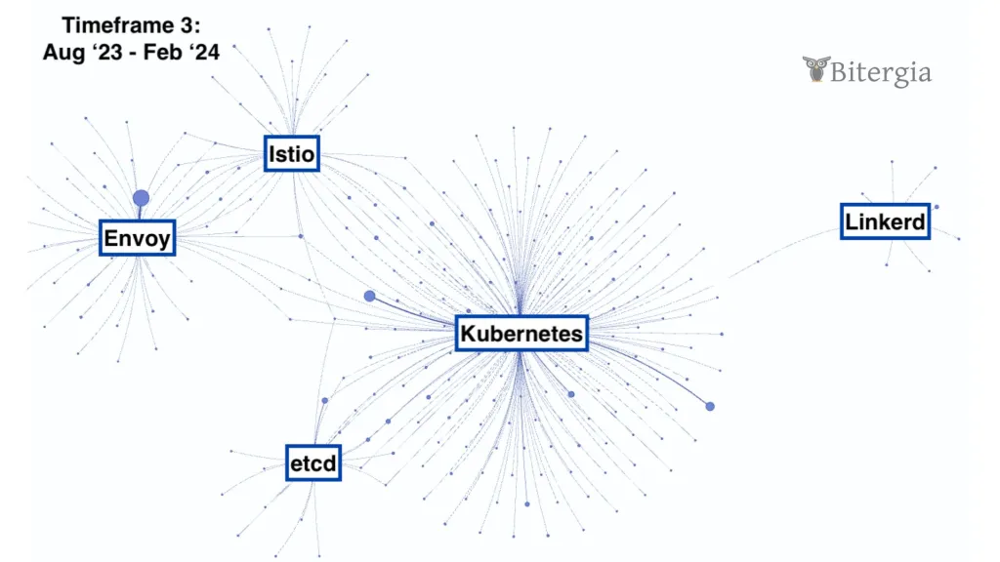

On February 21, 2024, the CNCF open source project Linkerd announced that it would no longer provide stable builds. The source code will continue to be under the OSI-approved Apache v2 open source license. Non-stable builds will also still be provided through the open source project. This change is about the release artifacts of stable builds only, not about code, governance, community, or anything else.

So why is there a push back and why was this so unexpected by the CNCF community at large?

Buoyant, the company behind Linkerd, quite accurately describes itself as “a small but mighty team of software engineers, network programmers, and distributed systems experts.” That small but mighty team has been the sole force behind the open source project for quite some time, and as their CEO writes, “to do that work and maintain that quality, there’s only one sustainable path: we need the many, many companies around the world that are building their businesses on top of Linkerd to do their part to fund the project,” and he bluntly lays it all out (and on the line) in his expanded blog post here.

In a month where another CNCF project, Flux, backed by Weaveworks called it quits and folded up its tent (see Alex Richardson’s post), one has to wonder what is going on under the big tent of the CNCF and if there’s any way to stop a more seismic shift in the stability of CNCF projects.

Let’s take a step back and look at open source project health metrics for the Linkerd project.

<!--truncate-->

### The journey of Linkerd in the CNCF

This blog post is about characterizing Linkerd as a member of the CNCF ecosystem. A look at the contributor community gives us a better understanding of the nature of Linkerd. Another interesting aspect to think about is what it means for an open source project to join an open source foundation and collection of projects, such as the CNCF. This may inform open source projects on the choice to join a foundation in the future.

For our analysis, we are interested in three timeframes. The first timeframe is the current situation as observed over the last 6 months (August 26, 2023 – February 26, 2024). The current situation can inform us about what’s going on with the project both today and leading up to the announcement. The second 6-month timeframe surrounds the graduation of Linkerd from the CNCF Incubator on July 28, 2021. This timeframe was selected on the assumption that the health of the open source project was checked and vetted by the CNCF incubator, which has specific requirements in place. For comparison, the third timeframe is the 6-months after Linkerd joined the CNCF on January 23, 2017. This timeframe serves as a baseline to compare the other two against.

Timeframes in chronological order:

- Linkerd joined the CNCF (Jan 23 – July 23, 2017)
- Linkerd graduated the CNCF Incubator (Jul 28, 2021 – Jan 28, 2022)
- Current situation (Aug 26, 2023 – Feb 26, 2024)

To analyze the Linkerd contributor community and the broader CNCF ecosystem, Bitergia collected data from GitHub with its Bitergia Analytics platform, which is a hosted service of the open source CHAOSS GrimoireLab tools. The dataset was checked and cleaned using industry best practices. One of the key features of Bitergia Analytics is the ability to affiliate contributors to organizations, and thus get insights into how organizations are engaged in an open source project.

### How diverse is Linkerd’s vendor ecosystem that participates in the ongoing development?

Bitergia coined the Elephant Factor to measure the diversity of organizations in an open source project. For projects like Linkerd, many companies benefit from the existence of the software. It is in the interest of all users that the ongoing development is shared among many companies.

To analyze the Elephant Factor, we look at the number of git commits, because they are the actual code and other contributions accepted into the git repository. We acknowledge that this excludes other types of contributions, but those are harder to get factual data on. In this analysis, we exclude commits from bots. To calculate the Elephant Factor, we count the most active organizations that together contribute 50% of the commits. The following diagram visualizes this analysis for us.

Percentage of git commits from non-bots stacked by organizations. The yellow line shows 50% of commits. Buoyant contributed 50% of commits at all times, including during our analysis timeframes. The black boxes are the three timeframes for our analysis. (Visualization from Bitergia Dashboard, requires login)

The Elephant Factor is one (1) in each of our three timeframes. This is visible in the diagram, which shows that Buoyant always contributed at least 50% of the commits. It appears that there were other organizations joining the development during the incubation process (between timeframes 1 and 2), but it did not turn into a lasting and sustainable balance of contributions between organizations.

This observation is concurrent with the list of current and past maintainers of Linkerd (see MAINTAINERS.md). All listed maintainers use a Buoyant email address or their LinkedIn profile shows Buoyant as an employer. There is one emeritus maintainer from a different organization, Nordstrom. Buoyant has a public use case with Nordstrom. It is admirable that Nordstrom, as a customer of Buoyant, provided a maintainer to Linkerd. If more users of Linkerd did this, I suspect the above chart would tell a different story.

### How active is the Linkerd project"`"s development?

A key determinant of an open source project’s health is its ongoing and active development. Projects that are not maintained become outdated fast. Especially in the fast-paced ecosystem of the CNCF projects, all projects need to keep up with the development of other interdependent projects.

To measure the level of activity, we can look at issues, pull requests, or git commits. The visualization of each looks similar, indicating that the trend is consistent across different parts of the software development lifecycle, but it would be enough to investigate only one further. Issues are a forum for ideation, proposing and discussing feature requests, and filing and investigating bug reports. Pull requests are a forum where developers and maintainers have focused conversations about specific change requests, in the form of commits. Only approved change requests get merged into the code base and become part of the git commit history. Of these three choices, we will not look at issues because they may only contain discussions without leading to development, and we will not look at the commit history because it only captures development work that was approved to be included in the software.

For the purpose of understanding the activity level in Linkerd’s development, we will look at pull requests. Pull requests are indicators that development occurred and was submitted to maintainers for review. Pull requests also capture change requests that were rejected and didn’t make it into the git commit history. This assumes that maintainers always follow the pull request workflow and do not commit directly into the main branch of the repository.

The top chart shows the number of pull requests opened during the time period and its open/close status as of February 28. The bottom chart shows the number of pull request submitters. (Visualization from Bitergia Dashboard, requires login)

The activity level has increased and then decreased throughout the years. The visualization shows consistent growth from the time Linkerd joined the CNCF incubator until it graduated. Since graduating, the development velocity has decreased.

On a side note, it would be interesting to chart the growth of Buoyant as a company and relate it with the growth of Linkerd’s development activity. This could corroborate the insight above that the majority of Linkerd development was completed by Buoyant. If Buoyant’s business was decreasing in proportion to the activity in Linkerd, then it would be understandable that the company is looking for ways to boost its revenue and stop the decline from continuing. This is an unsubstantiated hypothesis and others can do this analysis because there is another possible explanation that is related to open source project health.

The pattern of growth and decline correlates with joining and graduating from the CNCF incubator. It could be that since joining the CNCF, developers from other, maybe related, projects have started to contribute to Linkerd. During the incubation phase, the relationships with other projects could have been established until Linkerd was ready to graduate. We picture relationships between projects as developers that work in more than one project. This could explain the growth pattern we see in both, the number of pull requests, and the number of submitters.

Continuing this line of reasoning, the decline in activity could indicate that integration work was completed and less knowledge transfer was necessary between other projects. After graduation, the Linkerd community could have entered a phase of ongoing maintenance of those relationships, not needing to add more relationships. Relationships may even begin to dissolve after the knowledge transfer that was necessary for the integration was successful. This is consistent with the previous observation that the proportion of contributions from outside Buoyant decreased. It could explain the decline pattern we see in both, the number of pull requests and the number of submitters.

Let’s take a look at how Linkerd’s community overlaps with other CNCF projects.

### How well is Linkerd’s contributor community integrated in the CNCF ecosystem?

To visualize the interrelatedness of contributor communities, we can use a network diagram. We will look at commits as the unit of analysis because commits constitute a change in the source code. In the network diagram, we depict commit authors as one kind of node and the projects as a different kind of node. We draw a line between commit authors and projects when an author’s commit was merged into the project during the analysis timeframe.

Commit authors will have lines to each project they contributed to. When we distribute the commit authors around each project and between projects, we can see which projects share a contributor community.

Unlike the above visualizations, the network diagram cannot depict changes over time. For this, we will need to look at the three timeframes separately. We also will need to make some choices for the visualization so as not to be overwhelmed. Because we want to focus on Linkerd, and the diagram would be too busy to show all CNCF projects, we will select only some projects. In addition to Linkerd, these will be the most active projects from each of the four subcategories of the Orchestration and Management category on the CNCF Landscape of Graduated Projects:

- Linkerd: “Ultra light, ultra simple, ultra powerful. Linkerd adds security, observability, and reliability to Kubernetes, without the complexity.” Joined CNCF on January 23, 2017 and graduated on July 28, 2021. Category: Orchestration & Management, Subcategory: Service Mesh. Linkerd was included in analysis because it is the focal project.
- Istio: “Simplify observability, traffic management, security, and policy with the Istio service mesh.” Joined CNCF on September 30, 2022 and graduated on July 12, 2023. Category: Orchestration & Management, Subcategory: Service Mesh. Istio was included in analysis because it is the only other project in the same subcategory as Linkerd, and thus can be seen as a directly competing project.
- etcd: “Distributed reliable key-value store for the most critical data of a distributed system.” Joined CNCF on December 11, 2018 and graduated on November 24, 2020. Category: Orchestration & Management, Subcategory: Coordination & Service Discovery. etcd was included in the analysis because it was the most active representative project of its subcategory.
- Envoy: “Cloud-native high-performance edge/middle/service proxy.” Joined CNCF on September 13, 2017 and graduated on November 28, 2018. Category: Orchestration & Management, Subcategory: Service Proxy. Envoy was included in the analysis because it was the only graduated project in its subcategory.
- Kubernetes: “Kubernetes is an open-source system for automating deployment, scaling, and management of containerized applications.” Joined CNCF on March 10, 2016 and graduated on March 6, 2018. Category: Orchestration & Management, Subcategory: Scheduling & Orchestration. Kubernetes was included in the analysis because it was the most active representative project in its subcategory and because it is the most well-known CNCF project.

We also need to decide how many contributors to display in the network diagram. When we show too many, it becomes more difficult to see patterns. Research has shown that open source projects have a long tail of contributors. A small number of very active contributors do the majority of the work. A much larger number of contributors contribute only infrequently and very little. Given the size difference between the 5 selected projects we got a meaningful insight showing the 250 most active contributors in each time period. This is on average, 50 contributors per project, but due to the size of the project communities, Kubernetes shows the most active contributors. When we selected fewer active contributors, there would have been no connection between the projects. When we selected more active contributors, the visualization became unmanageable.

A concern with including Kubernetes is that it is orders of magnitude larger than the other projects (about 40x the activity level of Linkerd). Kubernetes is like the sun of the CNCF system and the other projects are like planets orbiting around it. Without understanding the gravitational pull of Kubernetes, we may not be able to explain the orbital pathways of its planets. Out of curiosity, we tested what the data showed when we omitted Kubernetes, and we arrived at a similar insight, though it was harder to see. We, therefore, chose to continue to include Kubernetes because of its importance in the CNCF ecosystem.

Let’s take a look at the three snapshots of the network diagram for each of our three timeframes:

Timeframe 1: Linkerd joined the CNCF (Jan 23 – July 23, 2017). Three contributors are active in the Linkerd project and also in Kubernetes, Istio, and Envoy. (Visualization from Bitergia Dashboard, requires login)

Timeframe 2: Linkerd graduated from the CNCF Incubator (Jul 28, 2021 – Jan 28, 2022). Only two contributors active in Linkerd are also active in one other project: Kubernetes. (Visualization from Bitergia Dashboard, requires login)

Timeframe 3: Current situation (Aug 26, 2023 – Feb 26, 2024). Only one contributor active in Linkerd is also active in one other project: Kubernetes. (Visualization from Bitergia Dashboard, requires login)

The common observation across the three snapshots is that Kubernetes, Envoy, etcd, and Istio have fairly well-connected contributor communities. The Linkerd contributor community has comparatively little overlap and the figurative distance to the other projects grew over time, as exemplified by the decreasing number of connections. Of the 250 most active contributors across these five projects, only 3, 2, and 1 contributor was part of the Linkerd and other project communities. If we had omitted Kubernetes from the analysis, Linkerd would have appeared to be floating off on its own, forming its own island during the last two timeframes because there was no connection to the other projects.

The decrease in connections is consistent with the conjecture we posited above, that after graduating from the CNCF incubator, there was less knowledge transfer between Linkerd and other projects. However, there can be different reasons for this evolution. It would be interesting to get the opinion on this from someone who was part of these projects and has historical knowledge. Without such contextual knowledge, we are left to speculate.

### Conclusion

We wrote this blog post because Linkerd made the announcement to no longer provide stable releases. With this blog post, we wanted to shed light on some questions about the health of the Linkerd project and understand its relationship with other CNCF projects.

We saw that software development in the Linkerd project is in the hands of a single company, Buoyant. The evolution over time showed some movements of other companies becoming involved, but that involvement did not seem to be of lasting importance. We further saw that the activity level grew steadily during the incubation period and has decreased since Linkerd graduated. This sparked the question of what the relationship between Linkerd and other closely related CNCF projects is. We found that over time, the relationship between Linkerd and other closely related CNCF projects became less.

These analyses and observations were made from the perspective of an outsider, someone who is not intimately familiar with CNCF and its projects. Any interpretation of the data and conclusions drawn may, therefore, be nonsensical as they are missing the contextual knowledge from someone who understands what actually happened in the projects. Bitergia has this dataset available and is open to exploring it together with others who have their own questions and bring a different perspective. We encourage you to reach out and let us know how our analytics and perspective can help you.

Blog post was written by Georg Link with help from Diane Mueller, Igor Zubiaurre, and Luis Cañas Díaz.
