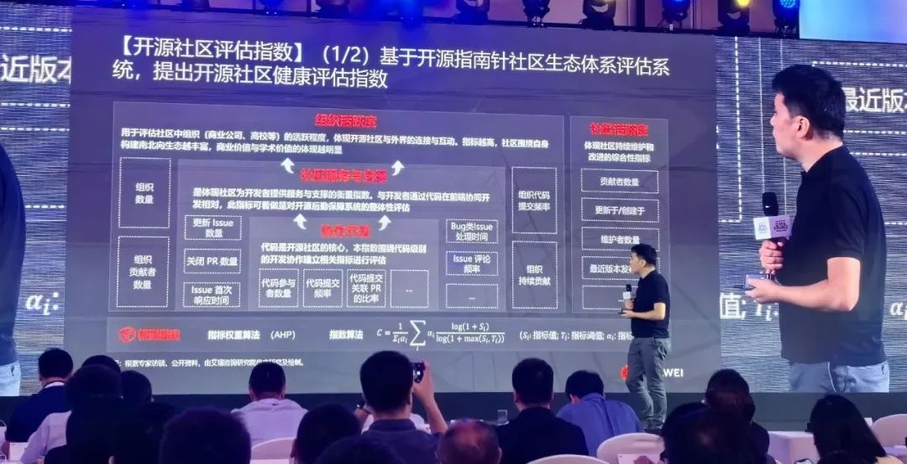
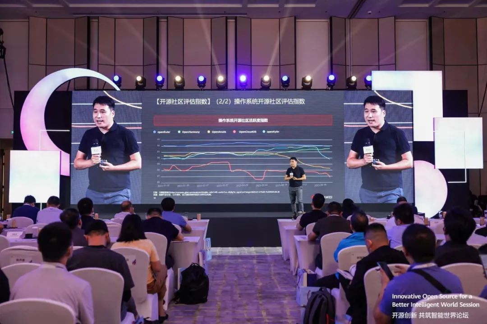

<!--truncate-->

  

Fanlei Xu, Research General Manager of iResearch Consulting, speaks at HUAWEI CONNECT 2023. Photo provided by the organizers of the conference.

  

On September 21, 2023, the Open Source Forum of HUAWEI CONNECT 2023 became a highly anticipated event in the industry. On this remarkable occasion, Huawei, in collaboration with iResearch Consulting, unveiled the eagerly awaited concise version of the "China Fundamental Softwares' Open Source Industry Research White Paper - 2023". The complete version is expected to be released in October. Stay tuned. The data for this white paper is sourced from OSS Compass (hereinafter referred to as "Compass").

### 01 🌟Understanding the Fundamental Softwares' Open Source Ecosystem for Future Trends

In the current digital wave, open source has become a crucial driving force for technological innovation and industrial development in the foundational software realm. Therefore, a deep understanding and study of the fundamental softwares' open source ecosystem is vital for grasping future trends and opportunities.

This white paper showcases in-depth research and analysis of China's foundational open source software ecosystem. Its detailed content and insights will provide guidance to the industry, developers, and policymakers, leading us into a more open and prosperous digital world.

### 02 🌟OSS Compass Data Enhances Insights

Compass, as the first domestic open source evaluation platform, has been dedicated to assessing and analyzing the development of the open source software ecosystem and providing insights for open source usage and investment.

**The release of this white paper also marks the unique value of the Compass community in the field of open source industry research and analysis. **The data and analysis in this white paper are based on the evaluation metrics of nearly 50,000 open source projects under almost 300 technology categories currently tracked by Compass. And Compass's technology categories and open source project insights are continuously expanding. By analyzing this real data from open source projects, we can comprehensively and promptly understand the current status and prospects of China's foundational open source software industry.

  

Fanlei Xu, Research General Manager of iResearch Consulting, speaks at HUAWEI CONNECT 2023. Photo provided by the organizers of the conference.

  

In the future, as evaluation metrics and models continue to evolve and SaaS platform functionalities expand, the Compass community will continue to leverage its expertise in open source ecosystem research, providing valuable insights and data for the open source community, businesses, and decision-makers, offering stronger support for the research and development of the open source software industry in China and globally.

### 03 🌟Engage in Compass, Explore the Open Source World

As a community dedicated to open source data analysis and visualization, Compass welcomes more developers, researchers, and tech enthusiasts to get involved. Through Compass, you can delve into the trends and dynamics of various cutting-edge open source projects, including artificial intelligence and large language models, and contribute your own efforts to innovations in the digital age.

In this digital era, we look forward to witnessing the flourishing development of the open source ecosystem, the emergence of more innovations, and collaboration from all sides to drive the prosperity of the open source community.

In the world of open source, the future is already here, and Compass will continue to assist you in exploring this opportunity-rich and vibrant world.
