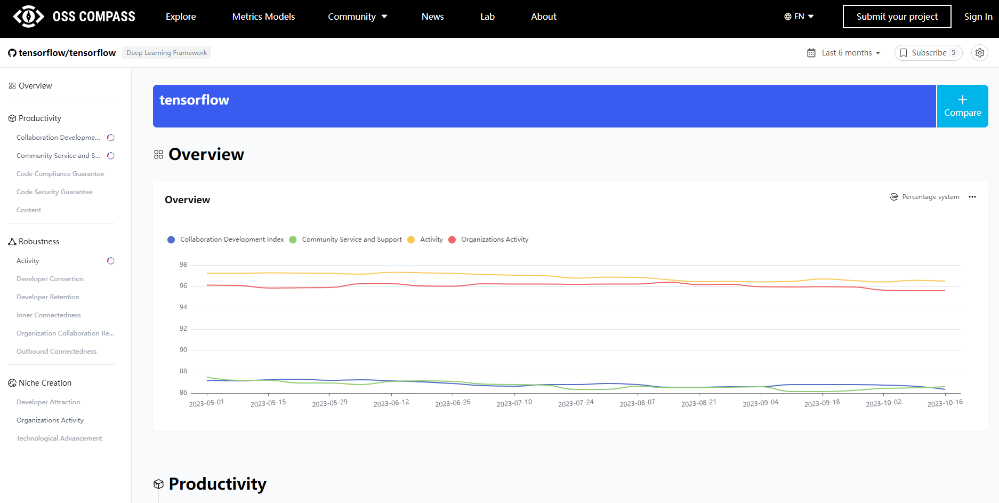
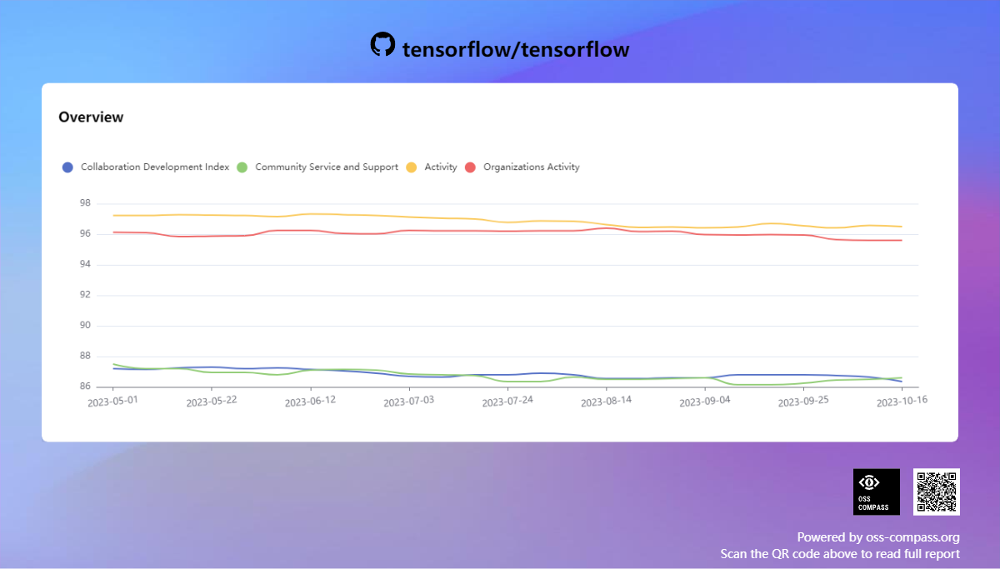
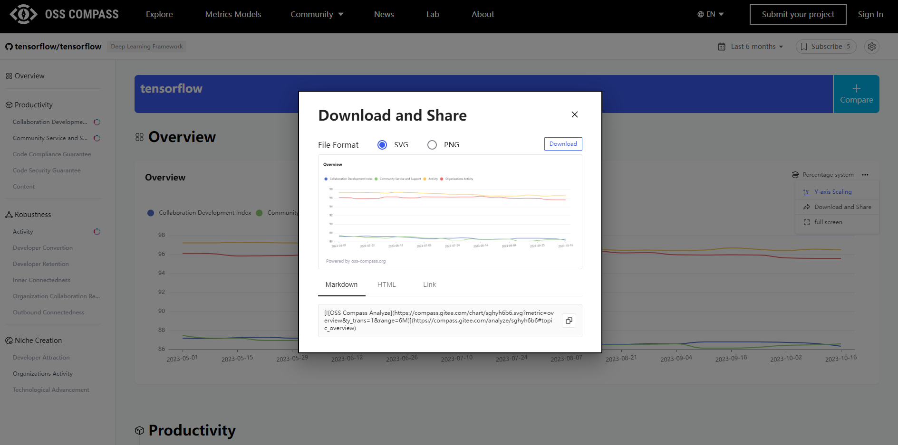
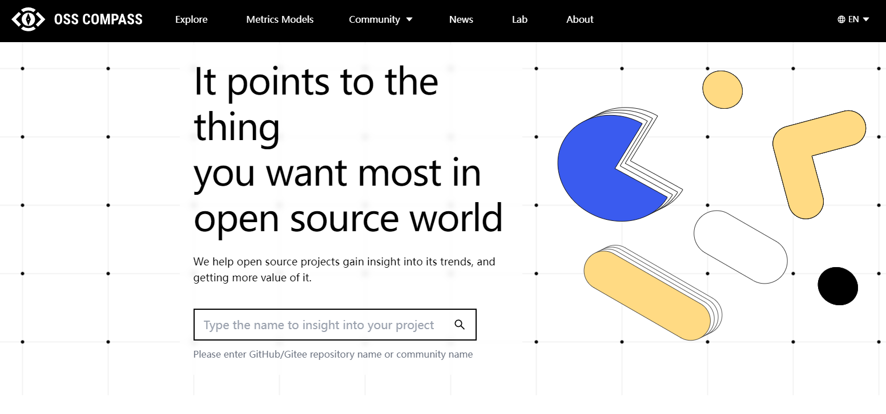
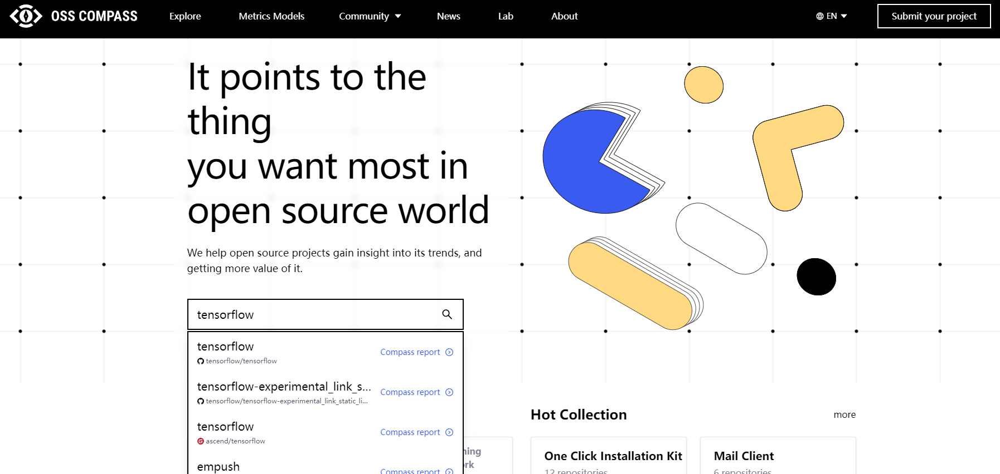
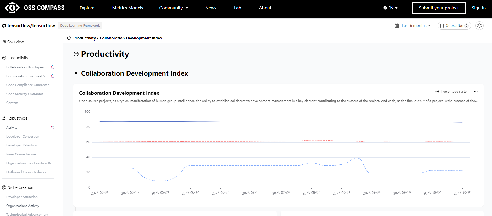
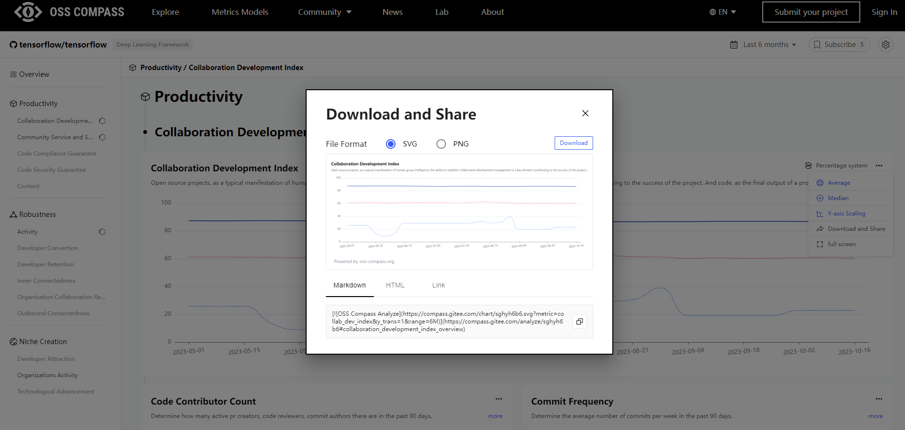
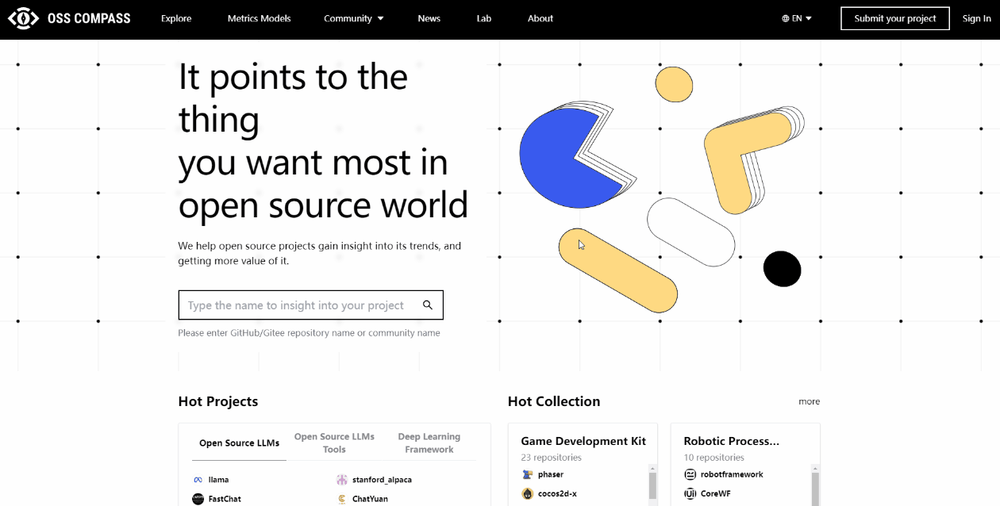

Hi, dear OSS Compass users! It's time for another edition of "OSS Compass New Feature Reveals"! Today, we are going to introduce a brand-new feature, one that has been eagerly requested by users, making OSS Compass project report pages more powerful and flexible! Without further ado, let's take a look~

<!--truncate-->

### 01 Project Report Page Review

Do you remember not too long ago when we introduced the OSS Compass (hereinafter referred to as "Compass") project report page, the magical page that allows you to understand project development trends at a glance? Yes, that's right, it's the page below!

You just need to search for your project on the Compass official website, then click on it to enter the project report page, where all project data is presented in intuitive chart form. Thus, you can easily understand the development of your project in various aspects. You can also download these charts with a single click for your project report analysis.

### 02 User's Creative Idea

However, over two months ago, we received a request from a user. This user wanted more than just static charts: he wanted to embed specific metric charts into his own website and receive real-time data updates. In other words, he wanted a "live" chart, not a "dead" one.

You might be wondering: what does a "live" chart mean? Simply put, when you embed this chart on your website, it can update in real-time and provide you with the latest data. Unlike the previous download function, where the chart remains static and doesn't change (as shown above).

This user is a big fan of the Compass community, always pushing us to pursue excellence!

### 03 Engineer Action

Our engineering team heard this request and immediately sprang into action. In a technical meeting within the community, they decided to implement this feature as quickly as possible to fulfill the user's wish.

But implementing this feature is not easy because Compass analyzes over 50,000 projects, each with dozens of evaluation metrics, which requires creating a large number of URL links and ensuring that the SVG format images in these links can update in real-time.

It may sound a bit daunting, but our engineering team is incredibly powerful! We've been working hard to bring you a better experience!

### 04 New Feature Online

Now, here's the good news! We've finally implemented this feature, allowing you to freely select a specific metric chart, embed it as a link on your website, and get the latest data at any time.

It's like installing a real-time monitor for your project, keeping an eye on your project's health. Want to know the project's activity, number of contributors, submission frequency, and more? No problem, just select the relevant chart, paste it into your web page, and you can easily stay informed.

This is an exciting moment, isn't it? Now, whether you're a developer, project manager, or a user interested in open-source projects, you can use Compass data more flexibly, and it's very easy to use.

### 05 How to Use the New Feature

Are you excited? Can't wait to try it out? Don't worry; let's first take a look at the steps:

#### 1.Visit the Compass official website and search for the project you're interested in

Enter the name or keywords of the project you're interested in into the search box on the website's homepage, then click the search button.

#### 2. Click on the project name to access the report page

In the search results, find the project you're looking for, click on the project name to access the project's report page.

#### 3. Choose the chart you want and click "Download and Share"

On the report page, you can see various charts displaying various project metrics. Now, you can choose the chart you want. Once you've selected a chart, find the "Download and Share" button in the upper right corner of the chart and click on it.

#### 4. Copy the link and embed it into your web page

A window will pop up displaying several links. Choose the one you want, copy it, and then paste it into the appropriate location in your web page's code.

  

We offer three types of links: Markdown, HTML, and Link.

  

#### 5. Enjoy the real-time updating chart

Now, your web page has an embedded live chart! It will update in real-time as the data changes, making your web page more dynamic and interesting.

Isn't it simple? Dear Compass users, don't hesitate! Try out this brand-new feature to make your project data come to life and give your reports more vitality!

### 06 Conclusion

We are truly delighted to bring you this feature and hope it makes your data analysis and reporting work easier and more enjoyable. If you have any questions or suggestions, feel free to leave a comment in the comments section or contact us at any time. The Compass team will continue to listen to your needs and provide more convenient and practical features for your open-source projects.

Thank you for your continuous support and feedback, making Compass stronger and stronger! We will keep working hard to bring you more exciting features, making your journey of data analysis more exciting!

Remember to follow our official account; don't miss any updates! Keep enjoying the open source journey, and let Compass guide you! Open source, we are always on the road! 😄🌟
