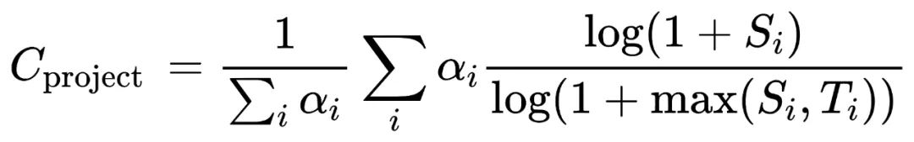
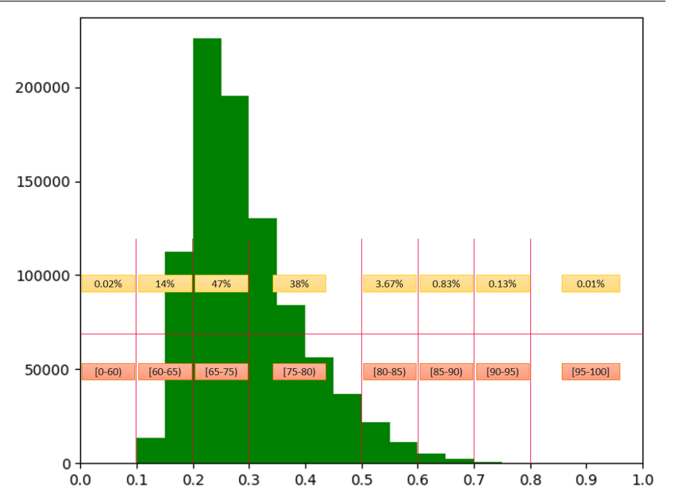
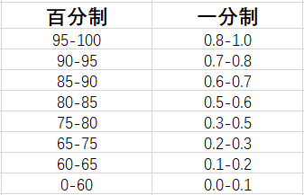
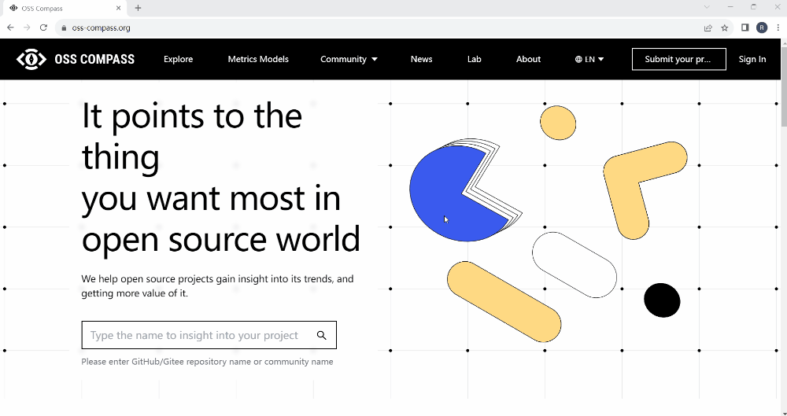

<!--truncate-->

### OSS Compass

Since its official release on February 21, 2023, OSS Compass has been accelerating its iterations, continuously optimizing metrics models, and SaaS services. In addition to the existing Dashboard, recent updates of SaaS services include the introduction of Compass Lab, allowing developers and users to customize their own metrics models. This series of articles will comprehensively explain the metrics models, Dashboard, the upcoming Compass Lab, and other new features of OSS Compass. Stay tuned.

Hey, open source adventurers! The first two articles in the "OSS Compass Feature Updates" series have already made a stunning debut, unveiling the mysteries of the "Compass Badge" and the "Dashboard Charts Y-Axis Scaling" feature. Today, the long-awaited "Percentage System" feature update has finally arrived! This feature is closely related to the algorithm of OSS Compass (hereinafter referred to as "Compass") evaluation metrics models. Without further ado, let's see how this powerful algorithm transforms into magic!

### 01 The Story Begins: Compass and Criticality Score

The purpose of Compass is to make the evaluation of open source projects more scientific and objective. Its model algorithms and backend component prototypes initially came from CHAOSS. Some of the model algorithms used by CHAOSS were originally based on the Criticality Score.

Criticality Score, sounding quite mysterious, is a quantified assessment project developed by Google and open-sourced through the Open Source Security Foundation (OpenSSF) to assess the importance/criticality of open source projects. By selecting metrics such as "number of contributors," "commit frequency," "number of releases in the past year," etc., it calculates the importance of open source projects using a formula. The formula it uses looks like this:

This formula involves three mysterious variables: ai, Si, and Ti. The ai represents the weight of the i-th metric, Si is the value of that metric, and Ti is the threshold of the metric. The threshold refers to the maximum value the metric can reach.

Using the log function for normalization is a common method, but this formula is a bit special: both the numerator and denominator use the form log(1+x) instead of log(x), and the +1 ensures that the final result is positive; and the denominator uses log(1+max(Si,Ti)), where max is used to keep the denominator constant at log(1+Ti) when Si<Ti, and the formula result remains 1 when Si>Ti.

With these complex calculations, the C value is kept between 0 and 1. Truly a magical transformation of the algorithm!

### 02 Magic's Advantages and Limitations: Criticality Score

The above algorithm of Criticality Score does indeed have a significant advantage in evaluating open source projects. It considers the differences in metric values comprehensively while allowing for flexible adjustment of weights. However, magic also has some limitations, such as potential occurrences of negative numbers or values greater than 1 after calculation, which are not very scientific in practical applications.

Moreover, the metrics defined by Criticality Score are not comprehensive and have been criticized for not being accurate and objective enough. Well, even though it's magic, it still needs improvement!

### 03 Compass's Magical Optimization

Here comes Compass! To address the limitations of the magic, we've optimized it!

Firstly, we've removed some meaningless metrics from "Criticality Score" and added more reasonable evaluation metrics. Currently, Compass has selected more than 30 evaluation metrics (continuously increasing), covering the dimensions of productivity, robustness, and Niche Creation. These metrics are cleverly combined to create a comprehensive assessment system.

Secondly, we've set reasonable weights and thresholds. Using expert experience and the Analytic Hierarchy Process (AHP), we've calculated reliable weights. At the same time, based on observations of code repositories of millions of open source projects, we've established sensible thresholds. Truly a masterful application of magic!

Lastly, we've standardized the calculation results beyond the 0-1 range to ensure that these results ultimately fall between 0 and 1. This makes the results of the magic more scientifically sound!

To verify the optimization approach, we compared the results of the optimized metrics model with the results of Google's Criticality Score calculation and found a significant strong positive correlation between the two.

Additionally, Compass is continuously improving algorithms, and in the future, we will introduce a completely new algorithm system. Join us and let's innovate algorithms together!

### 04 Magic's Transformation Charm: From One-Point System to Percentage System

After optimization, the charm of the magic has grown even greater!

The results calculated by the above formula fall between 0 and 1, which we refer to as "one-point system". Now, we've added the ability to switch from one-point system to percentage system.

Why make this switch?

This is because after the results of one-point system are displayed on charts, while the curve trends carry a lot of information, the definition of the scores is complex, and interpretation of the scores is difficult. Therefore, we've added the percentage system feature to make the magic more universally understandable!

To make the conversion from one-point system to percentage system more reasonable, we first did statistics for the results distribution of one-point system for nearly a million open source projects. Yes! The distribution is shown in the chart below~ As you can see, nearly 85% of projects have scores concentrated between 0.2-0.3 and 0.3-0.5. If we simply scale the one-point scores proportionally to percentage scores, it obviously doesn't make sense~

So, we discussed this with some experts and established the correspondence as shown below. Additionally, we've added a "percentage system" conversion button on the Dashboard page, making it easy for users to switch flexibly.

### 05 Unveiling the Magic. All in Compass!

Adventurers, want to experience the power of magic firsthand? Just open the Compass official website, go to the Exploration page, and find the Dashboard of an open source project you're interested in. Click the "percentage system" button below the settings icon in the upper-right corner, watch the values on the metrics chart change between 0 and 100, and feel the magic's wonderful transformation!

When the button is gray (not selected), the values on the Y-axis of the metrics chart range from 0 to 1. This is the result calculated directly or standardized using the previous magical formula. When the "percentage system" button is selected, it will turn blue, and the values on the Y-axis of the metrics chart will range from 0 to 100. This achieves the conversion from one-point system to percentage system.

Have questions? Suggestions? Don't hesitate! Scan the QR code at the end of the article, join the official Compass WeChat group, and discuss and exchange ideas with us and more open source enthusiasts~

In the future, OSS Compass will continue to evolve and give back to the broader user base, providing greater convenience for open source project evaluation and assisting in the healthy and sustainable development of open source communities.

We look forward to more developers joining the OSS Compass community and contributing to its development. At the same time, we welcome users to continue using Compass SaaS services and providing feedback, continuously powering the enhancement of OSS Compass's capabilities.

If the buttons do not work, please copy the following URL to your browser:

https://join.slack.com/t/oss-compass/shared_invite/zt-1ttt9sv5h-8E~oPP6VJqm8ero5qH9LlA

You can also join our WeChat group to communicate with us anytime.

