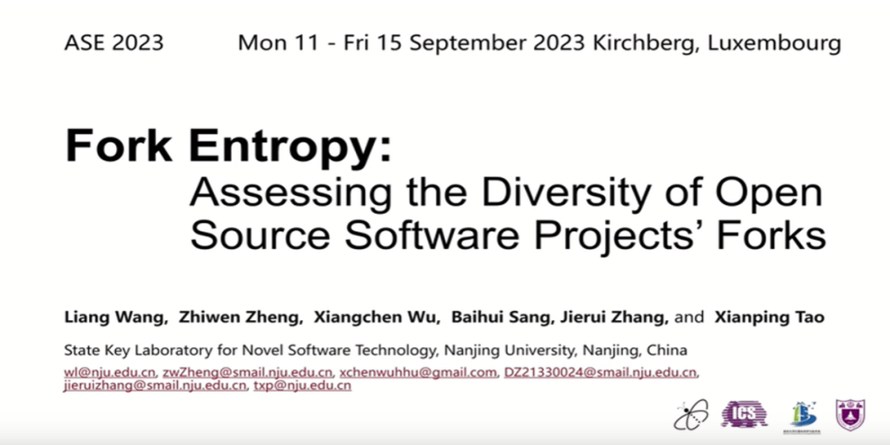
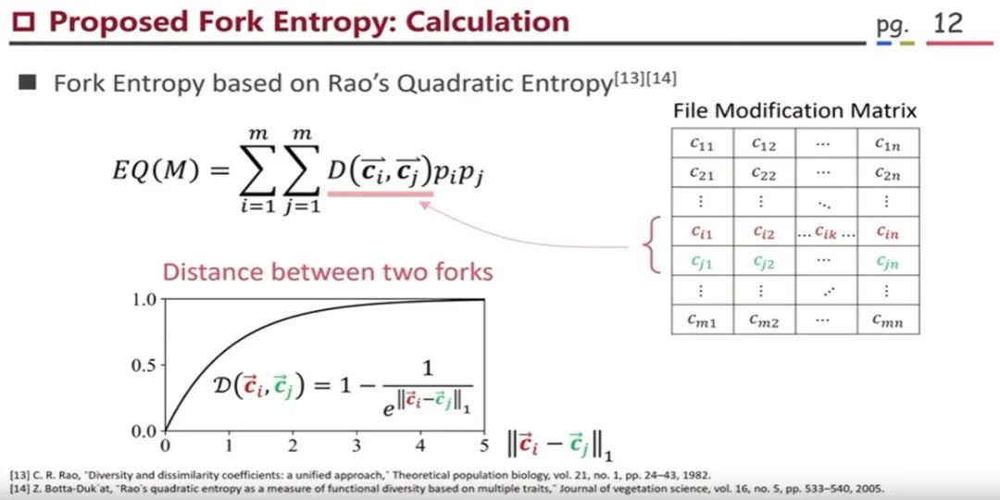

<!--truncate-->

At the 38th IEEE/ACM International Conference on Automated Software Engineering (ASE 2023) in September, 2023, an important research study on open source software projects garnered widespread attention. This research, titled "Fork Entropy: Assessing the Diversity of Open Source Software Projects' Forks," was jointly conducted by Professor Liang Wang and his team from Nanjing University.

In this era of technological advancement, open source software projects play an increasingly crucial role in our lives. Forking, as a way to create branches or copies of open source projects, is a significant approach of open source collaboration. The number of forks, which represents the number of branches, is often used as a standard to assess the development of open source projects.

However, observations within the open source communities have revealed that a higher number of forks does not necessarily equate to better development of open source projects. So, how can we measure the development of open source projects through fork metric?

### 01🌟 Fork Entropy: A New Metric for Open Source Projects

Building upon information theory and entropy theory, Professor Liang Wang and his team introduced the concept of "Fork Entropy". It calculates the Fork Entropy value through a formula to measure the diversity of open source projects' branches.

Through this research, they discovered a significant correlation between the diversity of forks of open source projects and the projects' productivity and quality. In other words, with the same number of forks, higher diversity leads to greater productivity, especially in younger projects, where the influence of Fork Entropy is more pronounced.

### 02🌟 Significance of Fork Entropy: A New Perspective on Open Source Projects Evaluation

This discovery provides us with a new perspective to assess the health of open source projects and the development of project branches.

Firstly, Fork Entropy helps communities better measure the diversity of forks of open source projects. This means we can analyze and evaluate the health of projects from a new angle. With this metric, we can gain a better understanding of the development of project branches and take measures to improve project maintainability and stability. Moreover, it enables us to devise better open source project management strategies and predict project development trends.

Secondly, Fork Entropy supports further quantitative analysis and data mining. Researchers can use this metric to conduct more in-depth studies, thoroughly verifying the relevance of Fork Entropy to critical aspects of open source software development. This will aid in a better understanding of how open source communities operate, thereby supporting and promoting the development of open source software.

### 03🌟 OSS Compass: A Crucial Data Support for Research

Now, let's learn about the key role that OSS Compass (short for "Compass") plays in supporting this research. You may have heard of this name before, as it plays a crucial role in this study. The Compass community not only are a research partner of Professor Liang Wang and his team but also serves as the data source for this research.

Compass community has gathered data from over 20,000 open source projects, providing a solid data foundation for Professor Liang Wang and his team's researches. This means they can conduct researches on a large-scale dataset, resulting in more accurate and representative conclusions.

In the future, the findings of this research will be applied in the Compass community to create new evaluation models, providing more information about the diversity of project branches to the open source community.

### 04🌟 Conclusion

In summary, Professor Liang Wang and his team's research brings a fresh perspective and toolset to the open source communities and the field of software development. Through Fork Entropy, we can better understand the diversity and health of open source projects, thus providing guidance for the health and diversification of the open source software ecosystem.

If you are interested in this research, consider watching the author's presentation at ASE 2023. The link to the presentation video: https://www.bilibili.com/video/BV1r94y1x7eV/?spm_id_from=333.788.recommend_more_video.0&vd_source=3c703e82f7fe5755e37c8c8b46233900 .
