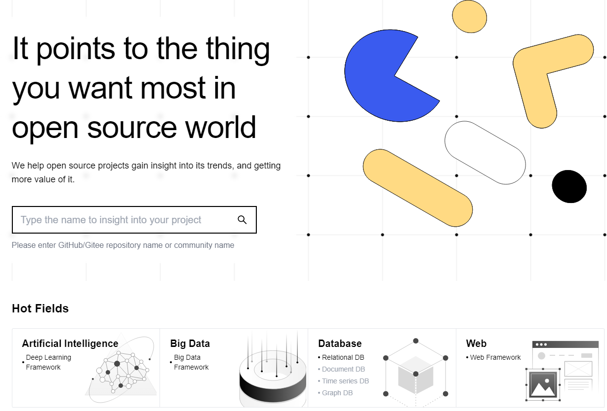
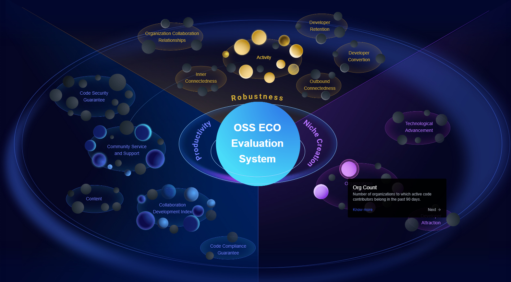

In the Spring of 2023, the [OSS Compass](https://oss-compass.org) press conference was successfully held in Beijing. Representatives from the CHAOSS community of the Linux Foundation (online), OS China, Nanjing University, Huawei, Baidu, and Tencent, etc attended the event. Member of the Chinese Academy of Sciences, director of Huawei's Open Source Software Management Committee, and CEO of OS China delivered the congratulatory speech.

<!--truncate-->

The release of [OSS Compass][oss-compass] marks the official birth of China's first open source ecological health assessment SaaS platform. At the conference, the theoretical research and practical results of [OSS Compass][oss-compass] were introduced, and the [OSS Compass][oss-compass] open source community governance architecture, evaluation model and development planning route were announced. [OSS Compass][oss-compass] is co-sponsored and collaboratively developed by the National Industrial Information Security Development Research Center, Open Source China, Nanjing University, Huawei, Peking University, OpenI, Baidu, and Tencent Open Source. It also has the support of multiple open source communities and enterprises. It is an open source practice that integrates industry, education, research and application. [OSS Compass][oss-compass] currently builds an OSS Eco Evaluation System including three dimensions of Productivity, Robustness, and Niche Creation, covering 14 metrics models.

At the beginning of the project, [OSS Compass][oss-compass] was committed to building an international open source ecological health assessment platform. On the one hand, [OSS Compass][oss-compass] follows the best practices of the CHAOSS project, including metrics models and metrics, with some backend components originally from Grimoirelab. On the other hand, [OSS Compass][oss-compass] is open to all open source projects on hosting platforms like GitHub, Gitee, etc.

Congratulations from Elizabeth Barron, the CHAOSS Community Manager. She said, "to date, CHAOSS has defined 76 individual metrics from a variety of viewpoints in a variety of areas, and has also developed many metrics models. We look forward to the future cooperation between CHAOSS and [OSS Compass][oss-compass] to help open source projects track and measure open source community health."

We believe that the advent of [OSS Compass][oss-compass] can make the open source ecosystem develop in a healthier direction together with CHAOSS!

[oss-compass]: https://oss-compass.org
