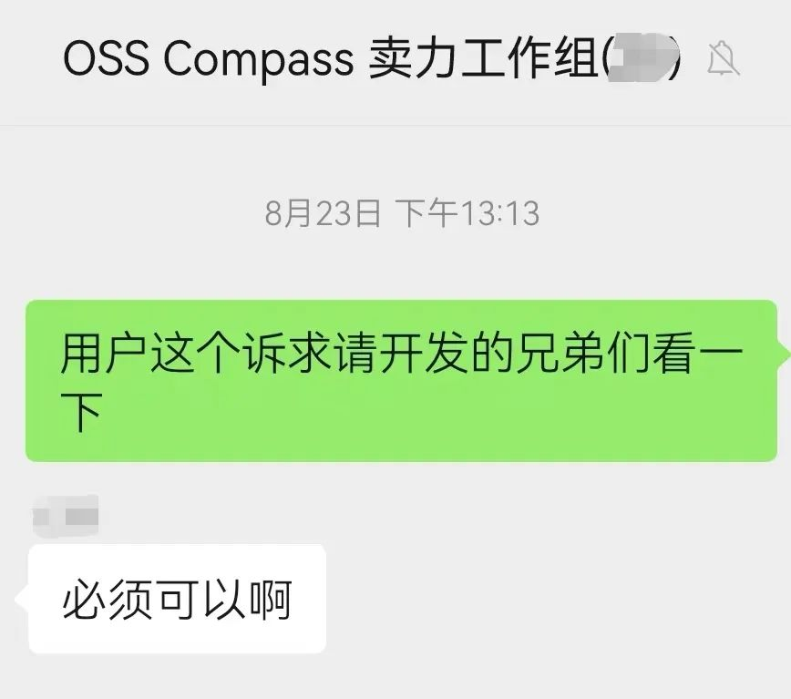
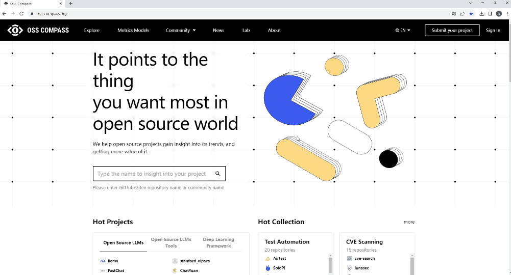
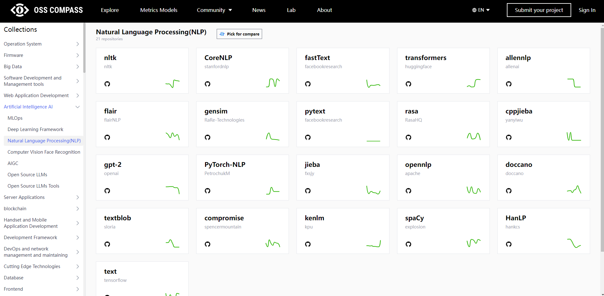
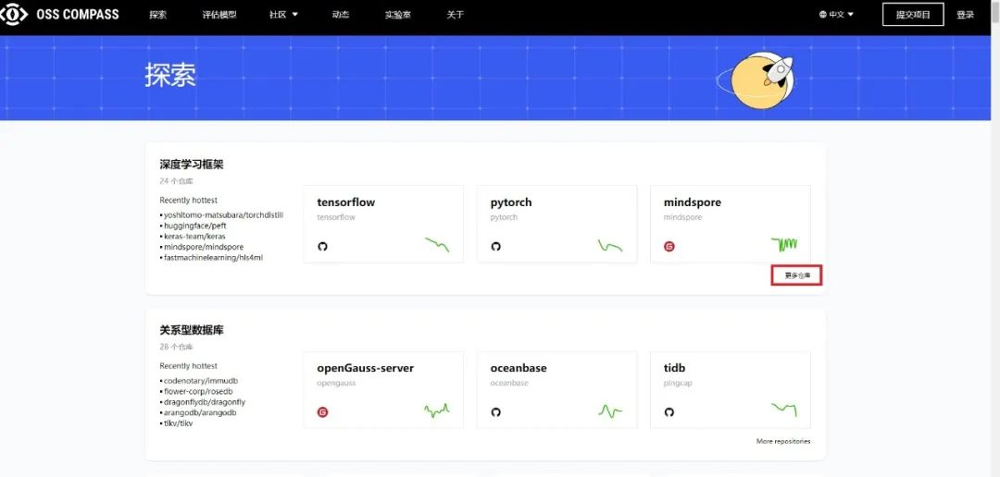
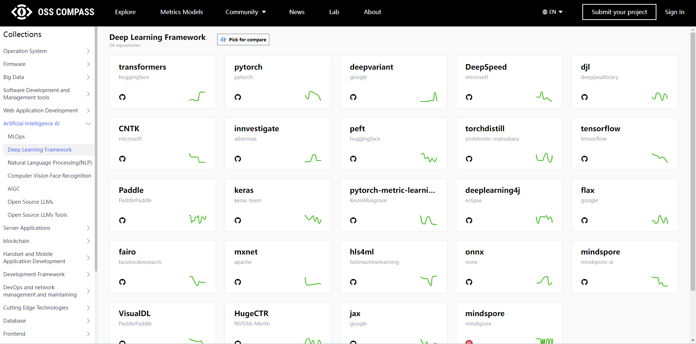

<!--truncate-->

Hello, everyone! The "OSS Compass Feature Update" series of articles have revealed the mysteries of "Compass Badge," "Y-axis Scale of the Charts on Dashboard", "Percentage System Switching and Algorithms of OSS Compass", and "Compass Lab". Today, I bring you another new feature from the OSS Compass (hereinafter referred to as "Compass") community!

Recently, a Compass user expressed a small wish, and it will bring great convenience to all of you. That is — you can now click on the repository icon below the project on the Compass website to jump to the repository directly!

### 01🌟 Compass Responds to User's Wish

Not long ago, a dedicated Compass user made a suggestion, hoping for a more convenient way to access project repositories on Compass website. Upholding the user-first philosophy, the Compass community immediately took action to turn this small wish into a reality.

### 02🌟 Feature Implementation with Speed

The developers of Compass have always been working tirelessly for the community, and they always prioritize user needs even during busy times. Soon, this feature was implemented! Note that Compass has already catalogued 20,000+ projects, so implementing this small feature required quite a bit of work!

### 03🌟 Easy Understanding with Operation Demonstration

Let's see how to use this new feature!

First, open the Compass official website, go to the Explore page, and find the project you're interested in. Then, below the project name, you'll see the Github or Gitee icon. Just click on these icons, and you'll be directed straight to the repository page! Simple, right?

### 04🌟 Small Feature with Great Convenience

Some might think this is just a small feature, but it brings tremendous convenience to Compass users. If you needed to view repositories for multiple projects before, you might have had to manually search for each one. Not anymore! This small button might save you a lot of valuable time!

### 05🌟 Explore Categories for More Excitement

As mentioned earlier, Compass has cataloged 20,000+ projects, and here I want to highlight the project categorization on the Compass official website. Compass community's newly appointed Board member, Checode's Wenxuan Long, and his team have been dedicated to this work.

Currently, we have more than 270 categories, providing great convenience for users to explore more projects. If you want to search for projects by category, simply click "More Repositories" on the Explore page, and you'll be redirected to the category page.

In the category page, you'll discover more projects waiting for your exploration. Likewise, you can click on Github or Gitee icon under projects names on the category page to access their repositories!

Whether you're a developer, project manager, or just someone interested in open source projects, Compass is committed to providing you with a better experience and more convenient features. We will always remain sensitive to user needs and continue to bring you more surprises.

Give this new feature a try! Let the Compass official website be your best companion in discovering outstanding open source projects, making your development journey more efficient and enjoyable! Thank you for your continuous support, and we will keep working hard to present more exciting content to you!
