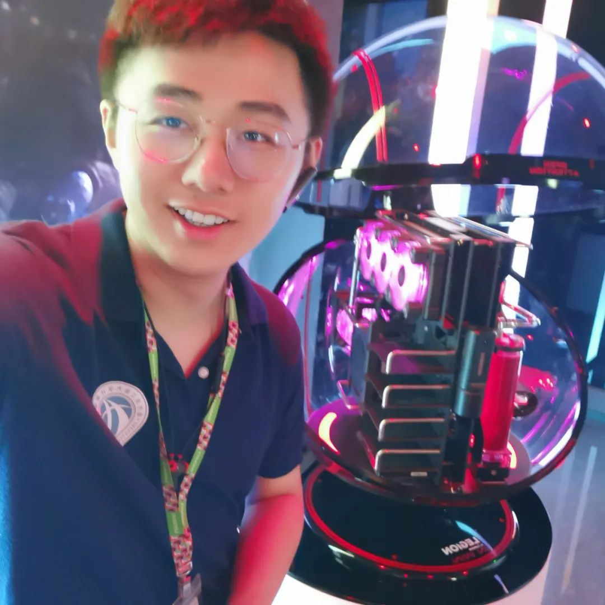

<!--truncate-->

Since its official release on February 21, 2023, OSS Compass (hereinafter referred to as "Compass") has been accelerating its iterations, continuously optimizing metrics models and SaaS services. And without the selfless support of the community, the vigorous development of Compass would be impossible.

On this creative stage, there are not only pioneers from the business field but also a group of young dreamers from universities. They silently inject new vitality into Compass's SaaS capabilities and contribute to the construction of metrics models.

Among them, special mention goes to the brave explorers in the ocean of knowledge. They are doctoral students Baihui Sang, Yuqian Zhuang and Xiangchen Wu, and master's students Yaxin Wang and Jierui Zhang from Nanjing University.

Like tiny streams merging into the sea, they have quietly cultivated in the Compass community for nearly a year, pouring sweat, and sowing wisdom. It is them who make the starlight of Compass shine brighter and make this open source land more fertile. On this elevated stage, they are the most dazzling stars, and the most resilient adventurers.

Sincere thanks to their selfless dedication and enthusiasm to Compass! It is because of the participation of these excellent students that the palace of open source continues to prosper and shine.

Recently, the Compass community has once again welcomed new university contributors. They are Wenhao Yang and Ruiqiao Qiu, doctoral students from Peking University. Like spring winds and nourishing rain, they bring the dew of knowledge and the breath of innovation, stepping into this passionate stage and tirelessly contributing their wisdom and strength to the development of Compass metrics models. Let's warmly applaud and sincerely welcome their joining!

Now let's listen to the inner voices of the two curve-wreckers~

### 01 🌟 Wenhao Yang:\*\* Doctoral Student in the Institute of Software, School of Computer Science, Peking University

Hello, everyone! I am Wenhao Yang, a doctoral student in the Institute of Software, School of Computer Science, Peking University, a tireless explorer in the world of technology, and a developer who loves the spirit of open source. I am honored to be a member of the Compass community.

I have a special passion for open source technology because I firmly believe that open source is an important engine driving technological innovation and social progress.

I chose to join Compass because I want to be more deeply involved in the construction of the open source community. I believe that through Compass's "Open Source Compass", we can interpret the pulse of the open source community like explorers, promote more high-quality open source projects to shine in the sky of technology.

In the Compass community, I mainly focus on data analysis, contributing to the development of the community and gaining numerous valuable experiences in the process.

I am full of expectations for the future of Compass. I look forward to seeing Compass, like a lighthouse, illuminating the path in the ocean of health evaluation of the open source communities, leading more open source projects to be recognized and supported by the public. At the same time, I also look forward to seeing more open source enthusiasts joining Compass, lighting up the future of the open source communities together.

Finally, I would like to express my gratitude to the Compass community for allowing me to participate in this global open source movement. I look forward to working with Compass and all community members in the future to promote the development of open source technology and make the world a better place through our work.

  

What a handsome curve-wrecker~

  

### 02 🌟 Ruiqiao Qiu:\*\* Doctoral Student at the School of Computer Science, Peking University

Hello, everyone! I am Ruiqiao Qiu, currently pursuing a doctoral degree in the Institute of Software, School of Computer Science, Peking University. My research direction mainly focuses on open source software technology and open source comunities. And I am very honored to join the Compass community as a contributor.

The reason I chose to participate in the Compass community is that open source plays a crucial role in the history of computer development. Compared to the mature open source ecosystems abroad, China's open source seems to have more room for development. As the first domestic open source ecosystem health evaluation platform, Compass community can serve as a guide for the health of the open source ecosystem and promote its development. Therefore, I want to contribute my efforts in this process and witness the growth of China's open source together with the Compass community.

In the Compass community, I, along with other members, am participating in the construction of the Compass Lab function, which is now almost complete. I am grateful to the Compass community for giving me the opportunity to contribute to open source.

I hope to see more and more open source enthusiasts participate in the Compass community in the future, injecting more vitality and providing a more comprehensive evaluation perspective to promote the development of the Compass community and China's open source ecosystem.

  

What a pretty curve-wrecker~

  

Once again, welcome the two curve-wreckers from Peking University, and thank them for their contributions to the Compass community! May their dreams soar under the sky of Compass, and may their contributions add more brilliant colors to the future of the open source world. Let us join hands to create a more splendid and brilliant tomorrow!
