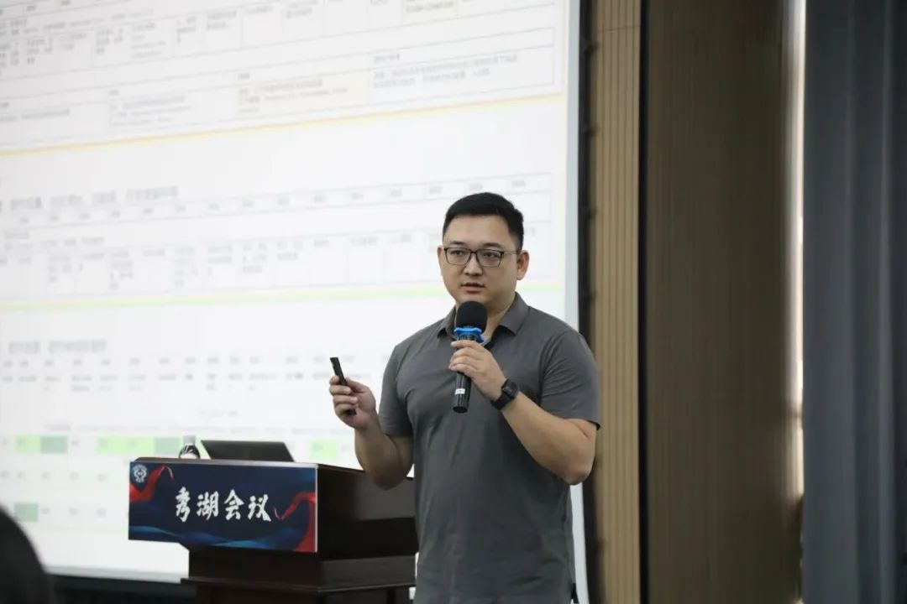
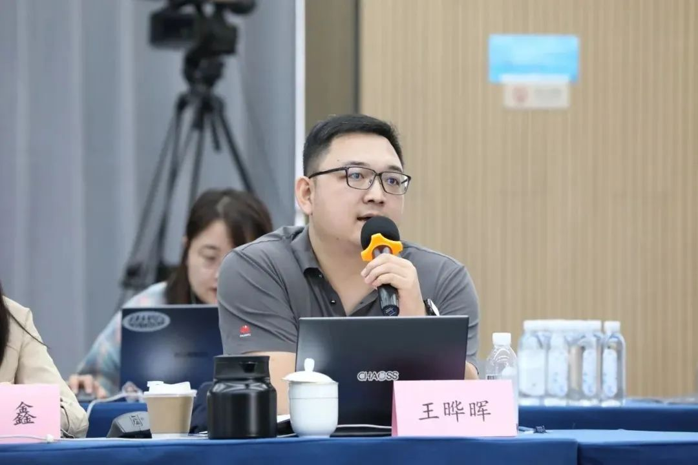

<!--truncate-->

Recently, OSS Compass community was invited to participate in the 7th Xiuhu Conference, a high-end conference created by the China Computer Society (CCF), discussed the issues related to open source projects, community evaluation and measurement with a number of guests, and shared the research and technical achievements of OSS Compass in this field.

For more details of the conference, please check below link:
https://www.ccf.org.cn/CCF_BC/activities/BLS/2023-11-15/798152.shtml
