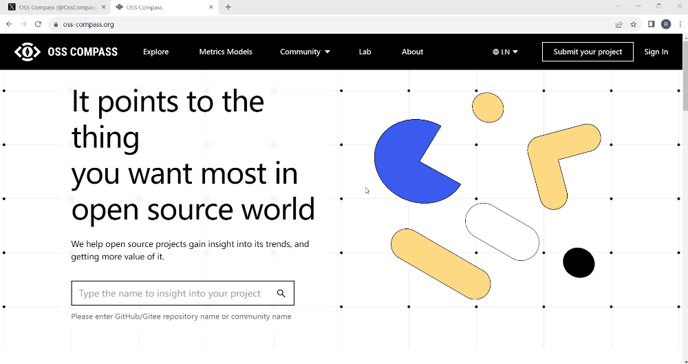
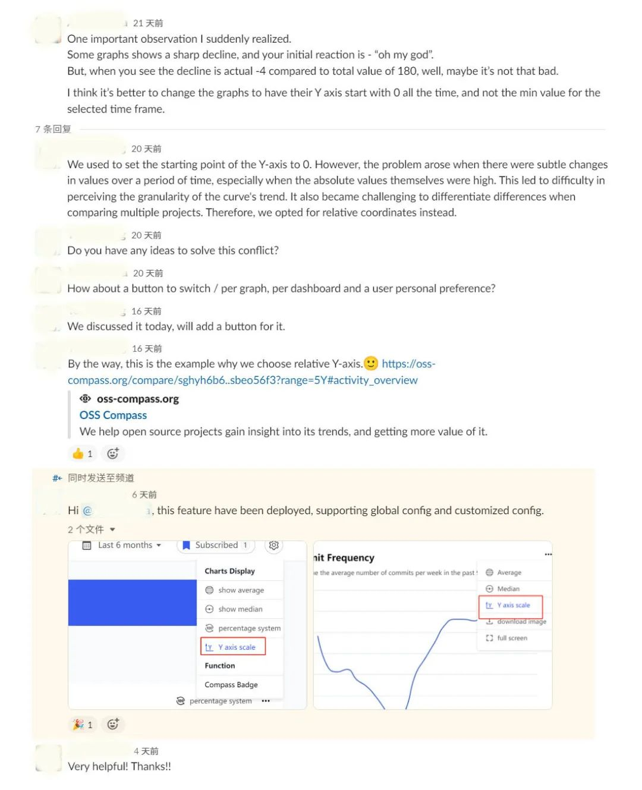

<!--truncate-->

In the previous issue "OSS Compass Feature Update: Compass Badge", we mentioned the Dashboard. Today, we will introduce the Y-axis Scaling feature, which is closely related to the Dashboard.

### 01 What is Dashboard

When open source projects submitted to OSS Compass (hereinafter referred to as "Compass") undergo analysis using the Compass community health evaluation models, a dedicated Dashboard page is generated for each project. This page presents the overall trends of the projects and variations of various evaluation metrics in the form of charts. On the "Explore" page of the Compass official website, clicking on an open source project immediately takes you to its Dashboard page. Give it a try!

  

Operation Demonstration: Opening the Dashboard

  

### 02 What is "Y-axis Scaling"

What is the relationship between Y-axis Scaling and the Dashboard? Well, "Y-axis Scaling" is simply a button located under the settings icon in the upper right corner of the Dashboard page. The charts on the Dashboard page express metrics trends through the curve changes between the horizontal axis and the Y-axis. Now, "Y-axis scaling" is offered as a separate option for users to choose whether or not to scale the Y-axis.

### 03 How to Use Y-axis Scaling

How do you use this "Y-axis scaling" feature? It's really simple! Find "Y-axis Scaling" under the settings icon in the upper right corner of the Dashboard page and click it. When this option is displayed in blue, the Y-axis is in an enlarged state, and when it's displayed in gray, the Y-axis is in a reduced state. Please see the demonstration below for how to use Y-axis scaling.

  

Operation Demonstration: How to Use Y-axis Scaling

  

It seems that there is indeed a significant difference between scaling and not scaling the curve!

### 04 The Story Behind the Implementation of Y-axis Scaling

At the initial release of Compass, the Dashboard did not support the Y-axis scaling feature. Why does it now support it? This story begins with a Slack conversation.

A user from abroad noticed that some metrics curves seemed to change significantly at first glance, making the data appear worse. His immediate reaction was "Oh, my god", and suddenly he felt uneasy. However, upon closer inspection, he found that the numerical changes were actually quite small. Though the curve seemed to change significantly, the interval values were relatively small as the Y-axis didn't start from zero.

Our technical experts responded, "The Y-axis initially started from zero, but after some time, they realized that the curves didn't change much although there were some numerical changes in reality. If these changes couldn't be reflected, it would be meaningless for the analysis results. Do you have any suggestions for us?"

The user suggested, "Could you consider adding a button to let users freely choose whether to scale the Y-axis for each chart?"

Our technical experts said, "We can consider it."

Ten days later, we implemented this feature, and the user happily started using it.

Compass users, if you have any other requirements, please don't hesitate to let us know.

We will do our best to meet your needs.
