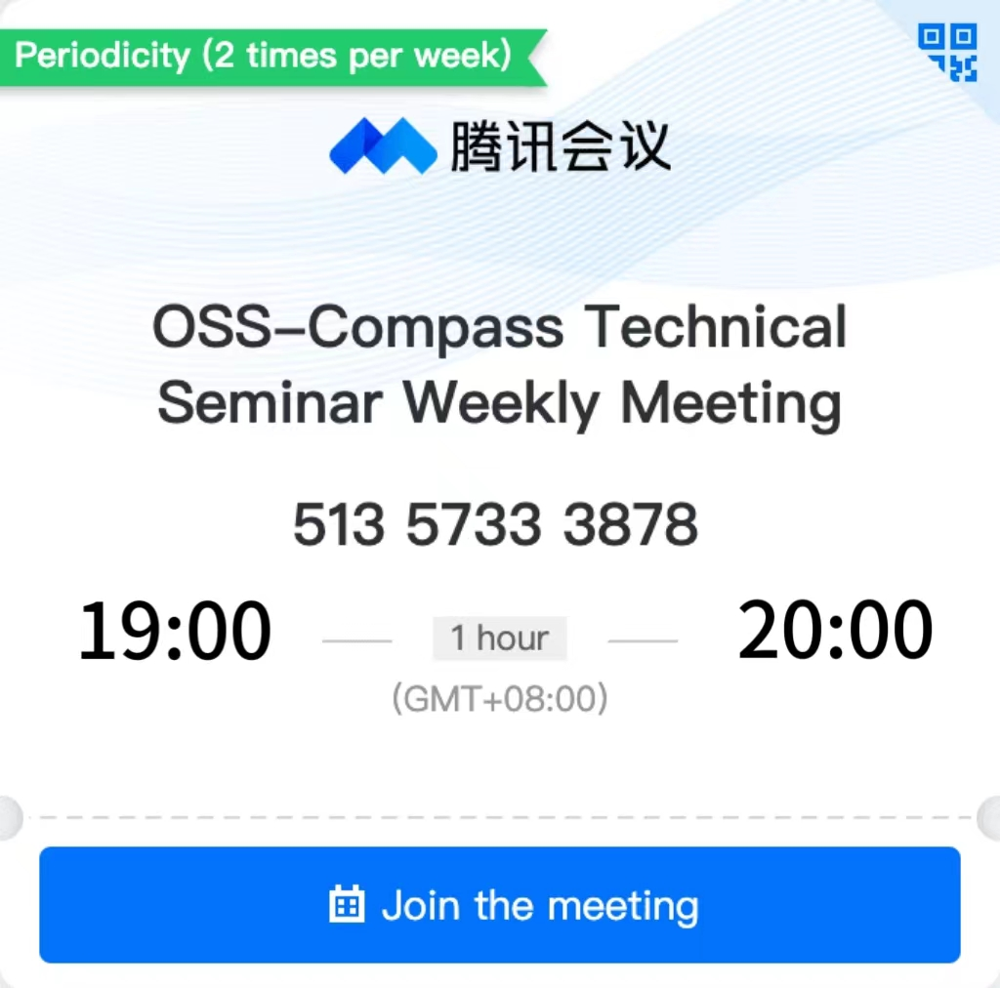

We hold regular online technical workshops to discuss and make decisions around evaluation models and the evolution of OSS Compass SAAS services, so feel free to share your thoughts with us via online meetings.

- **Conference Topic**: OSS-Compass Technical Seminar Weekly Meeting
- **Meeting Time**: Every Tuesday 19:00-20:00 Beijing time (GMT+08:00)
- **Tencent Conference No.**：513-5733-3878

If the button click does not work, you can copy the click or copy the following URL to your browser to access.

:::info Join the meeting

<https://meeting.tencent.com/dm/AE8RoTY40SfS>

:::

:::info View the meeting minutes

<https://github.com/oss-compass/community/blob/main/meeting%20minutes/meeting-minutes_EN.md>

:::
