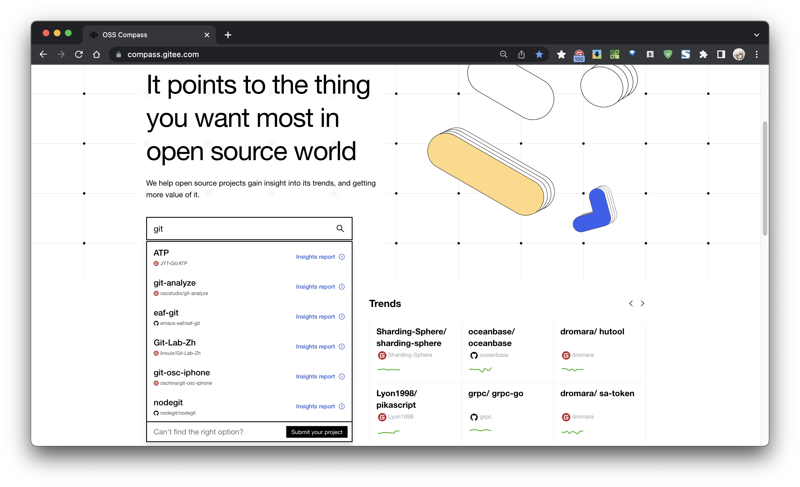
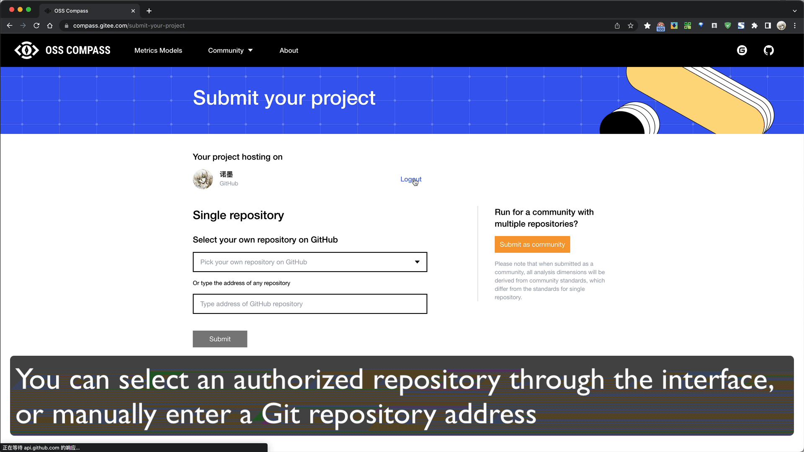

:::tip This article should take approximately ⏱ 3 minutes to read.

:::

Welcome to OSS-Compass, through this article, you will be able to quickly understand what OSS-Compass is in three minutes, and get the corresponding insight analysis report for your project.

## View Analysis Report

You can search the data report of the open source project or open source community you want to view through the website homepage.

## Submit a project analysis request

If you don't find the analysis you want, you can submit your analysis request through "Submit your project" in the upper right corner of the website.

You can choose to use GitHub or Gitee authorized login to submit your project analysis request.

After logging in, you can submit a Single repository analysis or Community analysis request as needed.

* **Single repository**: Focus on data insights from a single open source repository with a single Git-hosted repository as the object of analysis.
* **Community**: Taking an open source community as the object of analysis, focusing on data insights in the process of community development.

### Submit as Single repository

1. You can select an authorized repository through the interface, or manually enter a Git repository address.
2. If you wish to update the list of your authorizations, click Update Authorization in the drop-down menu to update.
3. Of course, you can also manually fill in the address of the Git repository you wish to submit the analysis to.

### Submit as Community

1. Click "Submit as Community" to switch to Community analysis request submission.
2. You can select the authorized repository through the interface, or manually enter the Git repository address to add your Software Artifact Repository.
3. Enter your community name at the bottom of the form.
4. In addition, you can also add a governance repository from the community, which is an option

> If you wish to update the list of your authorizations, click Update Authorization in the drop-down menu to update.

## View project analysis request progress

The project analysis requests will create a Pull Request under the repository specified by the OSS Compass. You can check the execution of your analysis report in the Pull Request.

After the submission is complete, you can follow the progress of the analysis report through OSS-Compass's GitHub or Gitee repository.

:::info You can click here to visit

<https://github.com/oss-compass/compass-projects-information/pulls>

:::
